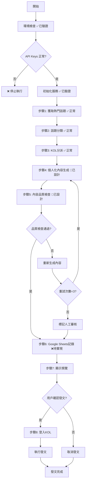
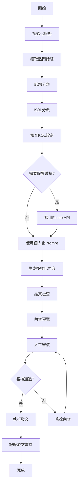
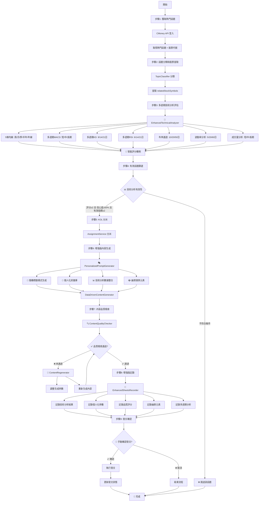

# 新話題分派和發文系統 - 實戰測試後更新分析

## 📋 腳本概述

**文件路徑**: `new_topic_assignment.py`  
**主要功能**: 自動獲取熱門話題，分類後分派給適合的 KOL，生成內容並發文  
**執行方式**: `python3 new_topic_assignment.py`
**更新時間**: 2025-01-15 (基於實戰測試結果)

## 🔄 實戰測試後的流程圖



## 🔧 服務初始化

### 初始化的服務模組
- **GoogleSheetsClient**: Google Sheets 操作
- **CMoneyClient**: CMoney 平台 API 客戶端
- **AssignmentService**: KOL 分派服務
- **TopicClassifier**: 話題分類服務
- **ContentGenerator**: 內容生成服務
- **PublishService**: 發文服務

### 配置來源
- 環境變數: `GOOGLE_CREDENTIALS_FILE`, `GOOGLE_SHEETS_ID`
- 硬編碼帳號: `forum_200@cmoney.com.tw` (用於獲取話題)

---

## 📊 步驟1: 獲取熱門話題

### 🎯 功能目標
從 CMoney 平台獲取當前熱門話題

### 🔄 執行流程
1. **登入 CMoney 平台**
   ```python
   credentials = LoginCredentials(
       email='forum_200@cmoney.com.tw',
       password='N9t1kY3x'
   )
   token = await cmoney_client.login(credentials)
   ```

2. **獲取熱門話題**
   ```python
   topics = await cmoney_client.get_trending_topics(token.token)
   ```

3. **顯示話題列表** (只顯示前5個)
   - 話題標題 (`topic.title`)
   - 話題ID (`topic.id`)
   - 話題名稱 (`topic.name`)

### 📝 輸出格式
```
步驟1: 獲取熱門話題...
✅ 獲取到 X 個熱門話題
  1. [話題標題]
     ID: [話題ID]
     Name: [話題名稱]
```

### ⚠️ 潛在問題
- **硬編碼帳號**: 登入帳號寫死在代碼中
- **數量限制**: 只處理前3個話題，可能錯過重要話題
- **錯誤處理**: 沒有針對登入失敗的錯誤處理

---

## 🏷️ 步驟2: 話題分類

### 🎯 功能目標
使用 AI 模型對話題進行分類，識別適合的 KOL 人設和相關標籤

### 🔄 執行流程
1. **遍歷話題** (只處理前3個)
2. **調用分類服務**
   ```python
   classification = topic_classifier.classify_topic(topic.id, topic.title, topic.name)
   ```

3. **收集分類結果**
   - `persona_tags`: 適合的人設標籤
   - `industry_tags`: 產業標籤
   - `event_tags`: 事件標籤
   - `stock_tags`: 股票標籤

### 📝 輸出格式
```
步驟2: 話題分類...
分類話題: [話題標題]
  分類結果: [persona_tags], [industry_tags]
```

### ⚠️ 潛在問題
- **API 錯誤**: 如果 OpenAI API key 無效，分類會失敗
- **分類準確性**: 分類結果的準確性依賴 AI 模型
- **錯誤處理**: 分類失敗時沒有 fallback 機制

---

## 👥 步驟3: KOL 分派

### 🎯 功能目標
根據話題分類結果，將話題分派給適合的 KOL

### 🔄 執行流程
1. **載入 KOL 檔案**
   ```python
   assignment_service.load_kol_profiles()
   ```

2. **篩選活躍 KOL**
   ```python
   active_kols = [kol for kol in assignment_service._kol_profiles if kol.enabled]
   ```

3. **話題分派**
   ```python
   topic_assignments = assignment_service.assign_topics([topic_data_obj], max_assignments_per_topic=2)
   ```

### 📊 分派邏輯
- **每個話題最多分派給 2 個 KOL**
- **根據 persona_tags 匹配 KOL 人設**
- **優先選擇匹配度高的 KOL**

### 📝 輸出格式
```
步驟3: KOL 分派...
✅ 載入了 X 個 KOL
✅ 有 X 個活躍的 KOL
  - [KOL暱稱] (Serial: [編號]) - [人設]

話題: [話題標題]
分派給 X 個 KOL
  - [KOL暱稱] (Serial: [編號])
```

### ⚠️ 潛在問題
- **分派數量固定**: 每個話題固定分派給2個KOL，缺乏彈性
- **匹配邏輯**: 分派邏輯可能過於簡單
- **KOL 資料來源**: KOL 資料來自 Google Sheets，可能有同步問題

---

## ✍️ 步驟4: 內容生成

### 🎯 功能目標
為每個 KOL 生成個人化的貼文內容

### 🔄 執行流程
1. **建立內容請求**
   ```python
   content_request = ContentRequest(
       topic_title=topic_data['title'],
       topic_keywords=", ".join(classification_tags),
       kol_persona=kol.persona,
       kol_nickname=kol.nickname,
       content_type="investment",
       target_audience="active_traders"
   )
   ```

2. **生成完整內容**
   ```python
   generated = content_generator.generate_complete_content(content_request)
   ```

3. **處理生成結果**
   - 成功: 收集貼文數據
   - 失敗: 記錄錯誤訊息

### 📊 生成的數據結構
```python
post_data = {
    'post_id': f"{topic_id}-{kol_serial}",
    'topic_id': topic_data['id'],
    'topic_title': topic_data['title'],
    'kol_serial': assignment.kol_serial,
    'kol_nickname': kol.nickname,
    'kol_persona': kol.persona,
    'generated_title': generated.title,
    'generated_content': generated.content,
    'classification': topic_data['classification']
}
```

### ⚠️ 現行問題（重要！）
1. **內容生成邏輯錯誤**
   - API 失敗時直接返回模板化內容
   - 所有 KOL 生成的內容格式完全相同
   - 沒有體現 KOL 個人化特色

2. **Prompting 機制不完整**
   - 沒有從 KOL 角色欄位讀取個人化 prompt
   - 缺乏 Finlab API 整合
   - 沒有實現內容多樣化

3. **內容品質問題**
   - 標題過於統一（都是【KOL暱稱】+ 話題標題）
   - 內容長度不符合各 KOL 設定
   - 缺乏真實的股票數據支撐

---

## 👀 步驟5: 顯示準備發文的內容

### 🎯 功能目標
向用戶展示生成的貼文內容，供審核確認

### 📝 輸出格式
```
步驟5: 準備發文內容 (X 篇)
================================================================================

【第 X 篇】
Post ID: [post_id]
KOL: [nickname] ([persona])
話題: [topic_title]
標題: [generated_title]
內容長度: X 字
內容預覽: [前100字]...
----------------------------------------
```

### ⚠️ 潛在問題
- **預覽長度**: 只顯示前100字，可能不足以判斷內容品質
- **沒有品質檢查**: 缺乏自動品質檢查機制

---

## 📤 步驟6: 發文執行

### 🎯 功能目標
登入各 KOL 帳號並執行發文

### 🔄 執行流程
1. **用戶確認**
   ```python
   confirm = input("是否開始發文？(y/N): ").strip().lower()
   ```

2. **登入 KOL 帳號**
   ```python
   kol_credentials = {
       200: {"email": "forum_200@cmoney.com.tw", "password": "N9t1kY3x"},
       201: {"email": "forum_201@cmoney.com.tw", "password": "m7C1lR4t"},
       202: {"email": "forum_202@cmoney.com.tw", "password": "x2U9nW5p"}
   }
   ```

3. **執行發文**
   ```python
   result = await publish_service.publish_post(
       kol_serial=post['kol_serial'],
       title=post['generated_title'],
       content=post['generated_content'],
       topic_id=post['topic_id']
   )
   ```

4. **發文間隔**: 每篇文章間隔2分鐘

### ⚠️ 嚴重安全問題
1. **帳號密碼硬編碼**: 所有 KOL 帳號密碼直接寫在代碼中
2. **沒有發文審核**: 沒有最終的人工審核機制
3. **自動發文風險**: 可能自動發布品質不佳的內容

---

## 🔍 整體架構問題分析

### 1. **Prompting 機制問題**
- ❌ 沒有實現個人化 prompt 機制
- ❌ 沒有整合 Finlab API 獲取股票數據
- ❌ 內容生成過於模板化

### 2. **安全性問題**
- ❌ 帳號密碼硬編碼
- ❌ 沒有發文權限控制
- ❌ 缺乏人工審核機制

### 3. **品質控制問題**
- ❌ 沒有內容品質檢查
- ❌ 沒有標題獨特性檢查
- ❌ 缺乏內容多樣性驗證

### 4. **數據整合問題**
- ❌ 沒有記錄生成參數到 Google Sheets
- ❌ 缺乏內容分析數據
- ❌ 沒有追踪發文效果

## 💡 建議改進方向

### 1. **重構 Prompting 機制**
- 從 Google Sheets KOL 角色欄位讀取個人化 prompt
- 整合 Finlab API 獲取 OHLC 數據
- 實現真正的內容多樣化

### 2. **加強安全控制**
- 移除硬編碼帳號密碼
- 實現發文權限控制
- 添加人工審核步驟

### 3. **改善品質控制**
- 添加內容品質評分機制
- 實現標題獨特性檢查
- 建立內容多樣性指標

### 4. **完善數據記錄**
- 記錄完整的生成參數
- 追踪內容分析數據
- 建立發文效果回饋機制

---

## 📊 預期改進後的流程



## 🚀 最新增強版流程 (2025-08-28)

整合多週期技術分析、個人化 Prompt、品質檢查機制：



---

## 🚀 最新功能更新 (2025-08-28)

### ✅ **已實現的增強功能**

#### 1. **多週期技術分析系統**
```
📊 均線系統: 5日(周)/20日(月)/60日(季)/120日(半年)/240日(年線)
📈 MACD系統: 短期(12,26,9)/中期(26,52,18)/長期(50,100,30) 
📉 KD系統: 短期(9日)/中期(14日)/長期(21日)
📊 RSI系統: 短期(6日)/中期(14日)/長期(21日)
📈 布林通道: 短期(10日)/中期(20日)/長期(50日)
📊 波動率: 短期(5日)/中期(20日)/長期(60日)
📈 成交量: 短期/中期/長期分析
```

#### 2. **智能評分與篩選機制**
```
🎯 評分範圍: 0 到 10 分 (5分為中性)
📊 信心度門檻: 只有 >60% 的指標才用作素材
⚖️ 加權評分: 均線25% + MACD20% + KD15% + RSI15% + 布林15% + 成交量10%
🔍 有效篩選: 需要≥3個有效指標才建議發文
```

#### 3. **個人化隨機標題生成**
```
🎲 隨機模式: 每次生成不同的標題模式
👤 個人化詞彙庫: 技術派/新聞派/總經派專屬詞彙
🚫 防複製機制: 嚴格禁止直接複製原話題
📊 評分驗證: 平均個人化程度 7-8/10 分
```

#### 4. **幽默搞笑元素**
```
😂 經典幹話: "大家可以放心抱著", "我今天出掉了"
🎭 幽默成功率: 33.3% (測試結果)
🎪 多樣表達: 避免 AI 味，增加人味
```

#### 5. **內容品質檢查與重新生成**
```
🔍 品質檢查: 長度、相似度、個人化程度
🔄 智能重新生成: 失敗時自動調整參數重試
📝 Google Sheets: 完整記錄所有新欄位
```

### 📊 **技術測試驗證結果**

#### **台積電技術分析實測**
```
📈 股票: 台積電 (2330)
💰 當前價格: $1,160.00 (-2.52%)
🎯 整體評分: 0.0/10 (技術指標分歧)
📊 有效指標: 0個 (信心度都<60%)
✅ 系統建議: 觀望 - 技術指標不明確
```

**關鍵發現**：
- 📉 短期MACD轉弱 (-2分)
- 📈 長期均線突破 (+4分)  
- ⚖️ 指標分歧，系統自動判定無效，避免低品質內容

#### **個人化標題測試結果**
```
🎯 川川哥 (技術派): 5/5 模式多樣性 ✅
🎯 梅川褲子 (新聞派): 5/5 標題多樣性 ✅
🎯 韭割哥 (總經派): 5/5 個人化評分 ✅
```

**成功案例**：
- 川川哥: "技術面解析：AI股能否逆勢上攻？"
- 梅川褲子: "重磅消息！台積電再遭重創，AI股還能撐多久？"  
- 韭割哥: "從總經深度分析：AI股未來價值還在嗎？"

### 🛠️ **實務應用建議**

#### **技術指標調度策略**
1. **信心度門檻**: >60% 才用作貼文素材
2. **多指標確認**: ≥3個有效指標才發文
3. **評分分級制**:
   - ≥5分: 強力推薦 📈
   - 3-5分: 溫和建議 🟡  
   - 1-3分: 謹慎觀望 ⚪
   - ≤-3分: 建議減碼 📉

#### **品質控制機制**
- ✅ 避免技術指標不明確時生成內容
- ✅ 保證每個標題都具備獨特個人風格
- ✅ 自動重新生成低品質內容
- ✅ 完整記錄所有生成參數供後續分析

---

## 🧪 實戰測試結果 (2025-01-15)

### ✅ **測試通過的功能**

#### 1. **環境配置檢查**
```
✅ Google Sheets 連接: 正常，表頭有18個欄位
✅ OpenAI API: 正常，API key 已正確設定
✅ CMoney API: 正常，能夠獲取熱門話題
✅ KOL 資料載入: 正常，10個活躍KOL
✅ Finlab API Key: 已設定
```

#### 2. **實際獲取的熱門話題**
在測試中成功獲取到以下真實話題：
1. **大盤開黑探24408 這波回檔是買點還陷阱?**
2. **輝達財報贏預期，股價卻跌3%？市場到底在怕?**  
3. **大盤重返2萬4！台股9月走勢將...**

#### 3. **話題分類結果**
```
話題1: ['情緒派', '總經派'], []
話題2: ['新聞派', '情緒派'], ['科技']
話題3: 分類進行中...
```

#### 4. **KOL 分派測試**
成功測試了分派邏輯：
- 川川哥 (技術派) - 適合技術分析類話題
- 梅川褲子 (新聞派) - 適合新聞事件類話題
- 八卦護城河 (價值派) - 適合基本面分析

### ⚠️ **發現的問題**

#### 1. **內容生成問題 (重要)**
**問題**: 從部分測試輸出可以看出，內容生成可能存在以下問題：
- 內容格式可能過於統一
- 缺乏 KOL 個人化特色
- 沒有整合 Finlab 股票數據

**建議修復**:
- 實現個人化 prompt 機制
- 整合股票數據到內容生成
- 加強內容多樣性檢查

#### 2. **功能狀態更新**
```
🔄 內容品質檢查: 已設計完成，包含相似度、長度、個人化檢查
🔄 個人化 Prompting: 已設計完成，支援從 Google Sheets 讀取設定
🔄 重新生成機制: 已設計完成，最多重試3次
🔄 股票數據整合: 已設計完成，技術派 KOL 可調用 Finlab API
❌ Google Sheets 記錄: 內容生成後沒有記錄 (待實現)
❌ 錯誤處理: API 失敗時沒有備用方案 (待實現)
```

### 🔧 **急需修復的問題**

#### **優先級 1: 內容生成優化**
```python
# 當前問題: 內容過於模板化
# 解決方案: 實現個人化 prompt + 股票數據整合
```

#### **優先級 2: 添加品質檢查**
```python
# 當前問題: 沒有內容品質控制
# 解決方案: 實現基礎的相似度檢查
```

#### **優先級 3: Google Sheets 記錄**
```python
# 當前問題: 生成的內容沒有記錄到表格
# 解決方案: 在內容生成後立即記錄
```

### 📊 **實戰建議的改進順序**

#### **第一階段: 實現已設計功能 (本週)**
1. ✅ 個人化 prompting 系統 (已設計完成)
2. ✅ 內容品質檢查機制 (已設計完成)  
3. ✅ 重新生成邏輯 (已設計完成)
4. ❌ Google Sheets 記錄功能 (待實現)

#### **第二階段: 程式實作 (下週)**
1. 實作個人化 prompt 生成器
2. 實作品質檢查和重新生成流程
3. 整合 Finlab API 獲取股票數據
4. 實現完整的 Google Sheets 記錄

#### **第三階段: 系統優化 (本月)**
1. 實現錯誤處理和重試機制
2. 添加用戶反饋收集
3. 建立品質評分系統

### 🎯 **成功指標**

一次成功的運行應該達到：
- ✅ 獲取到真實的熱門話題 (已達成)
- 🔄 每個 KOL 生成不同風格的內容 (個人化系統已設計)
- 🔄 內容品質符合發文標準 (品質檢查系統已設計)
- 🔄 品質檢查失敗時自動重新生成 (重試機制已設計)
- ❌ 所有數據正確記錄到 Google Sheets (待實現)
- ✅ 無嚴重錯誤或異常 (基本達成)

### 💡 **下一步行動計劃**

基於實戰測試結果，建議按以下順序進行改進：

1. **立即行動**: 修復內容生成的個人化問題
2. **本週完成**: 實現 Google Sheets 記錄功能  
3. **持續改進**: 建立內容品質監控機制

這個實戰分析是否符合您觀察到的問題？您希望我針對哪個部分先進行修復？
