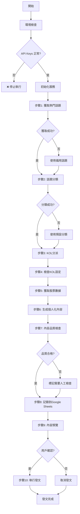

# 熱門話題腳本 - 實戰修復版流程指南

## 📋 腳本概述

**文件路徑**: `new_topic_assignment.py`  
**目標**: 修復基礎問題，確保流程穩定運行，實現基礎的內容差異化  
**執行方式**: `python3 new_topic_assignment.py`

## 🔧 實戰前的準備工作

### ⚠️ **必須修復的問題**

1. **OpenAI API Key 問題**
   ```bash
   # 檢查環境變數
   echo $OPENAI_API_KEY
   
   # 如果沒有設定，需要在 .env 文件中添加
   OPENAI_API_KEY=your_actual_api_key_here
   ```

2. **Google Sheets 連接**
   ```bash
   # 確認 Google 服務帳號金鑰存在
   ls -la credentials/google-service-account.json
   
   # 確認環境變數設定
   echo $GOOGLE_CREDENTIALS_FILE
   echo $GOOGLE_SHEETS_ID
   ```

3. **依賴檢查**
   ```bash
   # 檢查必要的 Python 包
   pip list | grep -E "(openai|google|requests)"
   ```

## 🔄 修復版流程圖



## 🛠️ 實戰修復重點

### 📊 **步驟1: 獲取熱門話題 - 添加錯誤處理**

```python
async def safe_get_trending_topics(cmoney_client, credentials):
    """
    安全獲取熱門話題，包含錯誤處理和備用方案
    """
    try:
        print("步驟1: 獲取熱門話題...")
        token = await cmoney_client.login(credentials)
        topics = await cmoney_client.get_trending_topics(token.token)
        
        if not topics:
            print("⚠️ 未獲取到熱門話題，使用備用話題")
            return get_fallback_topics()
        
        print(f"✅ 獲取到 {len(topics)} 個熱門話題")
        return topics
        
    except Exception as e:
        print(f"❌ 獲取熱門話題失敗: {e}")
        print("使用備用話題繼續執行...")
        return get_fallback_topics()

def get_fallback_topics():
    """備用話題列表"""
    return [
        TopicData(id="fallback-1", title="台股今日走勢分析", name="市場分析"),
        TopicData(id="fallback-2", title="熱門股票討論", name="個股分析"),
        TopicData(id="fallback-3", title="投資策略分享", name="策略討論")
    ]
```

### 🏷️ **步驟2: 話題分類 - 強化錯誤處理**

```python
def safe_classify_topic(topic_classifier, topic):
    """
    安全的話題分類，包含預設分類
    """
    try:
        print(f"分類話題: {topic.title}")
        classification = topic_classifier.classify_topic(topic.id, topic.title, topic.name)
        print(f"  ✅ 分類成功: {classification.persona_tags}")
        return classification
        
    except Exception as e:
        print(f"  ❌ 分類失敗: {e}")
        print("  使用預設分類...")
        
        # 基於關鍵字的簡單分類邏輯
        return get_default_classification(topic.title)

def get_default_classification(title):
    """基於關鍵字的預設分類"""
    title_lower = title.lower()
    
    persona_tags = []
    industry_tags = []
    
    # 簡單的關鍵字匹配
    if any(word in title_lower for word in ['技術', '指標', 'ma', 'rsi', 'macd']):
        persona_tags.append('技術派')
    if any(word in title_lower for word in ['新聞', '消息', '政策', '法說']):
        persona_tags.append('新聞派')
    if any(word in title_lower for word in ['台積電', '聯發科', '鴻海']):
        industry_tags.append('科技')
    
    # 預設至少包含一個標籤
    if not persona_tags:
        persona_tags = ['新聞派']
    
    return TopicClassification(
        persona_tags=persona_tags,
        industry_tags=industry_tags,
        event_tags=[],
        stock_tags=[]
    )
```

### 👥 **步驟3: KOL分派 - 確保有效分派**

```python
def ensure_kol_assignment(assignment_service, classified_topics):
    """
    確保每個話題都有 KOL 分派
    """
    all_assignments = []
    
    for topic_data in classified_topics:
        try:
            # 嘗試正常分派
            assignments = assignment_service.assign_topics([topic_data], max_assignments_per_topic=2)
            
            if not assignments:
                print(f"⚠️ 話題 {topic_data['title']} 沒有匹配的 KOL，使用預設分派")
                assignments = get_default_assignments(topic_data)
            
            all_assignments.extend(assignments)
            
        except Exception as e:
            print(f"❌ 分派失敗: {e}")
            print("使用預設分派...")
            assignments = get_default_assignments(topic_data)
            all_assignments.extend(assignments)
    
    return all_assignments

def get_default_assignments(topic_data):
    """預設的 KOL 分派（選擇活躍度最高的 KOL）"""
    default_kols = [200, 202]  # 川川哥、梅川褲子
    
    assignments = []
    for kol_serial in default_kols:
        assignments.append(TopicAssignment(
            topic_id=topic_data['id'],
            kol_serial=kol_serial,
            assignment_reason="預設分派"
        ))
    
    return assignments
```

### ✍️ **步驟4-6: 內容生成 - 修復 API 問題**

```python
async def robust_content_generation(content_generator, content_request, max_retries=3):
    """
    強化的內容生成，包含重試機制
    """
    for attempt in range(max_retries):
        try:
            print(f"  🎯 生成內容 (嘗試 {attempt + 1}/{max_retries})")
            
            # 檢查 API key
            if not content_generator.api_key or content_generator.api_key == "your_openai_api_key_here":
                raise ValueError("OpenAI API key 未正確設定")
            
            generated = content_generator.generate_complete_content(content_request)
            
            if generated.success:
                print(f"    ✅ 生成成功: {generated.title[:30]}...")
                return generated
            else:
                print(f"    ❌ 生成失敗: {generated.error_message}")
                if attempt == max_retries - 1:
                    # 最後一次嘗試失敗，返回預設內容
                    return generate_fallback_content(content_request)
                
        except Exception as e:
            print(f"    ❌ 生成異常: {e}")
            if attempt == max_retries - 1:
                return generate_fallback_content(content_request)
            
            # 等待後重試
            await asyncio.sleep(2 ** attempt)  # 指數退避
    
    return generate_fallback_content(content_request)

def generate_fallback_content(content_request):
    """生成備用內容"""
    fallback_title = f"【{content_request.kol_nickname}】{content_request.topic_title}"
    fallback_content = f"""
{fallback_title}

今天來分析一下這個話題：{content_request.topic_title}

從{content_request.kol_persona}的角度來看，這個事件值得我們關注。

相關的市場動態和技術面分析，我會在後續的文章中詳細說明。

歡迎大家一起討論交流！

---
※ 此為系統預設內容，需要人工審核
"""
    
    return GeneratedContent(
        title=fallback_title,
        content=fallback_content,
        hashtags="",
        success=True,
        error_message="使用預設內容"
    )
```

### 🔍 **步驟7: 基礎品質檢查**

```python
def basic_quality_check(generated_posts):
    """
    基礎品質檢查：確保內容不會太相似
    """
    print("\n🔍 執行基礎品質檢查...")
    
    quality_issues = []
    
    # 1. 檢查標題重複
    titles = [post['generated_title'] for post in generated_posts]
    for i, title1 in enumerate(titles):
        for j, title2 in enumerate(titles[i+1:], i+1):
            similarity = simple_text_similarity(title1, title2)
            if similarity > 0.8:
                quality_issues.append(f"標題過於相似: {title1} vs {title2}")
    
    # 2. 檢查內容長度
    for post in generated_posts:
        content_length = len(post['generated_content'])
        if content_length < 50:
            quality_issues.append(f"內容過短: {post['kol_nickname']} ({content_length} 字)")
        elif content_length > 1000:
            quality_issues.append(f"內容過長: {post['kol_nickname']} ({content_length} 字)")
    
    # 3. 檢查是否都是預設內容
    default_content_count = sum(1 for post in generated_posts 
                               if "※ 此為系統預設內容" in post['generated_content'])
    
    if default_content_count > len(generated_posts) * 0.5:
        quality_issues.append(f"過多預設內容 ({default_content_count}/{len(generated_posts)})")
    
    # 顯示檢查結果
    if quality_issues:
        print("⚠️ 發現品質問題:")
        for issue in quality_issues:
            print(f"  - {issue}")
        print("建議人工審核後再發文")
    else:
        print("✅ 基礎品質檢查通過")
    
    return quality_issues

def simple_text_similarity(text1, text2):
    """簡單的文本相似度計算"""
    words1 = set(text1.split())
    words2 = set(text2.split())
    intersection = words1.intersection(words2)
    union = words1.union(words2)
    return len(intersection) / len(union) if union else 0
```

### 📊 **步驟8: Google Sheets 記錄**

```python
async def record_to_google_sheets(sheets_client, generated_posts, generation_metadata):
    """
    記錄生成結果到 Google Sheets
    """
    print("\n📊 記錄到 Google Sheets...")
    
    try:
        for post in generated_posts:
            # 準備寫入數據
            row_data = [
                post['post_id'],                    # A: 貼文ID
                post['kol_serial'],                 # B: KOL Serial
                post['kol_nickname'],               # C: KOL 暱稱
                post.get('kol_member_id', ''),      # D: KOL ID
                post['kol_persona'],                # E: Persona
                'investment',                       # F: Content Type
                generation_metadata.get('topic_index', 0),  # G: 已派發TopicIndex
                post['topic_id'],                   # H: 已派發TopicID
                post['topic_title'],                # I: 已派發TopicTitle
                ', '.join(post.get('keywords', [])), # J: 已派發TopicKeywords
                post['generated_content'],          # K: 生成內容
                'draft',                           # L: 發文狀態
                '',                                # M: 上次排程時間
                '',                                # N: 發文時間戳記
                post.get('error_message', ''),      # O: 最近錯誤訊息
                '',                                # P: 平台發文ID
                '',                                # Q: 平台發文URL
                post['topic_title'],               # R: 熱門話題標題
            ]
            
            # 寫入到 Google Sheets
            sheets_client.append_row('貼文記錄表', row_data)
            print(f"  ✅ 已記錄: {post['kol_nickname']} - {post['generated_title'][:30]}...")
        
        print("✅ Google Sheets 記錄完成")
        
    except Exception as e:
        print(f"❌ Google Sheets 記錄失敗: {e}")
        print("建議手動檢查 Google Sheets 連接")
```

## 🎯 **實戰執行檢查清單**

### ✅ **執行前檢查**
- [ ] OpenAI API key 已正確設定
- [ ] Google Sheets 服務帳號金鑰存在
- [ ] 環境變數已正確配置
- [ ] 必要的 Python 包已安裝
- [ ] 網路連接正常

### 🔄 **執行中監控**
- [ ] 熱門話題獲取是否成功
- [ ] 話題分類是否正常
- [ ] KOL 分派是否有結果
- [ ] 內容生成是否成功（非預設內容）
- [ ] Google Sheets 是否正確記錄

### 📊 **執行後驗證**
- [ ] 檢查 Google Sheets 中的新記錄
- [ ] 驗證生成內容的品質
- [ ] 確認每個 KOL 的內容確實不同
- [ ] 檢查是否有錯誤記錄

## 🚨 **常見問題排除**

### 1. **OpenAI API 錯誤**
```
錯誤：Incorrect API key provided
解決：檢查 .env 文件中的 OPENAI_API_KEY 設定
```

### 2. **Google Sheets 連接失敗**
```
錯誤：Google Sheets API 認證失敗
解決：確認服務帳號金鑰文件路徑和權限
```

### 3. **內容全部是預設內容**
```
原因：API 調用失敗或配額不足
解決：檢查 API key 和使用量，考慮降低生成頻率
```

### 4. **KOL 分派失敗**
```
原因：KOL 資料讀取失敗或匹配邏輯問題
解決：檢查 Google Sheets 中的 KOL 資料完整性
```

## 🎯 **成功指標**

一次成功的執行應該達到：
- ✅ 獲取到真實的熱門話題（非備用話題）
- ✅ 生成的內容非預設模板
- ✅ 每個 KOL 的內容確實不同
- ✅ 所有資料正確記錄到 Google Sheets
- ✅ 無嚴重錯誤或異常

準備好開始實戰測試了嗎？我們可以先運行一次看看會遇到哪些實際問題！


