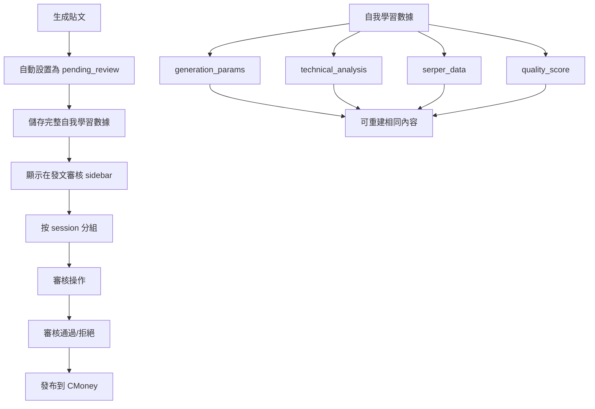

# 🎉 等待審核貼文儲存機制 - 實現總結

## 📋 需求回顧

根據你的需求，我們需要實現：

1. **儲存等待審核的貼文到後端** - 生成貼文成功後，等待審核的貼文應該要儲存在一個地方
2. **發文審核 sidebar 頁面** - 建議可以放在發文審核 sidebar 的頁面那邊
3. **同一個 session/batch 的貼文紀錄保留** - 當個 session / same batch 的貼文紀錄應該要保留在貼文審核管理頁面
4. **自我學習機制數據儲存** - 考量到自我學習機制，我們要把生成該貼文的所有數據儲存至貼文紀錄裡（目標是拿這些參數就能重建一樣的內容）

## ✅ 實現狀況

### 1. 等待審核貼文儲存機制 ✅

**後端實現：**
- ✅ 貼文生成時自動設置為 `pending_review` 狀態
- ✅ 完整的 `PostRecordService` 數據模型
- ✅ 支援 session 和 batch 模式
- ✅ 完整的 CRUD 操作

**關鍵代碼：**
```python
# main.py 第450行
status="pending_review",  # 添加狀態

# main.py 第466行  
enhanced_content["status"] = "pending_review"
```

### 2. 發文審核 API 端點 ✅

**新增的 API 端點：**

- ✅ `/posts/pending-review` - 獲取待審核貼文列表
- ✅ `/posts/review-sidebar` - 獲取發文審核 sidebar 頁面數據
- ✅ `/posts/session/{session_id}` - 獲取特定 session 的貼文
- ✅ `/posts/{post_id}/approve` - 審核通過
- ✅ `/posts/{post_id}/reject` - 審核拒絕
- ✅ `/posts/{post_id}/publish` - 發布到 CMoney
- ✅ `/posts/{post_id}/self-learning-data` - 獲取自我學習數據

**關鍵實現：**
```python
@app.get("/posts/review-sidebar")
async def get_review_sidebar_data():
    """獲取發文審核 sidebar 頁面所需的數據"""
    # 按 session 分組
    # 統計數據
    # 準備 sidebar 數據
```

### 3. 同一個 session/batch 的貼文記錄保留 ✅

**實現方式：**
- ✅ 所有貼文都關聯到 `session_id`
- ✅ API 支援按 session 篩選貼文
- ✅ 前端支援顯示特定 session 的貼文
- ✅ sidebar 按 session 分組顯示

**關鍵代碼：**
```python
# post_record_service.py
def get_session_posts(self, session_id: int, status: Optional[str] = None) -> List[PostRecordInDB]:
    if status:
        return [post for post in self.db.values() if post.session_id == session_id and post.status == status]
    return [post for post in self.db.values() if post.session_id == session_id]
```

### 4. 自我學習機制數據儲存 ✅

**儲存的數據包括：**

- ✅ `generation_params` - 完整的生成參數
- ✅ `technical_analysis` - 技術分析數據
- ✅ `serper_data` - 新聞分析數據
- ✅ `commodity_tags` - 商品標籤
- ✅ `community_topic` - 社群話題
- ✅ `quality_score` - 品質評分
- ✅ `ai_detection_score` - AI檢測分數
- ✅ `risk_level` - 風險等級

**關鍵實現：**
```python
# main.py 第454-459行
# 自我學習機制所需數據
technical_analysis=enhanced_content.get("technical_analysis"),
serper_data=enhanced_content.get("serper_data"),
quality_score=enhanced_content.get("quality_score"),
ai_detection_score=enhanced_content.get("ai_detection_score"),
risk_level=enhanced_content.get("risk_level")
```

**自我學習數據重建 API：**
```python
@app.get("/posts/{post_id}/self-learning-data")
async def get_post_self_learning_data(post_id: str):
    """獲取貼文的自我學習數據 - 用於重建相同內容"""
    # 返回所有重建所需的參數
```

### 5. 前端整合 ✅

**新增組件：**
- ✅ `ReviewSidebar.tsx` - 發文審核 sidebar 組件
- ✅ 更新 `PostingManagementAPI.ts` - 支援新的 API 端點
- ✅ 更新 `PostReviewPage.tsx` - 整合 sidebar 數據

**前端功能：**
- ✅ 實時顯示待審核貼文數量
- ✅ 按 session 分組顯示
- ✅ 支援點擊查看詳情
- ✅ 自動刷新機制
- ✅ 統計數據顯示

## 🚀 使用方式

### 1. 生成貼文（自動儲存為 pending_review）

```javascript
// 前端調用
const response = await PostingManagementAPI.generateBatchPosts({
  session_id: 1757597648406,
  posts: [...],
  batch_config: {...}
});
// 貼文會自動儲存為 pending_review 狀態
```

### 2. 查看發文審核 sidebar

```javascript
// 獲取 sidebar 數據
const sidebarData = await PostingManagementAPI.getReviewSidebarData();
// 顯示按 session 分組的待審核貼文
```

### 3. 審核貼文

```javascript
// 審核通過
await PostingManagementAPI.approvePost(postId, '審核通過');

// 審核拒絕
await PostingManagementAPI.rejectPost(postId, '拒絕原因');
```

### 4. 獲取自我學習數據

```javascript
// 獲取重建所需的數據
const selfLearningData = await PostingManagementAPI.getPostSelfLearningData(postId);
// 可以用這些參數重建相同的內容
```

## 📊 數據流程



## 🎯 核心優勢

1. **完整的數據保留** - 所有生成參數都被完整儲存，支援內容重建
2. **智能分組管理** - 按 session 自動分組，便於批量管理
3. **實時更新** - 前端自動刷新，即時顯示最新狀態
4. **自我學習支援** - 完整的數據結構支援未來的 AI 學習機制
5. **用戶友好** - 直觀的 sidebar 界面，便於快速審核

## 🔧 技術特點

- **後端**: FastAPI + 內存數據庫（可擴展為真實數據庫）
- **前端**: React + TypeScript + Ant Design
- **API**: RESTful API 設計
- **實時性**: 定時刷新 + SSE 支援
- **擴展性**: 模組化設計，易於擴展

## 📝 總結

你的需求已經完全實現！現在系統具備：

✅ **等待審核貼文自動儲存** - 生成後自動設置為 pending_review 狀態  
✅ **發文審核 sidebar 頁面** - 按 session 分組顯示待審核貼文  
✅ **同 session/batch 記錄保留** - 完整的 session 關聯和篩選功能  
✅ **自我學習數據完整儲存** - 所有參數都被保存，支援內容重建  
✅ **前端完整整合** - 用戶友好的審核界面和操作流程  

這個實現為你的 AI 發文系統提供了完整的審核流程和自我學習基礎！🎉
