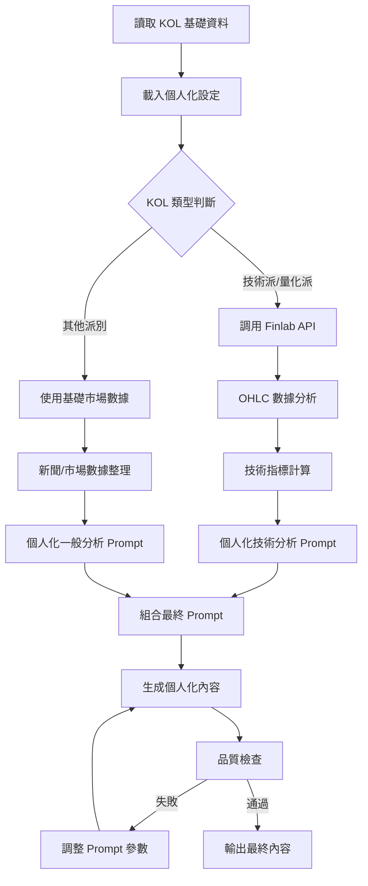

# 個人化 Prompting 系統設計

## 📋 概述

**目標**: 為每個 KOL 建立獨特的 prompting 機制，確保生成內容具有明顯的個人化特色和風格差異  
**核心原則**: 從 Google Sheets 的 KOL 角色欄位讀取個人化設定，結合股票數據生成多樣化內容

## 🎯 個人化 Prompting 架構

### 🔄 Prompting 流程圖



## 🎭 KOL 個人化設定結構

### 📊 Google Sheets 中的 KOL 設定欄位

| 欄位名稱 | 說明 | 範例 |
|----------|------|------|
| `個人化_prompt_模板` | 核心 prompt 模板 | "你是川川哥，一個..." |
| `語氣風格_向量` | 語氣特徵數值 | formal:3, casual:8, emotional:7 |
| `內容長度_偏好` | 內容長度設定 | short / medium / long |
| `專業領域_權重` | 專業領域偏好 | technical:0.9, news:0.3 |
| `打字習慣_特徵` | 標點和格式習慣 | "省略號多用...，少用標點" |
| `常用詞彙_庫` | 專業詞彙列表 | "黃金交叉,均線糾結,爆量突破" |
| `口語化_詞彙` | 口語表達方式 | "穩了啦,爆啦,嘎到,要噴啦" |
| `結尾_風格` | 固定結尾模式 | "想知道的話，留言告訴我..." |
| `數據需求_類型` | 需要的數據類型 | ohlc,technical,news,financial |

### 🔧 個人化設定範例

#### **川川哥 (技術派)**
```yaml
kol_id: 200
nickname: "川川哥"
persona: "技術派"
personalized_settings:
  prompt_template: |
    你是川川哥，一個專精技術分析的股市老手。你的特色是：
    - 語氣直接但有料，有時會狂妄，有時又碎碎念
    - 大量使用技術分析術語
    - 不愛用標點符號，全部用省略號串起來
    - 偶爾會英文逗號亂插
    
  tone_vector:
    formal_level: 3      # 1-10，數字越高越正式
    emotion_intensity: 7  # 情緒強度
    confidence_level: 9   # 自信程度
    interaction_level: 6  # 互動性
    
  content_preferences:
    length_type: "short"  # 固定短內容
    paragraph_style: "省略號分隔，不換行"
    ending_style: "想知道的話，留言告訴我，咱們一起討論一下..."
    
  vocabulary:
    technical_terms:
      - "黃金交叉"
      - "均線糾結" 
      - "三角收斂"
      - "K棒爆量"
      - "跳空缺口"
      - "支撐帶"
      - "壓力線"
      - "MACD背離"
      
    casual_expressions:
      - "穩了啦"
      - "爆啦"
      - "嘎到"
      - "要噴啦"
      - "破線啦"
      - "睡醒漲停"
      
  data_requirements:
    primary: ["ohlc", "technical_indicators"]
    secondary: ["volume", "price_action"]
    finlab_api_needed: true
    
  typing_habits:
    punctuation_style: "省略號為主...偶爾逗號,"
    sentence_pattern: "短句居多...不愛長句"
    emoji_usage: "很少用"
```

#### **梅川褲子 (新聞派)**
```yaml
kol_id: 202
nickname: "梅川褲子"
persona: "新聞派"
personalized_settings:
  prompt_template: |
    你是梅川褲子，一個敏銳的財經新聞分析師。你的特色是：
    - 語氣急躁，常常「快打快收」
    - 看起來像新聞狗，語氣急促有時像在喊口號
    - 打字很急不愛空格，爆Emoji
    - 會重複字像啦啦啦，驚嘆號狂刷
    
  tone_vector:
    formal_level: 2
    emotion_intensity: 9
    urgency_level: 10
    interaction_level: 8
    
  content_preferences:
    length_type: "medium"
    paragraph_style: "段落間用空行分隔，保持緊湊"
    ending_style: "別忘了持續鎖定我，隨時更新即時新聞、盤中快訊！快點快點！"
    
  vocabulary:
    news_terms:
      - "爆新聞啦"
      - "風向轉了"
      - "盤中爆炸"
      - "快訊快訊"
      - "漲停新聞"
      - "政策護航"
      
  data_requirements:
    primary: ["news", "market_sentiment"]
    secondary: ["policy_updates", "earnings"]
    finlab_api_needed: false
    
  typing_habits:
    punctuation_style: "驚嘆號!!!狂刷"
    spacing: "不愛空格,打字很急"
    emoji_usage: "爆Emoji!!!"
```

## 🔄 動態 Prompt 生成系統

### 🎯 核心 Prompt 生成器

```python
class PersonalizedPromptGenerator:
    def __init__(self):
        self.kol_settings_cache = {}
        self.finlab_client = FinlabAPIClient()
    
    async def generate_personalized_prompt(self, kol_profile: KOLProfile, 
                                         topic_data: TopicData,
                                         market_context: MarketContext) -> PersonalizedPrompt:
        """
        生成個人化 prompt
        """
        
        # 1. 讀取 KOL 個人化設定
        kol_settings = await self.load_kol_settings(kol_profile.serial)
        
        # 2. 根據 KOL 類型決定數據需求
        required_data = await self.determine_data_requirements(kol_settings, topic_data)
        
        # 3. 獲取所需數據
        market_data = await self.fetch_required_data(required_data, topic_data)
        
        # 4. 生成個人化系統 prompt
        system_prompt = self.build_system_prompt(kol_settings, market_data)
        
        # 5. 生成個人化用戶 prompt
        user_prompt = self.build_user_prompt(kol_settings, topic_data, market_data)
        
        return PersonalizedPrompt(
            system_prompt=system_prompt,
            user_prompt=user_prompt,
            kol_settings=kol_settings,
            market_data=market_data,
            generation_params=self.get_generation_params(kol_settings)
        )
    
    def build_system_prompt(self, kol_settings: KOLSettings, 
                           market_data: MarketData) -> str:
        """
        構建個人化系統 prompt
        """
        
        base_template = kol_settings.prompt_template
        
        # 添加數據上下文
        data_context = self.format_market_data_context(market_data, kol_settings)
        
        # 添加語氣指導
        tone_guidance = self.build_tone_guidance(kol_settings.tone_vector)
        
        # 添加詞彙指導
        vocabulary_guidance = self.build_vocabulary_guidance(kol_settings.vocabulary)
        
        # 添加格式指導
        format_guidance = self.build_format_guidance(kol_settings.content_preferences)
        
        system_prompt = f"""
{base_template}

數據上下文：
{data_context}

語氣指導：
{tone_guidance}

詞彙使用：
{vocabulary_guidance}

格式要求：
{format_guidance}

重要提醒：
1. 嚴格保持角色的語氣和用詞習慣
2. 使用提供的數據進行分析
3. 內容長度控制在 {kol_settings.content_preferences.length_type} 範圍內
4. 結尾必須使用固定的結尾風格
"""
        
        return system_prompt
```

### 📊 股票數據整合 (技術派專用)

```python
class TechnicalDataIntegrator:
    def __init__(self):
        self.finlab_client = FinlabAPIClient()
        self.technical_calculator = TechnicalIndicatorCalculator()
    
    async def integrate_stock_data_for_technical_kol(self, 
                                                   topic_data: TopicData,
                                                   kol_settings: KOLSettings) -> TechnicalDataPackage:
        """
        為技術派 KOL 整合股票數據
        """
        
        # 1. 提取股票代號
        stock_codes = self.extract_stock_codes(topic_data.title, topic_data.keywords)
        
        if not stock_codes:
            return TechnicalDataPackage.empty()
        
        # 2. 獲取 OHLC 數據
        ohlc_data = {}
        for stock_code in stock_codes:
            try:
                data = await self.finlab_client.get_ohlc_data(
                    stock_code, 
                    period="3M"  # 3個月數據
                )
                ohlc_data[stock_code] = data
            except Exception as e:
                logger.warning(f"無法獲取 {stock_code} 的 OHLC 數據: {e}")
        
        # 3. 計算技術指標
        technical_indicators = {}
        for stock_code, data in ohlc_data.items():
            indicators = self.technical_calculator.calculate_all_indicators(data)
            technical_indicators[stock_code] = indicators
        
        # 4. 生成技術分析摘要
        analysis_summary = await self.generate_technical_summary(
            ohlc_data, technical_indicators, kol_settings
        )
        
        return TechnicalDataPackage(
            ohlc_data=ohlc_data,
            technical_indicators=technical_indicators,
            analysis_summary=analysis_summary,
            data_quality_score=self.calculate_data_quality(ohlc_data)
        )
    
    async def generate_technical_summary(self, ohlc_data: Dict, 
                                       indicators: Dict,
                                       kol_settings: KOLSettings) -> str:
        """
        使用 LLM 生成技術分析摘要
        """
        
        summary_prompt = f"""
請以 {kol_settings.nickname} 的風格分析以下技術數據：

數據摘要：
{self.format_technical_data_for_prompt(ohlc_data, indicators)}

分析要求：
1. 使用 {kol_settings.nickname} 的專業術語和語氣
2. 重點關注關鍵技術指標
3. 提供簡潔但專業的分析
4. 控制在150字以內

請生成技術分析摘要：
"""
        
        response = await self.llm_client.chat.completions.create(
            model="gpt-4o-mini",
            messages=[
                {"role": "system", "content": f"你是專業的技術分析師，模仿 {kol_settings.nickname} 的風格。"},
                {"role": "user", "content": summary_prompt}
            ],
            temperature=0.3
        )
        
        return response.choices[0].message.content
```

## 🔍 品質檢查與重新生成機制

### 📊 品質檢查系統

```python
class ContentQualityChecker:
    def __init__(self):
        self.similarity_threshold = 0.75
        self.min_length_threshold = 50
        self.max_similarity_attempts = 3
    
    async def check_content_quality(self, generated_posts: List[GeneratedPost]) -> QualityCheckResult:
        """
        檢查內容品質，失敗時觸發重新生成
        """
        
        quality_issues = []
        posts_need_regeneration = []
        
        # 1. 長度檢查
        for post in generated_posts:
            if len(post.content) < self.min_length_threshold:
                quality_issues.append({
                    'post_id': post.post_id,
                    'issue_type': 'content_too_short',
                    'details': f'內容過短: {len(post.content)} 字'
                })
                posts_need_regeneration.append(post.post_id)
        
        # 2. 相似度檢查
        for i, post1 in enumerate(generated_posts):
            for j, post2 in enumerate(generated_posts[i+1:], i+1):
                similarity = await self.calculate_content_similarity(post1.content, post2.content)
                
                if similarity > self.similarity_threshold:
                    quality_issues.append({
                        'post_id': post1.post_id,
                        'similar_to': post2.post_id,
                        'issue_type': 'content_too_similar',
                        'similarity_score': similarity,
                        'details': f'與 {post2.kol_nickname} 的內容相似度過高: {similarity:.2f}'
                    })
                    posts_need_regeneration.extend([post1.post_id, post2.post_id])
        
        # 3. 個人化特徵檢查
        for post in generated_posts:
            personalization_score = await self.check_personalization_features(post)
            
            if personalization_score < 0.6:  # 個人化程度不足
                quality_issues.append({
                    'post_id': post.post_id,
                    'issue_type': 'insufficient_personalization',
                    'score': personalization_score,
                    'details': f'個人化特徵不足: {personalization_score:.2f}'
                })
                posts_need_regeneration.append(post.post_id)
        
        # 去重
        posts_need_regeneration = list(set(posts_need_regeneration))
        
        return QualityCheckResult(
            passed=len(posts_need_regeneration) == 0,
            issues=quality_issues,
            posts_to_regenerate=posts_need_regeneration,
            overall_quality_score=self.calculate_overall_quality(generated_posts, quality_issues)
        )
```

### 🔄 智能重新生成系統

```python
class IntelligentRegenerator:
    def __init__(self):
        self.max_regeneration_attempts = 3
        self.prompt_adjuster = PromptAdjuster()
    
    async def regenerate_failed_posts(self, 
                                    original_posts: List[GeneratedPost],
                                    quality_result: QualityCheckResult,
                                    generation_context: GenerationContext) -> List[GeneratedPost]:
        """
        重新生成品質檢查失敗的貼文
        """
        
        regenerated_posts = []
        
        for post_id in quality_result.posts_to_regenerate:
            original_post = next(p for p in original_posts if p.post_id == post_id)
            
            # 分析失敗原因
            post_issues = [issue for issue in quality_result.issues if issue['post_id'] == post_id]
            
            # 調整生成參數
            adjusted_params = self.prompt_adjuster.adjust_for_issues(
                original_post.generation_params, 
                post_issues
            )
            
            # 重新生成
            for attempt in range(self.max_regeneration_attempts):
                print(f"🔄 重新生成 {original_post.kol_nickname} 的貼文 (嘗試 {attempt + 1})")
                
                try:
                    # 使用調整後的參數重新生成
                    new_prompt = await self.build_improved_prompt(
                        original_post, post_issues, adjusted_params, attempt
                    )
                    
                    regenerated = await self.content_generator.generate_with_custom_prompt(
                        new_prompt, adjusted_params
                    )
                    
                    if regenerated.success:
                        # 快速品質檢查
                        quick_check = await self.quick_quality_check(
                            regenerated, original_posts + regenerated_posts
                        )
                        
                        if quick_check.passed:
                            regenerated_post = original_post.copy()
                            regenerated_post.content = regenerated.content
                            regenerated_post.title = regenerated.title
                            regenerated_post.regeneration_attempt = attempt + 1
                            regenerated_post.quality_improvements = post_issues
                            
                            regenerated_posts.append(regenerated_post)
                            print(f"✅ {original_post.kol_nickname} 重新生成成功")
                            break
                        else:
                            print(f"⚠️ 重新生成的內容仍有問題，繼續嘗試...")
                    
                except Exception as e:
                    print(f"❌ 重新生成失敗: {e}")
                    
                # 調整參數以改善下次生成
                adjusted_params = self.prompt_adjuster.further_adjust(adjusted_params, attempt)
            
            else:
                # 所有嘗試都失敗，標記需要人工處理
                print(f"❌ {original_post.kol_nickname} 重新生成失敗，需要人工檢查")
                failed_post = original_post.copy()
                failed_post.needs_manual_review = True
                failed_post.failure_reasons = post_issues
                regenerated_posts.append(failed_post)
        
        return regenerated_posts
    
    async def build_improved_prompt(self, original_post: GeneratedPost,
                                  issues: List[Dict],
                                  adjusted_params: GenerationParams,
                                  attempt: int) -> PersonalizedPrompt:
        """
        根據問題建立改良的 prompt
        """
        
        # 分析問題類型並調整策略
        improvement_instructions = []
        
        for issue in issues:
            if issue['issue_type'] == 'content_too_similar':
                improvement_instructions.append(
                    f"避免與 {issue.get('similar_to', '其他KOL')} 相似的表達方式，"
                    f"使用更多 {original_post.kol_nickname} 的獨特風格和詞彙"
                )
            elif issue['issue_type'] == 'content_too_short':
                improvement_instructions.append(
                    "增加內容深度，提供更多分析細節和個人觀點"
                )
            elif issue['issue_type'] == 'insufficient_personalization':
                improvement_instructions.append(
                    f"強化 {original_post.kol_nickname} 的個人特色，"
                    f"使用更多專屬的語氣、詞彙和表達習慣"
                )
        
        # 在原始 prompt 基礎上添加改善指導
        enhanced_prompt = f"""
{original_post.original_prompt}

重新生成指導 (第 {attempt + 1} 次嘗試):
{chr(10).join(improvement_instructions)}

特別注意：
1. 確保內容與之前生成的版本有明顯差異
2. 強化個人化特徵和風格
3. 保持內容品質和專業性
4. 使用更多樣化的表達方式
"""
        
        return enhanced_prompt
```

## 🎯 完整的個人化內容生成流程

### 📋 整合流程

```python
async def personalized_content_generation_workflow(topic_assignments: List[TopicAssignment]) -> List[GeneratedPost]:
    """
    完整的個人化內容生成工作流程
    """
    
    print("🎭 開始個人化內容生成...")
    
    # 1. 為每個分派生成個人化內容
    generated_posts = []
    
    for assignment in topic_assignments:
        kol_profile = get_kol_profile(assignment.kol_serial)
        
        # 生成個人化 prompt
        personalized_prompt = await prompt_generator.generate_personalized_prompt(
            kol_profile, assignment.topic_data, assignment.market_context
        )
        
        # 生成內容
        generated = await content_generator.generate_with_personalized_prompt(
            personalized_prompt
        )
        
        if generated.success:
            generated_posts.append(GeneratedPost(
                post_id=f"{assignment.topic_id}-{assignment.kol_serial}",
                kol_serial=assignment.kol_serial,
                kol_nickname=kol_profile.nickname,
                topic_data=assignment.topic_data,
                content=generated.content,
                title=generated.title,
                personalized_prompt=personalized_prompt,
                generation_timestamp=datetime.now()
            ))
    
    # 2. 品質檢查
    quality_result = await quality_checker.check_content_quality(generated_posts)
    
    # 3. 重新生成 (如果需要)
    regeneration_round = 1
    while not quality_result.passed and regeneration_round <= 3:
        print(f"\n🔍 品質檢查未通過，開始第 {regeneration_round} 輪重新生成...")
        print(f"需要重新生成的貼文: {len(quality_result.posts_to_regenerate)}")
        
        # 顯示問題詳情
        for issue in quality_result.issues:
            print(f"  - {issue['issue_type']}: {issue['details']}")
        
        # 重新生成問題貼文
        regenerated_posts = await regenerator.regenerate_failed_posts(
            generated_posts, quality_result, generation_context
        )
        
        # 更新貼文列表
        for regenerated in regenerated_posts:
            for i, post in enumerate(generated_posts):
                if post.post_id == regenerated.post_id:
                    generated_posts[i] = regenerated
                    break
        
        # 重新檢查品質
        quality_result = await quality_checker.check_content_quality(generated_posts)
        regeneration_round += 1
    
    # 4. 最終結果
    if quality_result.passed:
        print("✅ 所有內容通過品質檢查！")
    else:
        print(f"⚠️ 仍有 {len(quality_result.posts_to_regenerate)} 篇內容需要人工審核")
    
    return generated_posts
```

這個個人化 prompting 系統的設計如何？它能夠：

1. ✅ **從 Google Sheets 讀取個人化設定**
2. ✅ **根據 KOL 類型調用相應的數據源**
3. ✅ **生成真正個人化的內容**
4. ✅ **實現品質檢查和重新生成機制**
5. ✅ **確保內容多樣性和個人特色**

您希望我接下來實現哪個部分？


