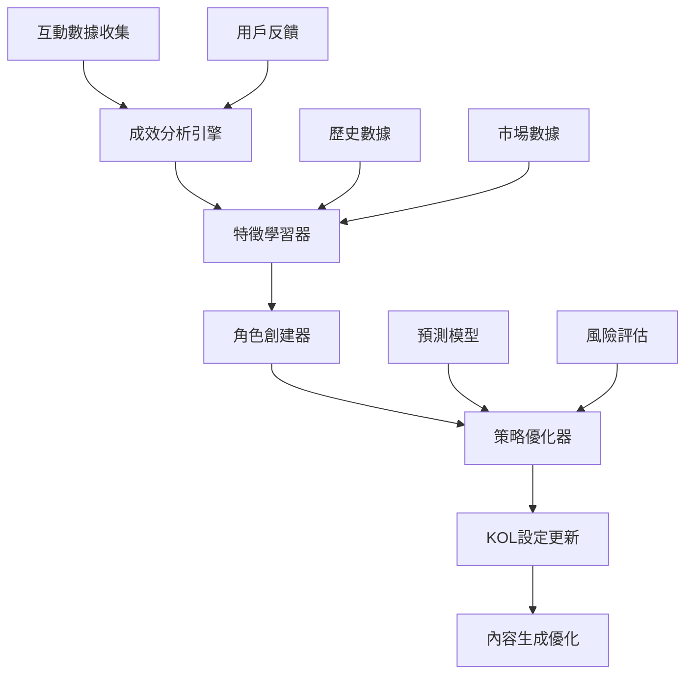
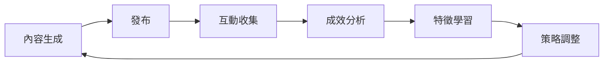

# 🧠 AI自我學習機制完整規劃

## 📋 概述

本規劃文件詳細說明虛擬KOL系統的智能自我學習機制，該機制能夠：
- **自動創建新KOL角色** - 基於互動成效分析
- **學習成功特徵** - 從高互動內容中提取模式
- **動態優化策略** - 實時調整KOL設定和內容生成
- **預測互動效果** - 提前預測內容表現和AI偵測風險

## 🎯 學習目標

### 主要目標
1. **提升互動率** - 從平均互動率提升至目標值
2. **降低AI偵測率** - 減少被識別為AI生成的內容
3. **增加內容多樣性** - 避免重複模式，提升真實感
4. **優化KOL分配** - 智能匹配KOL與題材類型

### 成功指標
- 互動率提升 30%+
- AI偵測率降低至 5% 以下
- KOL角色多樣性增加 50%+
- 內容生成速度提升 20%+

## 🏗️ 系統架構

### 核心組件



### 數據流程

1. **數據收集階段**
   - 實時收集互動數據 (1hr/1day/7days)
   - 分析內容特徵和用戶反應
   - 記錄AI偵測結果

2. **學習分析階段**
   - 識別高互動內容的共同特徵
   - 分析KOL個人化設定的效果
   - 檢測失敗模式和風險因素

3. **策略優化階段**
   - 生成新的KOL角色設定
   - 調整現有KOL的個人化參數
   - 優化內容生成策略

4. **實施驗證階段**
   - 部署新的KOL設定
   - 監控效果並收集反饋
   - 持續迭代優化

## 🔍 詳細功能設計

### 1. 自動角色創建器 (Auto Role Creator)

#### 功能描述
基於高互動內容分析，自動生成新的KOL角色設定

#### 核心算法
```python
class AutoRoleCreator:
    def create_new_kol_role(self, high_performance_data: List[Dict]) -> KOLRole:
        # 1. 分析高互動內容特徵
        content_features = self.analyze_content_patterns(high_performance_data)
        
        # 2. 提取成功元素
        success_elements = self.extract_success_elements(content_features)
        
        # 3. 生成新角色設定
        new_role = self.generate_role_configuration(success_elements)
        
        # 4. 驗證角色可行性
        validated_role = self.validate_role_feasibility(new_role)
        
        return validated_role
```

#### 學習維度
- **語氣風格** - 從高互動內容中學習語氣模式
- **詞彙選擇** - 識別有效的專業術語和口語表達
- **內容結構** - 學習成功的文章結構和段落安排
- **互動方式** - 分析有效的提問和引導方式
- **時間偏好** - 識別最佳發文時間和頻率

### 2. 特徵學習器 (Feature Learner)

#### 功能描述
深度分析互動數據，提取成功內容的特徵模式

#### 學習指標
```python
class FeatureLearner:
    def learn_content_features(self, interaction_data: List[Dict]) -> Dict[str, Any]:
        return {
            # 內容特徵
            'high_engagement_patterns': self.analyze_engagement_patterns(interaction_data),
            'successful_topics': self.identify_successful_topics(interaction_data),
            'effective_lengths': self.analyze_optimal_lengths(interaction_data),
            'winning_formats': self.identify_winning_formats(interaction_data),
            
            # KOL特徵
            'persona_effectiveness': self.analyze_persona_effectiveness(interaction_data),
            'tone_impact': self.analyze_tone_impact(interaction_data),
            'vocabulary_success': self.analyze_vocabulary_success(interaction_data),
            
            # 時機特徵
            'timing_patterns': self.analyze_timing_patterns(interaction_data),
            'frequency_optimization': self.analyze_frequency_optimization(interaction_data),
            
            # 風險特徵
            'ai_detection_patterns': self.analyze_ai_detection_patterns(interaction_data),
            'low_engagement_warning_signs': self.identify_warning_signs(interaction_data)
        }
```

#### 特徵類型

**📊 內容特徵**
- 標題長度和結構
- 段落數量和長度
- 表情符號使用模式
- 連結數量和位置
- 提問方式和頻率

**🎭 KOL特徵**
- 語氣強度和變化
- 專業術語使用頻率
- 口語化表達比例
- 個人化元素密度
- 情感表達方式

**⏰ 時機特徵**
- 發文時間分布
- 市場時機選擇
- 話題熱度匹配
- 競爭環境分析

**⚠️ 風險特徵**
- AI偵測敏感詞彙
- 過度格式化模式
- 重複性表達
- 缺乏個人特色

### 3. 策略優化器 (Strategy Optimizer)

#### 功能描述
基於學習結果，動態調整KOL策略和內容生成參數

#### 優化維度
```python
class StrategyOptimizer:
    def optimize_kol_strategy(self, kol_id: str, learning_insights: Dict) -> Dict[str, Any]:
        return {
            # 個人化設定優化
            'persona_adjustments': self.optimize_persona_settings(kol_id, learning_insights),
            'tone_calibration': self.calibrate_tone_settings(kol_id, learning_insights),
            'vocabulary_refinement': self.refine_vocabulary(kol_id, learning_insights),
            
            # 內容策略優化
            'content_type_weights': self.optimize_content_weights(kol_id, learning_insights),
            'length_preferences': self.optimize_length_preferences(kol_id, learning_insights),
            'interaction_style': self.optimize_interaction_style(kol_id, learning_insights),
            
            # 時機策略優化
            'timing_optimization': self.optimize_timing_strategy(kol_id, learning_insights),
            'frequency_adjustment': self.adjust_posting_frequency(kol_id, learning_insights),
            
            # 風險控制優化
            'ai_detection_prevention': self.enhance_ai_detection_prevention(kol_id, learning_insights),
            'quality_thresholds': self.adjust_quality_thresholds(kol_id, learning_insights)
        }
```

### 4. 預測模型 (Prediction Models)

#### 互動效果預測
```python
class EngagementPredictor:
    def predict_engagement(self, content_features: Dict, kol_settings: Dict) -> Dict[str, float]:
        return {
            'likes_probability': self.predict_likes(content_features, kol_settings),
            'comments_probability': self.predict_comments(content_features, kol_settings),
            'shares_probability': self.predict_shares(content_features, kol_settings),
            'overall_engagement_score': self.calculate_overall_score(content_features, kol_settings),
            'confidence_level': self.calculate_confidence(content_features, kol_settings)
        }
```

#### AI偵測風險預測
```python
class AIDetectionPredictor:
    def predict_ai_detection_risk(self, content: str, kol_settings: Dict) -> Dict[str, float]:
        return {
            'ai_detection_probability': self.calculate_ai_risk(content, kol_settings),
            'risk_factors': self.identify_risk_factors(content, kol_settings),
            'mitigation_suggestions': self.suggest_mitigations(content, kol_settings),
            'confidence_level': self.calculate_confidence(content, kol_settings)
        }
```

## 📈 學習流程設計

### 階段1: 數據收集與分析 (每小時執行)

```python
async def hourly_learning_cycle():
    # 1. 收集最新互動數據
    interaction_data = await collect_interaction_data()
    
    # 2. 分析互動成效
    performance_analysis = await analyze_performance(interaction_data)
    
    # 3. 識別異常和機會
    anomalies = await detect_anomalies(performance_analysis)
    opportunities = await identify_opportunities(performance_analysis)
    
    # 4. 更新即時策略
    await update_realtime_strategies(anomalies, opportunities)
```

### 階段2: 深度學習分析 (每日執行)

```python
async def daily_learning_cycle():
    # 1. 收集24小時完整數據
    daily_data = await collect_daily_data()
    
    # 2. 深度特徵分析
    feature_analysis = await deep_feature_analysis(daily_data)
    
    # 3. 模式識別
    patterns = await identify_patterns(feature_analysis)
    
    # 4. 生成學習洞察
    insights = await generate_learning_insights(patterns)
    
    # 5. 更新KOL策略
    await update_kol_strategies(insights)
```

### 階段3: 策略優化與驗證 (每週執行)

```python
async def weekly_learning_cycle():
    # 1. 收集週度數據
    weekly_data = await collect_weekly_data()
    
    # 2. 策略效果評估
    strategy_evaluation = await evaluate_strategy_effectiveness(weekly_data)
    
    # 3. 創建新KOL角色
    new_kol_roles = await create_new_kol_roles(strategy_evaluation)
    
    # 4. 優化現有KOL
    await optimize_existing_kols(strategy_evaluation)
    
    # 5. 訓練預測模型
    await train_prediction_models(weekly_data)
    
    # 6. 生成學習報告
    await generate_learning_report(strategy_evaluation)
```

## 🎨 KOL角色創建機制

### 自動角色生成流程

```python
class KOLRoleGenerator:
    def generate_new_kol_role(self, success_patterns: Dict) -> KOLRole:
        # 1. 分析成功模式
        persona_traits = self.extract_persona_traits(success_patterns)
        communication_style = self.extract_communication_style(success_patterns)
        content_preferences = self.extract_content_preferences(success_patterns)
        
        # 2. 生成角色設定
        new_role = KOLRole(
            nickname=self.generate_nickname(persona_traits),
            persona=self.generate_persona(persona_traits),
            prompt_template=self.generate_prompt_template(persona_traits, communication_style),
            tone_vector=self.generate_tone_vector(communication_style),
            content_preferences=content_preferences,
            vocabulary=self.generate_vocabulary(success_patterns),
            data_requirements=self.generate_data_requirements(content_preferences),
            typing_habits=self.generate_typing_habits(communication_style)
        )
        
        # 3. 驗證角色可行性
        validated_role = self.validate_role(new_role)
        
        return validated_role
```

### 角色特徵學習

**🎭 人格特質學習**
- 從高互動內容中提取人格特徵
- 分析語氣、用詞、表達方式
- 識別有效的個人化元素

**💬 溝通風格學習**
- 學習成功的開場方式
- 分析有效的提問技巧
- 識別受歡迎的結尾風格

**📝 內容偏好學習**
- 分析最受歡迎的內容長度
- 識別有效的段落結構
- 學習成功的話題選擇

## 🔄 持續優化機制

### 實時調整

```python
class RealtimeOptimizer:
    def optimize_content_generation(self, kol_id: str, topic: str) -> Dict[str, Any]:
        # 1. 獲取KOL當前設定
        current_settings = self.get_kol_settings(kol_id)
        
        # 2. 獲取最新學習洞察
        latest_insights = self.get_latest_insights(kol_id)
        
        # 3. 預測內容效果
        predicted_performance = self.predict_performance(topic, current_settings)
        
        # 4. 動態調整參數
        optimized_settings = self.dynamic_adjust(current_settings, latest_insights, predicted_performance)
        
        return optimized_settings
```

### 學習反饋循環



## 📊 監控與評估

### 關鍵指標監控

**📈 成效指標**
- 互動率變化趨勢
- AI偵測率變化趨勢
- KOL使用分布變化
- 內容品質評分變化

**🔍 學習指標**
- 新KOL創建數量
- 策略調整頻率
- 預測準確率
- 學習收斂速度

**⚠️ 風險指標**
- AI偵測風險等級
- 內容重複率
- 用戶反饋負面率
- 系統穩定性指標

### 學習報告生成

```python
class LearningReportGenerator:
    def generate_weekly_report(self) -> Dict[str, Any]:
        return {
            'performance_summary': self.generate_performance_summary(),
            'learning_insights': self.generate_learning_insights(),
            'new_kol_roles': self.generate_new_kol_summary(),
            'strategy_optimizations': self.generate_optimization_summary(),
            'risk_assessment': self.generate_risk_assessment(),
            'recommendations': self.generate_recommendations(),
            'next_week_focus': self.generate_next_week_focus()
        }
```

## 🚀 實施計劃

### 第一階段：基礎學習機制 (2週)
- 完善互動數據收集
- 實現基礎特徵學習
- 建立KOL策略調整機制

### 第二階段：智能角色創建 (2週)
- 實現自動KOL角色生成
- 建立角色驗證機制
- 整合角色創建到主流程

### 第三階段：預測模型 (2週)
- 實現互動效果預測
- 實現AI偵測風險預測
- 建立預測準確率監控

### 第四階段：持續優化 (持續)
- 實現實時策略調整
- 建立學習反饋循環
- 持續監控和優化

## 🎯 預期效果

### 短期效果 (1個月)
- 互動率提升 15-20%
- AI偵測率降低 10-15%
- KOL角色多樣性增加 30%

### 中期效果 (3個月)
- 互動率提升 25-30%
- AI偵測率降低至 8% 以下
- 自動創建 5-10 個新KOL角色
- 預測準確率達到 80%+

### 長期效果 (6個月)
- 互動率提升 30%+
- AI偵測率降低至 5% 以下
- 建立完整的學習生態系統
- 實現完全自動化的內容優化

## 🔧 技術實現要點

### 數據處理
- 實時數據流處理
- 大規模數據分析
- 特徵工程和模式識別

### 機器學習
- 監督學習模型訓練
- 無監督學習模式發現
- 強化學習策略優化

### 系統整合
- 與現有KOL系統整合
- Google Sheets數據同步
- 實時API調用優化

### 監控與維護
- 學習效果監控
- 系統性能監控
- 自動化測試和驗證

---

## 📝 總結

這個自我學習機制將使虛擬KOL系統能夠：

1. **自動進化** - 持續學習和改進內容生成策略
2. **智能創建** - 自動生成新的KOL角色和設定
3. **預測優化** - 提前預測和避免風險
4. **個性化提升** - 深度個人化每個KOL的特色
5. **持續監控** - 實時監控學習效果和系統健康

通過這個完整的學習機制，系統將能夠不斷提升內容品質，降低AI偵測風險，並創造更加真實和吸引人的虛擬KOL體驗。
