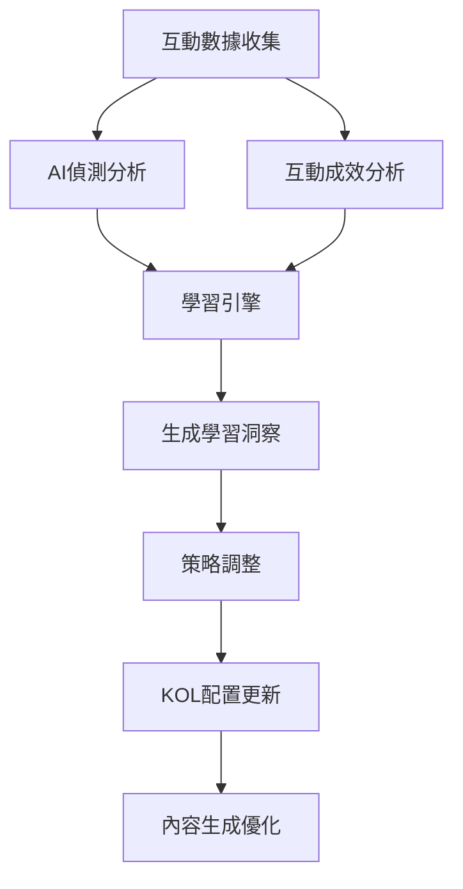
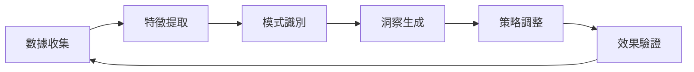

# 智能自我學習機制設計文件

## 🎯 概述

本文件詳細說明虛擬KOL系統的智能自我學習機制，該機制能夠自動分析互動成效、偵測AI生成內容被識別的風險，並動態調整KOL策略以提升內容品質和互動效果。

## 🏗️ 系統架構

### 核心組件

```
src/services/learning/
├── learning_engine.py          # 學習引擎核心
├── ai_detection_service.py     # AI偵測服務
├── engagement_analyzer.py      # 互動成效分析
└── strategy_optimizer.py       # 策略優化器
```

### 數據流程



## 🔍 主要功能模組

### 1. 學習引擎 (Learning Engine)

**核心職責：**
- 整合所有分析結果
- 生成學習洞察和建議
- 管理KOL策略配置
- 訓練預測模型

**主要功能：**
```python
class LearningEngine:
    async def analyze_interaction_effectiveness(self, interaction_data)
    async def generate_learning_insights(self, metrics)
    async def update_kol_strategies(self, insights)
    async def train_models(self, training_data)
    async def predict_engagement(self, content_features)
    async def predict_ai_detection(self, content_features)
```

**學習指標：**
- 互動分數 (Engagement Score)
- AI偵測分數 (AI Detection Score)
- 情感分數 (Sentiment Score)
- 留言品質分數 (Comment Quality Score)

### 2. AI偵測服務 (AI Detection Service)

**核心職責：**
- 分析內容是否被識別為AI生成
- 偵測留言中的AI相關信號
- 提供改進建議

**偵測維度：**

#### 語言模式分析
- 過於正式的語言結構
- 缺乏個人化表達
- 客觀性過強的表述

#### 結構模式分析
- 標題密度過高
- 列表結構過於規整
- 段落長度過於一致

#### 情感表達分析
- 缺乏情感詞彙
- 過多客觀描述
- 缺乏個人觀點

#### 人類特徵分析
- 個人化表達指標
- 隨意表達模式
- 打字習慣特徵
- 不完整思維表達

**AI偵測關鍵詞庫：**
```python
ai_keywords = [
    '人工智慧', 'AI', '機器人', 'bot', '自動生成',
    'chatgpt', 'gpt', 'claude', 'bard', 'copilot',
    '看起來像ai', '感覺是ai', 'ai生成', '機器寫的'
]
```

**人類特徵指標：**
```python
human_indicators = [
    '我覺得', '我認為', '我的看法', '個人覺得',
    '哈哈', '呵呵', '靠', '幹', '真的假的',
    '...', '!!!', 'XD', 'Orz'
]
```

### 3. 互動成效分析 (Engagement Analyzer)

**核心職責：**
- 分析內容互動表現
- 識別成功模式和改進機會
- 計算表現基準和趨勢

**分析維度：**

#### 基礎互動指標
- 互動率 (Engagement Rate)
- 留言率 (Comment Rate)
- 分享率 (Share Rate)
- 保存率 (Save Rate)

#### 品質指標
- 平均留言長度
- 正面情感比例
- 回覆率

#### 時間指標
- 最佳發文時段
- 互動衰減率
- 高峰時段分析

**表現基準：**
```python
industry_benchmarks = {
    'engagement_rate': 0.05,      # 5%
    'comment_rate': 0.01,         # 1%
    'share_rate': 0.005,          # 0.5%
    'save_rate': 0.002,           # 0.2%
    'avg_comment_length': 20,
    'positive_sentiment_ratio': 0.6,
    'reply_rate': 0.3
}
```

## 🧠 學習機制設計

### 1. 多層次學習架構

#### 即時學習 (Real-time Learning)
- 每次互動後立即分析
- 快速調整內容策略
- 即時風險預警

#### 短期學習 (Short-term Learning)
- 每日/每週數據分析
- 內容類型優化
- 時機調整

#### 長期學習 (Long-term Learning)
- 月度/季度趨勢分析
- 人格特質調整
- 策略深度優化

### 2. 學習循環 (Learning Loop)



### 3. 學習洞察類型

#### 內容優化洞察
- 識別高表現內容類型
- 分析內容特徵模式
- 提供內容策略建議

#### 人格調整洞察
- 分析AI偵測風險
- 識別人格表達問題
- 建議人格優化方向

#### 時機優化洞察
- 分析最佳發文時段
- 識別受眾活躍時間
- 優化發布策略

#### 受眾行為洞察
- 分析受眾互動模式
- 識別受眾偏好
- 優化受眾定位

## 📊 智能分析算法

### 1. 互動分數計算

```python
def calculate_engagement_score(data):
    likes = data.get('likes_count', 0)
    comments = data.get('comments_count', 0)
    shares = data.get('shares_count', 0)
    saves = data.get('saves_count', 0)
    views = max(data.get('views_count', 1), 1)
    
    # 加權計算
    engagement_score = (
        likes * 0.3 +
        comments * 0.4 +
        shares * 0.2 +
        saves * 0.1
    ) / views
    
    return min(engagement_score, 1.0)
```

### 2. AI偵測分數計算

```python
def calculate_ai_detection_score(content):
    score = 0.0
    
    # 語言模式分析 (30%)
    language_score = analyze_language_patterns(content)
    score += language_score * 0.3
    
    # 結構模式分析 (20%)
    structure_score = analyze_structure_patterns(content)
    score += structure_score * 0.2
    
    # 情感表達分析 (20%)
    emotion_score = analyze_emotion_patterns(content)
    score += emotion_score * 0.2
    
    # 人類特徵分析 (30%)
    human_score = analyze_human_patterns(content)
    score -= human_score * 0.3  # 人類特徵降低AI分數
    
    return max(0, min(1, score))
```

### 3. 機器學習模型

#### 互動預測模型
- 使用隨機森林回歸
- 特徵：內容長度、圖片、標籤、發文時間、話題熱度
- 目標：預測互動潛力

#### AI偵測模型
- 使用隨機森林回歸
- 特徵：語言模式、結構特徵、情感指標
- 目標：預測AI偵測風險

## 🎯 策略調整機制

### 1. 內容類型權重調整

```python
def update_content_weights(strategy, insight):
    if "增加" in insight.recommended_action:
        increase_type = extract_content_type(insight.recommended_action)
        if increase_type not in strategy.content_type_weights:
            strategy.content_type_weights[increase_type] = 0.5
        strategy.content_type_weights[increase_type] += 0.1
```

### 2. 人格特質調整

```python
def update_persona_adjustments(strategy, insight):
    if "個人化元素" in insight.recommended_action:
        strategy.persona_adjustments['personalization'] += 0.1
    
    if "情感表達" in insight.recommended_action:
        strategy.persona_adjustments['emotion'] += 0.1
```

### 3. 時機偏好調整

```python
def update_timing_preferences(strategy, insight):
    if "最佳發文時段" in insight.description:
        best_hour = extract_hour(insight.description)
        strategy.timing_preferences['optimal_hour'] = best_hour
```

## 📈 可擴展性設計

### 1. 模組化架構

- **獨立服務**：每個分析模組可獨立部署和擴展
- **插件機制**：支援新增分析維度和算法
- **配置驅動**：通過配置文件調整分析參數

### 2. 水平擴展

- **數據分片**：按KOL或時間分片處理數據
- **並行處理**：多進程/多線程並行分析
- **緩存機制**：Redis緩存分析結果

### 3. 垂直擴展

- **GPU加速**：使用GPU加速機器學習模型
- **分布式計算**：使用Spark等分布式框架
- **雲端部署**：支援雲端自動擴展

## 🔧 實施步驟

### 階段一：基礎架構 (1-2週)
1. 建立學習引擎核心框架
2. 實作基礎數據收集和分析
3. 建立簡單的AI偵測機制

### 階段二：智能分析 (2-3週)
1. 完善AI偵測算法
2. 實作互動成效分析
3. 建立機器學習模型

### 階段三：策略優化 (2-3週)
1. 實作策略調整機制
2. 建立學習洞察生成
3. 整合到內容生成流程

### 階段四：優化擴展 (持續)
1. 模型持續訓練和優化
2. 新增分析維度
3. 性能優化和擴展

## 📊 監控和評估

### 1. 關鍵指標 (KPIs)

#### 學習效果指標
- 學習洞察準確率
- 策略調整成功率
- 預測模型準確度

#### 業務效果指標
- 平均互動率提升
- AI偵測風險降低
- 內容品質改善

#### 系統性能指標
- 分析處理時間
- 系統可用性
- 資源使用率

### 2. 監控儀表板

```python
def get_learning_dashboard():
    return {
        'learning_summary': {
            'total_insights': len(learning_history),
            'active_kols': len(kol_strategies),
            'model_accuracy': calculate_model_accuracy()
        },
        'performance_metrics': {
            'avg_engagement_improvement': calculate_improvement(),
            'ai_detection_risk_reduction': calculate_risk_reduction(),
            'content_quality_score': calculate_quality_score()
        },
        'system_health': {
            'processing_time': get_avg_processing_time(),
            'error_rate': get_error_rate(),
            'resource_usage': get_resource_usage()
        }
    }
```

## 🚀 未來發展方向

### 1. 深度學習整合
- 使用Transformer模型進行文本分析
- 實作深度強化學習策略優化
- 整合多模態分析（文字+圖片+影片）

### 2. 實時學習
- 流式數據處理
- 實時模型更新
- 即時策略調整

### 3. 跨平台學習
- 多平台數據整合
- 跨平台策略同步
- 統一學習模型

### 4. 個性化學習
- 用戶個性化分析
- 個性化內容推薦
- 個性化互動策略

## 📝 總結

智能自我學習機制是虛擬KOL系統的核心競爭力，通過持續的數據分析、模式識別和策略優化，能夠：

1. **自動識別問題**：快速發現AI偵測風險和互動問題
2. **智能生成洞察**：提供具體可執行的改進建議
3. **動態調整策略**：根據學習結果自動優化KOL配置
4. **持續改進效果**：通過反饋循環不斷提升系統表現

該機制設計充分考慮了可擴展性、可維護性和實用性，能夠隨著系統發展和數據積累不斷進化和優化。

