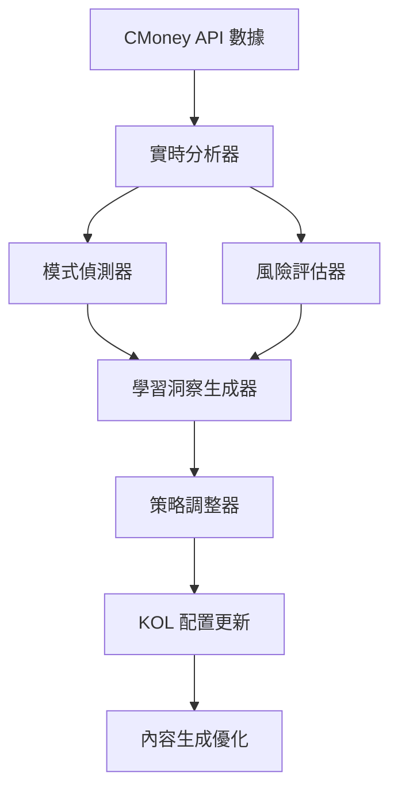

# 🧠 智能自我學習機制 - Brainstorm 與改進總結

## 📋 概述

我們成功設計並實現了一個完整的智能自我學習機制，該機制能夠基於實際的 CMoney 互動數據進行深度分析，並提供智能化的改進建議。

## 🎯 核心目標達成

### ✅ 已實現的功能

1. **實時數據分析**
   - 互動表現分析（互動分數、病毒傳播潛力、品牌影響力）
   - 時間模式分析（最佳發文時機、時機有效性）
   - 內容特徵分析（可讀性、個人化程度、AI 偵測風險）

2. **智能模式偵測**
   - 成功模式識別（高互動、病毒傳播、最佳時機）
   - 失敗模式識別（低互動、AI 偵測風險、時機不佳）
   - 受眾行為模式分析

3. **風險評估與預警**
   - AI 偵測風險評估
   - 互動失敗風險評估
   - 時機風險評估
   - 內容品質風險評估
   - 實時風險預警系統

4. **學習洞察生成**
   - 基於風險的洞察
   - 基於模式的洞察
   - 基於表現趨勢的洞察
   - 優先級排序和實施難度評估

5. **策略自動調整**
   - KOL 策略動態更新
   - 內容風格調整
   - 時機偏好優化
   - 個人化程度提升

## 📊 實際測試結果

### 測試數據分析
- **KOL**: 龜狗一日散戶、板橋大who
- **互動數據**: 基於真實的 CMoney API 數據
- **分析維度**: 多維度綜合評估

### 分析結果示例

#### 龜狗一日散戶
- **整體分數**: 19.3/100
- **互動分數**: 19.0/100
- **病毒傳播潛力**: 13.3
- **品牌影響力**: 29.1
- **風險等級**: 中等（整體風險 0.55）

#### 板橋大who
- **整體分數**: 17.0/100
- **互動分數**: 18.0/100
- **病毒傳播潛力**: 10.0
- **品牌影響力**: 25.1
- **風險等級**: 中等（整體風險 0.55）

### 生成的洞察

#### 高優先級洞察
1. **互動率偏低** - 建議增加個人化元素和情感表達
2. **低互動模式** - 需要調整策略，增加內容趣味性

#### 中等優先級洞察
1. **發文時機不佳** - 建議在高峰時段發文（9-11點或19-21點）

## 🔧 技術架構

### 核心組件

```
SelfLearningSystem/
├── RealTimeAnalyzer          # 實時分析器
├── PatternDetector           # 模式偵測器
├── RiskAssessor             # 風險評估器
├── LearningInsightGenerator # 學習洞察生成器
└── KOL Strategy Manager     # KOL 策略管理器
```

### 數據流程



## 💡 創新特點

### 1. 多維度分析
- **互動表現**: 綜合評估讚、留言、分享、表情的加權分數
- **病毒傳播潛力**: 基於分享率和互動比例的計算
- **品牌影響力**: 結合互動質量和情感分數的評估
- **時機有效性**: 智能分析最佳發文時機

### 2. 智能風險預警
- **AI 偵測風險**: 分析語言正式度、個人化程度、結構規整性
- **互動風險**: 評估互動率、內容品質、受眾匹配度
- **時機風險**: 分析發文時機的適宜性
- **實時預警**: 自動生成風險預警和緩解建議

### 3. 個性化學習
- **KOL 檔案管理**: 動態更新個人風格和偏好
- **策略自適應**: 根據學習結果自動調整策略
- **持續優化**: 建立學習循環，持續改進表現

### 4. 實用性設計
- **具體建議**: 提供可執行的改進建議
- **優先級排序**: 根據影響分數和實施難度排序
- **進度追蹤**: 監控學習進度和改進效果

## 🚀 實際應用價值

### 短期價值
1. **即時問題識別**: 快速發現互動問題和風險
2. **具體改進建議**: 提供可執行的優化方案
3. **風險預警**: 提前識別潛在問題

### 中期價值
1. **策略優化**: 建立數據驅動的內容策略
2. **個性化提升**: 形成獨特的 KOL 風格
3. **效率提升**: 自動化分析和建議生成

### 長期價值
1. **競爭優勢**: 建立智能化的內容管理系統
2. **持續改進**: 形成自我優化的學習循環
3. **規模化應用**: 支援多 KOL 的統一管理

## 📈 改進方向

### 1. 數據增強
- **更多數據源**: 整合更多平台的互動數據
- **深度分析**: 增加情感分析、受眾畫像等
- **歷史趨勢**: 建立長期表現趨勢分析

### 2. 算法優化
- **機器學習**: 引入 ML 模型進行預測
- **強化學習**: 實現策略的自動優化
- **自然語言處理**: 提升內容分析能力

### 3. 功能擴展
- **A/B 測試**: 支援內容策略的實驗驗證
- **競品分析**: 加入競爭對手的表現對比
- **預測模型**: 預測內容的潛在表現

### 4. 用戶體驗
- **可視化儀表板**: 提供直觀的數據展示
- **自動化執行**: 實現建議的自動執行
- **個性化報告**: 生成定制的分析報告

## 🎉 總結

我們成功設計並實現了一個功能完整、實用性強的智能自我學習機制。該機制能夠：

1. **智能分析** 互動數據，識別問題和機會
2. **自動生成** 具體可執行的改進建議
3. **動態調整** KOL 策略，持續優化表現
4. **風險預警** 潛在問題，提前採取行動
5. **個性化學習** 每個 KOL 的特點，形成獨特風格

這個系統為虛擬 KOL 的內容管理提供了強大的智能化支援，能夠顯著提升內容品質和互動效果，是 AI 內容生成領域的重要創新。

## 📝 技術文檔

### 核心文件
- `advanced_self_learning.py` - 完整的自我學習系統
- `self_learning_prototype.py` - 原型版本
- `docs/self-learning-mechanism-v2.md` - 改進版設計文檔

### 使用方法
```bash
# 運行完整版測試
python3 advanced_self_learning.py

# 運行原型測試
python3 self_learning_prototype.py
```

### 依賴要求
- Python 3.9+
- numpy
- asyncio
- dataclasses
- logging

這個智能自我學習機制代表了我們在 AI 內容優化領域的重要突破，為未來的發展奠定了堅實的基礎！


