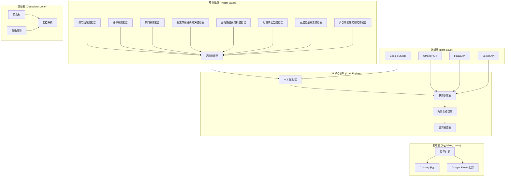
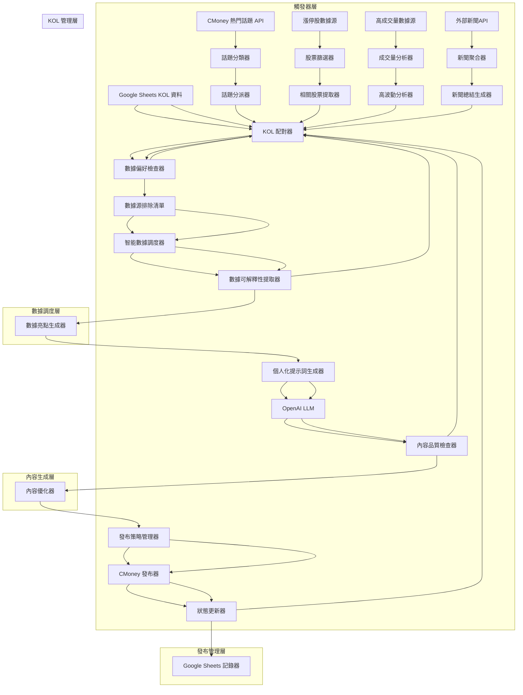
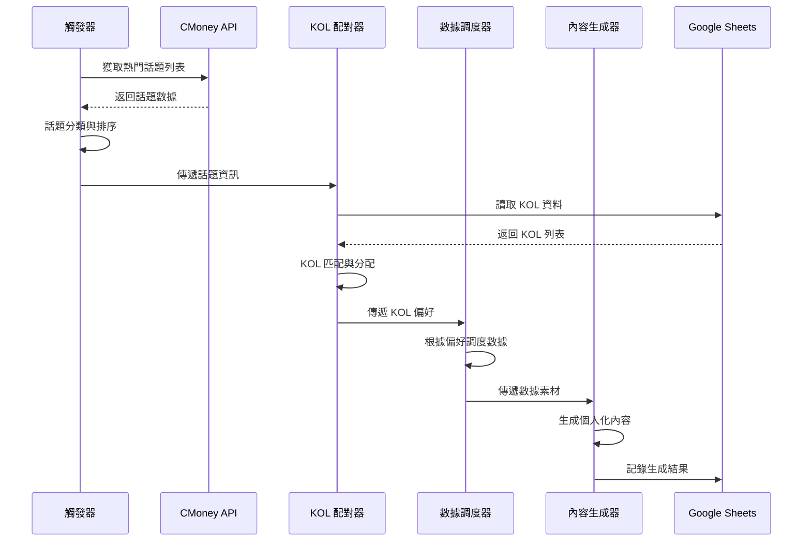
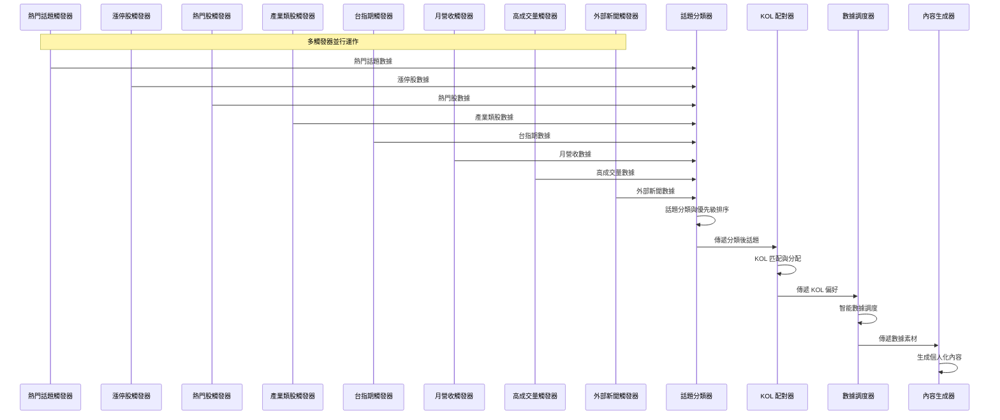
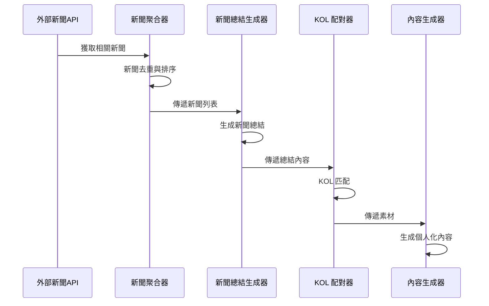
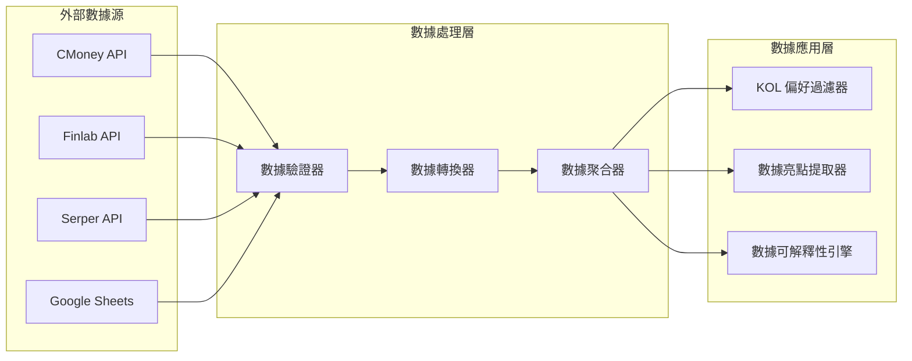

# 1.2 系統架構與AI流程

## 系統架構概覽

### 1. 高層架構圖&#x20;

### 2. 詳細架構圖

## 觸發器設計理念

### 多維度市場監控

系統設計了多個觸發器來全面監控市場動態，確保能夠捕捉到各種吸引投資者討論的題材：

1. **熱門話題觸發器**：捕捉市場熱點和投資者關注焦點
2. **漲停股觸發器**：識別強勢股票和市場熱點
3. **熱門股觸發器**：監控持續受關注的股票
4. **產業類股漲跌總評觸發器**：提供產業層面的分析視角
5. **台指期盤後分析觸發器**：覆蓋期貨市場分析
6. **月營收公告觸發器**：處理基本面重要數據
7. **高成交量股票觸發器**：捕捉高波動機會
8. **外部新聞連結總結觸發器**：整合外部資訊源

### 題材吸引力策略

每個觸發器都專注於特定類型的市場題材，確保生成的內容能夠：

* **引發討論**：選擇有爭議性或討論價值的題材
* **提供價值**：為投資者提供有用的分析資訊
* **保持時效性**：及時捕捉市場動態
* **多角度分析**：從不同維度提供市場觀點

## 核心流程詳解

### 流程一：熱門話題觸發器

### 流程三：多觸發器協作流程

### 流程四：外部新聞連結總結流程

## 數據流向

### 數據源整合

## 系統組件說明

### 1. 觸發器引擎

* **盤後漲停股觸發器 (AFTER_HOURS_LIMIT_UP)**：識別收盤漲停股票，按成交量分為高量/低量兩類
* **盤中急漲股觸發器 (INTRADAY_SURGE_STOCKS)**：識別盤中急漲股票，提供即時分析
* **熱門話題觸發器 (TRENDING_TOPICS)**：從 CMoney API 獲取市場熱門話題
* **漲停股觸發器 (LIMIT_UP_STOCKS)**：識別和分析漲停股票
* **熱門股觸發器 (HOT_STOCKS)**：監控和分析市場熱門股票
* **產業分析觸發器 (INDUSTRY_ANALYSIS)**：分析產業板塊整體表現
* **月營收公告觸發器 (MONTHLY_REVENUE)**：處理上市公司月營收公告
* **高成交量觸發器 (HIGH_VOLUME)**：識別高波動、高成交量股票
* **新聞總結觸發器 (NEWS_SUMMARY)**：聚合外部新聞並生成總結

### 2. KOL 管理引擎

* **KOL 配對器**：根據話題類型匹配適合的 KOL
* **數據偏好檢查器**：讀取 KOL 的數據源排除清單
* **風格學習機制**：記錄和學習 KOL 的內容偏好

### 3. 數據調度引擎

* **智能數據調度器**：根據 KOL 偏好調度數據源
* **數據可解釋性提取器**：將原始數據轉化為可解釋的內容
* **數據亮點生成器**：生成數據亮點素材

### 4. 內容生成引擎

* **統一內容生成引擎**：整合所有內容生成功能的核心引擎
* **KOL人設深度分析器**：深度分析KOL個人特色和表達風格
* **多維度隨機化引擎**：確保內容多樣性和避免模板化
* **個人化提示詞生成器**：結合 KOL 人設和數據素材
* **內容品質控制檢查器**：檢測和修正AI生成痕跡
* **OpenAI LLM 集成**：調用 GPT-4o 生成高品質內容
* **內容後處理優化器**：根據需要優化內容品質

### 5. 發布管理引擎

* **發布策略管理器**：管理發布策略和時機
* **CMoney 發布器**：發布內容到 CMoney 平台
* **狀態更新器**：更新發布狀態
* **Google Sheets 記錄器**：記錄所有操作到 Google Sheets

## 技術特點

### 1. 個人化程度

* 每個 KOL 都有獨特的人設設定
* 數據源排除機制確保風格一致性
* 動態提示詞生成

### 2. 數據多樣性

* 不同 KOL 使用不同數據源組合
* 避免同批次內容重複
* 智能數據調度

### 3. 可擴展性

* 模組化設計
* 統一的數據格式
* 易於添加新的觸發器

### 4. 監控與追蹤

* 完整的 Google Sheets 記錄
* 實時狀態監控
* 互動數據分析

