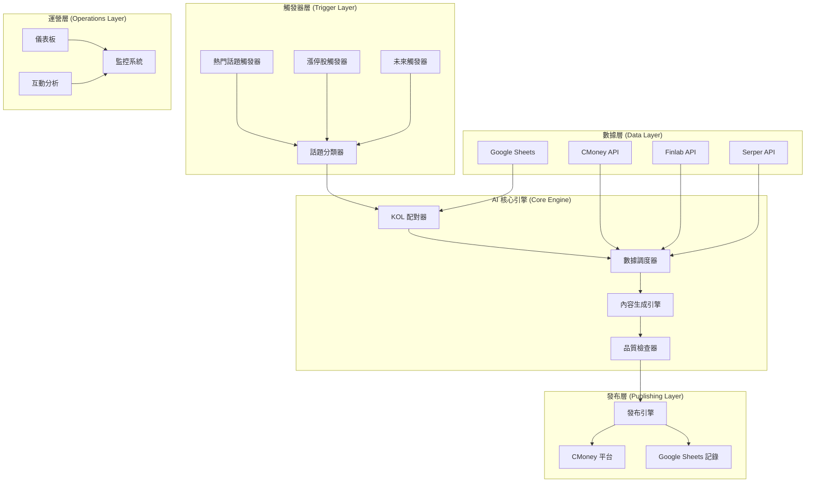
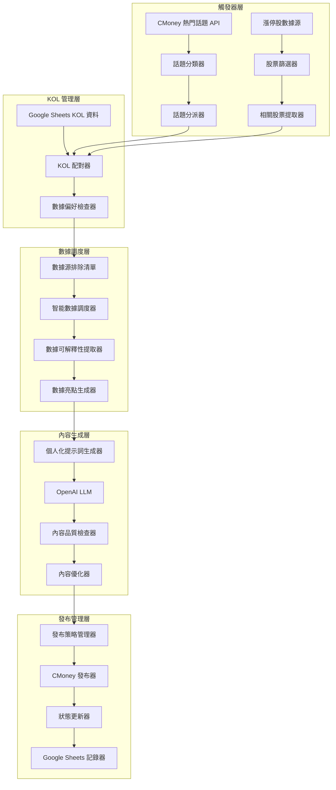
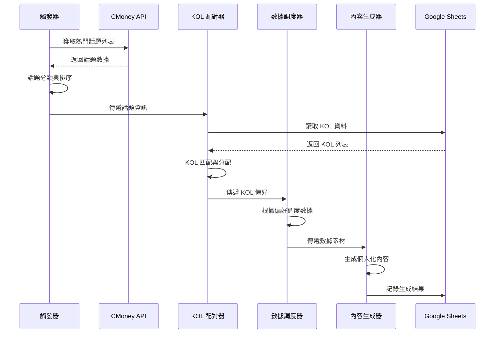
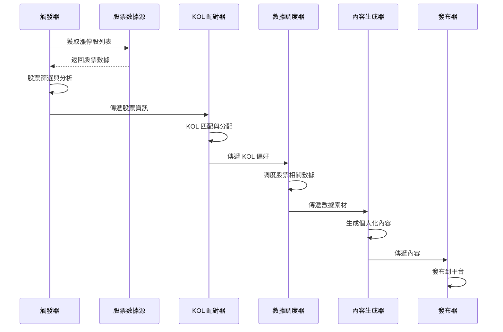
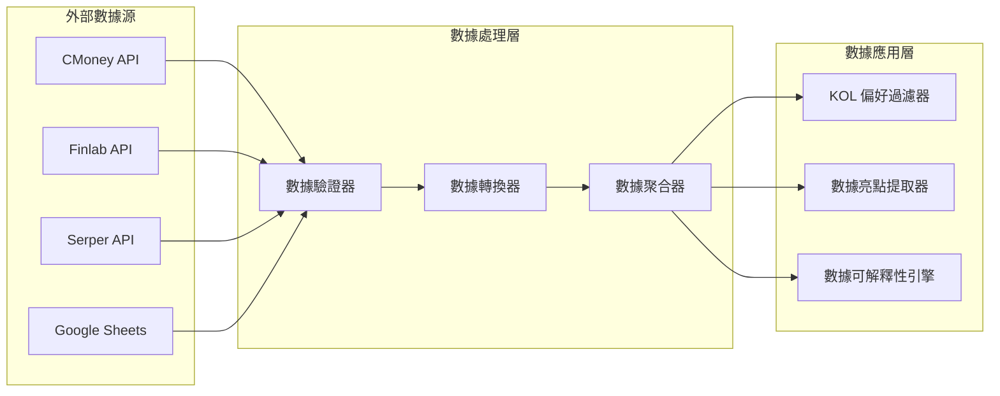

# 系統架構與AI流程

## 系統架構概覽

### 1. 高層架構圖 (適合簡報)

### 2. 詳細架構圖

## 核心流程詳解

### 流程一：熱門話題觸發器

### 流程二：漲停股觸發器

## 數據流向

### 數據源整合

## 系統組件說明

### 1. 觸發器引擎
- **熱門話題觸發器**：從 CMoney API 獲取市場熱門話題
- **漲停股觸發器**：識別和分析漲停股票
- **話題分類器**：自動分類話題類型
- **話題分派器**：根據熱度和類型分配話題

### 2. KOL 管理引擎
- **KOL 配對器**：根據話題類型匹配適合的 KOL
- **數據偏好檢查器**：讀取 KOL 的數據源排除清單
- **風格學習機制**：記錄和學習 KOL 的內容偏好

### 3. 數據調度引擎
- **智能數據調度器**：根據 KOL 偏好調度數據源
- **數據可解釋性提取器**：將原始數據轉化為可解釋的內容
- **數據亮點生成器**：生成數據亮點素材

### 4. 內容生成引擎
- **個人化提示詞生成器**：結合 KOL 人設和數據素材
- **OpenAI LLM 集成**：調用 GPT-3.5 生成內容
- **內容品質檢查器**：檢查生成內容的品質
- **內容優化器**：根據需要優化內容

### 5. 發布管理引擎
- **發布策略管理器**：管理發布策略和時機
- **CMoney 發布器**：發布內容到 CMoney 平台
- **狀態更新器**：更新發布狀態
- **Google Sheets 記錄器**：記錄所有操作到 Google Sheets

## 技術特點

### 1. 個人化程度
- 每個 KOL 都有獨特的人設設定
- 數據源排除機制確保風格一致性
- 動態提示詞生成

### 2. 數據多樣性
- 不同 KOL 使用不同數據源組合
- 避免同批次內容重複
- 智能數據調度

### 3. 可擴展性
- 模組化設計
- 統一的數據格式
- 易於添加新的觸發器

### 4. 監控與追蹤
- 完整的 Google Sheets 記錄
- 實時狀態監控
- 互動數據分析

## 未來優化方向

### 短期優化 (1-2個月)
1. **內容評分系統**：建立內容品質評分機制
2. **A/B 測試**：實現內容效果對比測試
3. **風險檢測**：添加內容合規檢查

### 中期優化 (3-6個月)
1. **動態學習**：KOL 偏好自動更新
2. **智能發布時機**：預測最佳發布時間
3. **數據洞察**：深度數據分析引擎

### 長期優化 (6個月+)
1. **完全自主**：系統自主決策內容策略
2. **跨平台擴展**：支持多個發布平台
3. **預測性生成**：預測熱門話題並提前生成內容
