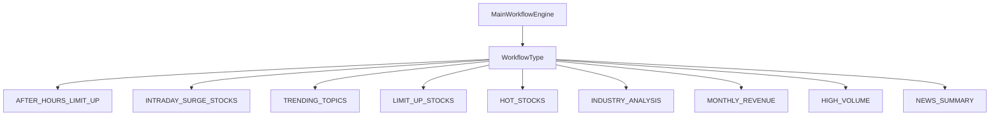
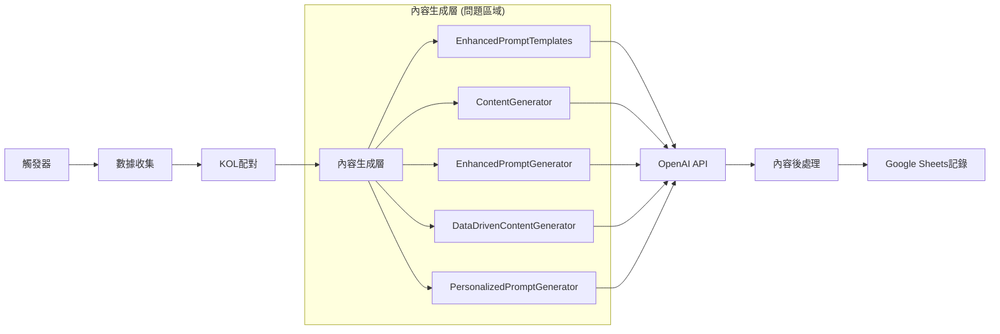
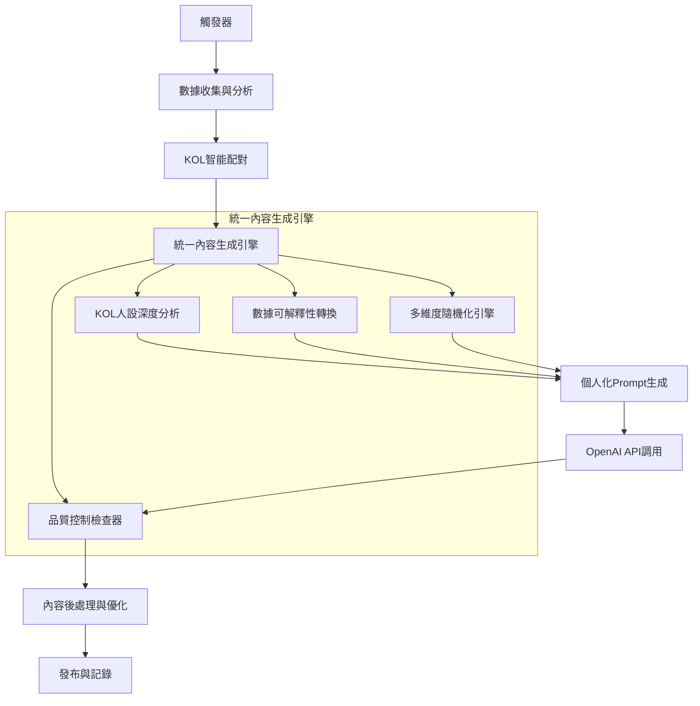

# 主流程架構與內容生成系統分析

## 🏗️ 當前系統架構

### 觸發器系統 (MainWorkflowEngine)



### 數據源整合

| 數據源 | 用途 | 狀態 |
|--------|------|------|
| **Finlab API** | 股價、成交量、成交金額 | ✅ 已整合 |
| **Serper API** | 新聞搜尋、漲停原因分析 | ✅ 已整合 |
| **CMoney API** | 熱門話題、文章發布 | ✅ 已整合 |
| **Google Sheets** | KOL設定、貼文記錄 | ✅ 已整合 |
| **OpenAI API** | 內容生成 | ✅ 已整合 |

### 內容生成模組架構



## 🚨 核心問題分析

### 1. **Batch Create AI味問題**

**問題根源：**
- **多生成器並存**：5個不同的內容生成器同時存在，缺乏統一標準
- **個人化不足**：KOL特色不夠突出，內容同質化嚴重
- **隨機化機制不完善**：缺乏真正的內容多樣性控制
- **品質控制缺失**：新腳本容易繞過現有的優化機制

**具體表現：**
- 內容結構過於相似
- 語氣風格缺乏個人特色
- 缺乏真正的隨機性和多樣性
- 標題和內容模板化嚴重

### 2. **架構複雜性問題**

- **重複功能**：多個生成器有重疊功能
- **維護困難**：修改需要同時更新多個模組
- **品質不一致**：不同生成器產出品質差異大
- **新腳本繞過**：容易創建新的生成邏輯，忽略現有優化

## 🎯 改進方案

### 1. **統一內容生成架構**



### 2. **核心改進策略**

#### A. **深度個人化系統**
- **KOL人設深度挖掘**：不只是基本設定，要包含：
  - 個人投資經歷和故事
  - 獨特的表達習慣和用詞
  - 專業領域的深度知識
  - 情緒表達和互動風格

#### B. **多維度隨機化引擎**
- **內容結構隨機化**：避免固定的開頭-中間-結尾結構
- **表達方式隨機化**：同一觀點用不同方式表達
- **互動元素隨機化**：隨機插入個人化互動元素
- **時間線隨機化**：模擬不同時間點的發文風格

#### C. **品質控制檢查器**
- **AI味檢測**：自動檢測並修正AI生成痕跡
- **個人化程度評估**：確保內容符合KOL特色
- **多樣性檢查**：避免內容重複和模板化
- **互動性評估**：確保內容有足夠的互動元素

### 3. **實施步驟**

#### 階段一：架構統一 (1-2週)
1. 創建統一的內容生成引擎
2. 整合現有的5個生成器功能
3. 建立統一的品質控制標準

#### 階段二：深度個人化 (2-3週)
1. 擴展KOL人設數據庫
2. 實現深度個人化算法
3. 建立個人化效果評估機制

#### 階段三：多樣性優化 (1-2週)
1. 實現多維度隨機化引擎
2. 建立內容多樣性檢查機制
3. 優化批量生成的多樣性

#### 階段四：品質控制 (1週)
1. 實現AI味檢測和修正
2. 建立內容品質評分系統
3. 建立持續優化機制

## 📋 具體技術改進

### 1. **統一內容生成引擎設計**

```python
class UnifiedContentGenerator:
    """統一內容生成引擎"""
    
    def __init__(self):
        self.kol_analyzer = KOLPersonaAnalyzer()
        self.randomization_engine = MultiDimensionalRandomizer()
        self.quality_controller = ContentQualityController()
        self.personalization_engine = DeepPersonalizationEngine()
    
    async def generate_content(self, trigger_data, kol_profile, market_data):
        # 1. 深度KOL分析
        kol_insights = await self.kol_analyzer.analyze_kol(kol_profile)
        
        # 2. 多維度隨機化
        randomization_params = self.randomization_engine.generate_params()
        
        # 3. 個人化內容生成
        content = await self.personalization_engine.generate(
            trigger_data, kol_insights, market_data, randomization_params
        )
        
        # 4. 品質控制
        optimized_content = await self.quality_controller.optimize(content)
        
        return optimized_content
```

### 2. **KOL人設深度分析器**

```python
class KOLPersonaAnalyzer:
    """KOL人設深度分析器"""
    
    def analyze_kol(self, kol_profile):
        return {
            'personality_traits': self.extract_personality_traits(kol_profile),
            'communication_style': self.analyze_communication_style(kol_profile),
            'expertise_areas': self.identify_expertise_areas(kol_profile),
            'unique_expressions': self.extract_unique_expressions(kol_profile),
            'interaction_patterns': self.analyze_interaction_patterns(kol_profile),
            'emotional_range': self.analyze_emotional_range(kol_profile)
        }
```

### 3. **多維度隨機化引擎**

```python
class MultiDimensionalRandomizer:
    """多維度隨機化引擎"""
    
    def generate_params(self):
        return {
            'content_structure': self.randomize_structure(),
            'expression_style': self.randomize_expression(),
            'interaction_elements': self.randomize_interactions(),
            'timeline_context': self.randomize_timeline(),
            'emotional_tone': self.randomize_emotion(),
            'technical_depth': self.randomize_technical_level()
        }
```

## 🎯 預期效果

### 1. **內容品質提升**
- 消除AI味，內容更自然
- 個人化程度大幅提升
- 內容多樣性顯著改善

### 2. **系統維護性改善**
- 統一的架構，易於維護
- 清晰的模組分工
- 標準化的品質控制

### 3. **批量生成優化**
- 每篇內容都有獨特特色
- 避免模板化和重複
- 保持高品質標準

## 📝 下一步行動

1. **立即行動**：創建統一內容生成引擎原型
2. **短期目標**：整合現有生成器功能
3. **中期目標**：實現深度個人化系統
4. **長期目標**：建立持續學習和優化機制


