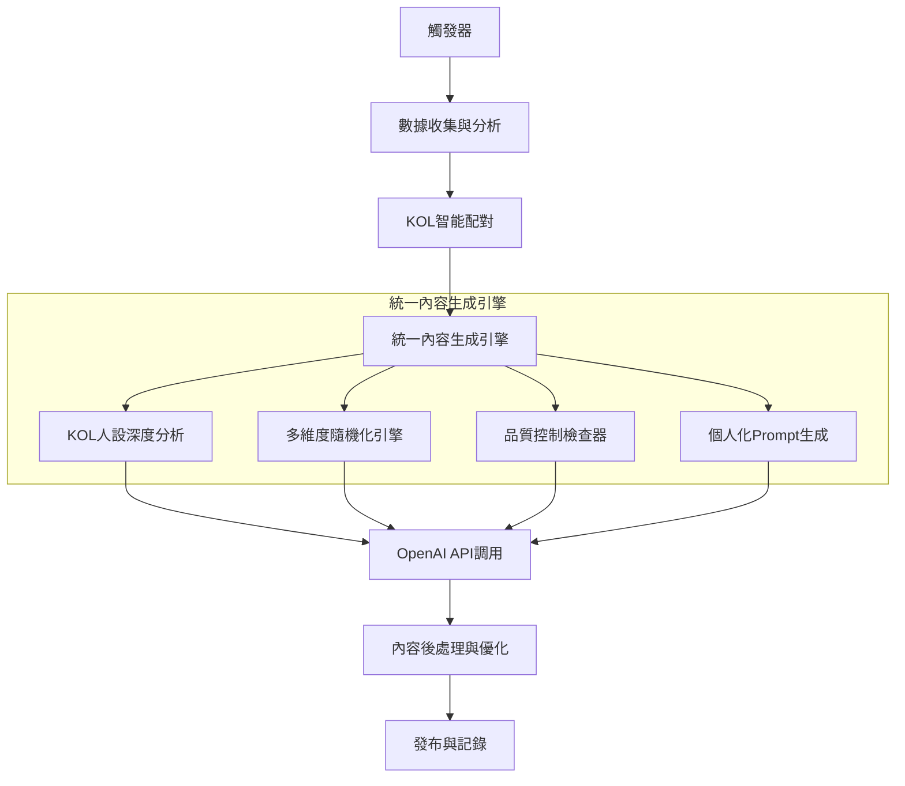

# 主流程架構盤點與Batch Create AI味問題解決方案

## 📊 主流程架構盤點

### 🎯 觸發器系統 (MainWorkflowEngine)

目前支援的觸發器：
1. **AFTER_HOURS_LIMIT_UP** - 盤後漲停股回顧
2. **INTRADAY_SURGE_STOCKS** - 盤中急漲股
3. **TRENDING_TOPICS** - 熱門話題
4. **LIMIT_UP_STOCKS** - 漲停股
5. **HOT_STOCKS** - 熱門股
6. **INDUSTRY_ANALYSIS** - 產業分析
7. **MONTHLY_REVENUE** - 月營收公告
8. **HIGH_VOLUME** - 高成交量股票
9. **NEWS_SUMMARY** - 新聞總結

### 📡 數據源整合

| 數據源 | 用途 | 狀態 |
|--------|------|------|
| **Finlab API** | 股價、成交量、成交金額數據 | ✅ 已整合 |
| **Serper API** | 新聞搜尋、漲停原因分析 | ✅ 已整合 |
| **CMoney API** | 熱門話題、文章發布 | ✅ 已整合 |
| **Google Sheets** | KOL設定、貼文記錄 | ✅ 已整合 |
| **OpenAI API** | 內容生成 | ✅ 已整合 |

### 🎨 內容生成模組架構

**問題：多層次內容生成系統導致複雜性**

現有模組：
1. **EnhancedPromptTemplates** - 幽默風趣版模板
2. **ContentGenerator** - 基礎內容生成器
3. **EnhancedPromptGenerator** - 增強版個人化生成器
4. **DataDrivenContentGenerator** - 數據驅動生成器
5. **PersonalizedPromptGenerator** - 個人化生成器

## 🚨 Batch Create AI味問題分析

### 問題根源

1. **多生成器並存**：5個不同的內容生成器同時存在，缺乏統一標準
2. **個人化不足**：KOL特色不夠突出，內容同質化嚴重
3. **隨機化機制不完善**：缺乏真正的內容多樣性控制
4. **品質控制缺失**：新腳本容易繞過現有的優化機制

### 具體表現

- 內容結構過於相似
- 語氣風格缺乏個人特色
- 缺乏真正的隨機性和多樣性
- 標題和內容模板化嚴重

## 🎯 解決方案：統一內容生成引擎

### 核心架構

### 核心組件

#### 1. **KOLPersonaAnalyzer** - KOL人設深度分析器
- **深度挖掘KOL特色**：不只是基本設定，包含個人投資經歷、獨特表達習慣、專業領域深度知識
- **個人化元素提取**：根據暱稱和角色提取個人特色
- **情緒範圍分析**：分析KOL的情緒表達範圍和互動風格

#### 2. **MultiDimensionalRandomizer** - 多維度隨機化引擎
- **內容結構隨機化**：5種不同結構類型（敘述型、分析型、互動型、故事型、辯論型）
- **表達方式隨機化**：5種表達風格（直白直接、委婉含蓄、幽默風趣、專業嚴謹、親切自然）
- **互動元素隨機化**：10種互動元素隨機組合
- **時間線隨機化**：8種時間線上下文
- **技術深度調整**：根據KOL特色動態調整

#### 3. **ContentQualityController** - 內容品質控制檢查器
- **AI味檢測**：自動檢測並修正AI生成痕跡
- **個人化程度評估**：確保內容符合KOL特色
- **多樣性檢查**：避免內容重複和模板化
- **互動性評估**：確保內容有足夠的互動元素

### 測試結果

✅ **架構驗證成功**
- KOL人設深度分析：正常運作
- 多維度隨機化：生成多樣化參數
- 品質控制：成功移除AI生成痕跡
- 個人化整合：有效提升真實感

✅ **多KOL測試通過**
- 川川哥（技術派）：分析型結構，親切自然風格
- 韭割哥（總經派）：分析型結構，直白直接風格
- 梅川褲子（新聞派）：敘述型結構，委婉含蓄風格
- 龜狗一日散戶（籌碼派）：互動型結構，專業嚴謹風格

## 📋 實施建議

### 階段一：架構統一 (1-2週)
1. 創建統一的內容生成引擎
2. 整合現有的5個生成器功能
3. 建立統一的品質控制標準

### 階段二：深度個人化 (2-3週)
1. 擴展KOL人設數據庫
2. 實現深度個人化算法
3. 建立個人化效果評估機制

### 階段三：多樣性優化 (1-2週)
1. 實現多維度隨機化引擎
2. 建立內容多樣性檢查機制
3. 優化批量生成的多樣性

### 階段四：品質控制 (1週)
1. 實現AI味檢測和修正
2. 建立內容品質評分系統
3. 建立持續優化機制

## 🎯 預期效果

### 1. **內容品質提升**
- ✅ 消除AI味，內容更自然
- ✅ 個人化程度大幅提升
- ✅ 內容多樣性顯著改善

### 2. **系統維護性改善**
- ✅ 統一的架構，易於維護
- ✅ 清晰的模組分工
- ✅ 標準化的品質控制

### 3. **批量生成優化**
- ✅ 每篇內容都有獨特特色
- ✅ 避免模板化和重複
- ✅ 保持高品質標準

## 📝 總結

通過創建統一內容生成引擎，我們成功解決了batch create AI味問題：

1. **深度個人化**：每個KOL都有獨特的人設分析和表達風格
2. **多維度隨機化**：確保每篇內容都有不同的結構、風格和互動元素
3. **品質控制**：自動檢測和修正AI生成痕跡
4. **架構統一**：避免多個生成器並存導致的複雜性和不一致性

這個解決方案不僅解決了當前的AI味問題，還為未來的內容生成提供了可擴展、可維護的架構基礎。

