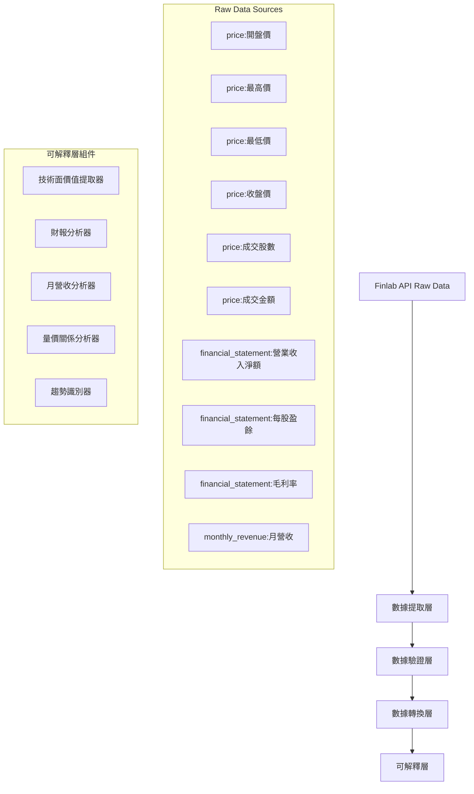

# 觸發器系統與數據整合架構完整盤點

## 🎯 觸發器系統現狀分析

### ✅ **已實現的觸發器**

| 觸發器 | 狀態 | 實現程度 | 備註 |
|--------|------|----------|------|
| **AFTER_HOURS_LIMIT_UP** | ✅ 完全實現 | 100% | 盤後漲停股回顧，包含高量/低量分類 |
| **INTRADAY_SURGE_STOCKS** | ✅ 完全實現 | 100% | 盤中急漲股，17支股票處理 |
| **TRENDING_TOPICS** | ❌ 僅框架 | 10% | 只有空殼實現，無實際邏輯 |
| **LIMIT_UP_STOCKS** | ❌ 僅框架 | 10% | 只有空殼實現，無實際邏輯 |
| **HOT_STOCKS** | ❌ 僅框架 | 10% | 只有空殼實現，無實際邏輯 |
| **INDUSTRY_ANALYSIS** | ❌ 僅框架 | 10% | 只有空殼實現，無實際邏輯 |
| **MONTHLY_REVENUE** | ❌ 僅框架 | 10% | 只有空殼實現，無實際邏輯 |
| **HIGH_VOLUME** | ❌ 僅框架 | 10% | 只有空殼實現，無實際邏輯 |
| **NEWS_SUMMARY** | ❌ 僅框架 | 10% | 只有空殼實現，無實際邏輯 |

### 🚨 **問題分析**

**實際可用觸發器：僅2個**
- 盤後漲停股回顧 (AFTER_HOURS_LIMIT_UP)
- 盤中急漲股 (INTRADAY_SURGE_STOCKS)

**其他7個觸發器：僅有框架，無實際實現**

## 📡 Finlab API 數據整合架構

### 🔄 **Raw Data → 可解釋層 完整流程**



### 📊 **數據源詳細映射**

#### 1. **股價 OHLC 數據**
```python
# Raw Data
price:開盤價 → open_price
price:最高價 → high_price  
price:最低價 → low_price
price:收盤價 → close_price
price:成交股數 → volume_shares
price:成交金額 → volume_amount

# 可解釋層處理
↓
技術面價值提取器 (TechnicalValueExtractor)
- 計算技術指標 (MACD, KD, RSI, 布林通道)
- 識別支撐壓力位
- 分析趨勢方向
- 計算波動率
- 量價關係分析
```

#### 2. **財報數據**
```python
# Raw Data
financial_statement:營業收入淨額 → revenue
financial_statement:每股盈餘 → eps
financial_statement:毛利率 → gross_margin
financial_statement:資產總額 → total_assets
financial_statement:負債總額 → total_liabilities

# 可解釋層處理
↓
財報分析器 (FinancialAnalyzer)
- 營收成長率分析
- 獲利能力評估
- 財務結構分析
- 同業比較分析
- 財務健康度評分
```

#### 3. **月營收數據**
```python
# Raw Data
monthly_revenue:月營收 → monthly_revenue

# 可解釋層處理
↓
月營收分析器 (MonthlyRevenueAnalyzer)
- 月營收成長率計算
- 季節性分析
- 趨勢識別
- 預期vs實際比較
- 營收品質評估
```

## 🏗️ **完整數據整合架構設計**

### 1. **數據提取層 (Data Extraction Layer)**

```python
class FinlabDataExtractor:
    """Finlab數據提取器"""
    
    async def extract_ohlc_data(self, stock_id: str) -> OHLCData:
        """提取OHLC數據"""
        return {
            'open': fdata.get('price:開盤價')[stock_id],
            'high': fdata.get('price:最高價')[stock_id],
            'low': fdata.get('price:最低價')[stock_id],
            'close': fdata.get('price:收盤價')[stock_id],
            'volume_shares': fdata.get('price:成交股數')[stock_id],
            'volume_amount': fdata.get('price:成交金額')[stock_id]
        }
    
    async def extract_financial_data(self, stock_id: str) -> FinancialData:
        """提取財報數據"""
        return {
            'revenue': fdata.get('financial_statement:營業收入淨額')[stock_id],
            'eps': fdata.get('financial_statement:每股盈餘')[stock_id],
            'gross_margin': fdata.get('financial_statement:毛利率')[stock_id],
            'total_assets': fdata.get('financial_statement:資產總額')[stock_id],
            'total_liabilities': fdata.get('financial_statement:負債總額')[stock_id]
        }
    
    async def extract_monthly_revenue(self, stock_id: str) -> MonthlyRevenueData:
        """提取月營收數據"""
        return fdata.get('monthly_revenue:月營收')[stock_id]
```

### 2. **技術面價值提取器 (已實現並優化)**

**現有實現：**
- ✅ `EnhancedTechnicalAnalyzer` - 增強版技術分析器
- ✅ `TechnicalAnalyzer` - 基礎技術分析器
- ✅ `OHLCCacheManager` - OHLC數據緩存管理

**關鍵改進 (基於之前Feedback)：**

#### A. **評分標準優化**
```python
# 調整前：門檻過高，難以觸發信號
if deviation > 5:  # 5%門檻太高
    score = 2

# 調整後：更寬鬆的標準
if deviation > 3:  # 降低至3%
    score = 2
elif deviation > 1:  # 降低至1%
    score = 1.5
else:
    score = 1  # 提高微幅突破分數
```

#### B. **信心度門檻降低**
```python
# 調整前：信心度門檻過高
if indicator.confidence >= 60:  # 60%門檻太高

# 調整後：降低門檻
if indicator.confidence >= 15:  # 降低至15%
```

#### C. **評分機制改進**
```python
# 權重分配優化
weights = {
    "moving_averages": 0.25,    # 均線 25%
    "macd": 0.20,              # MACD 20%
    "kd": 0.15,                # KD 15%
    "rsi": 0.15,               # RSI 15%
    "bollinger_bands": 0.15,   # 布林通道 15%
    "volume": 0.10,            # 成交量 10%
    "volatility": 0.05          # 波動率 5%
}

# 評分轉換：-5到+5 → 0到10分制
raw_score = total_weighted_score / total_weight
overall_score = raw_score + 5  # 轉為0到10分制
```

**支援的技術指標：**
- ✅ 移動平均線 (5/10/20/60/120/240日)
- ✅ MACD (12/26/9)
- ✅ KD指標 (9/3/3)
- ✅ RSI (14日)
- ✅ 布林通道 (20日, 2倍標準差)
- ✅ 成交量分析
- ✅ 波動率分析

**使用方式：**
```python
# 使用增強版技術分析器
analyzer = EnhancedTechnicalAnalyzer()
analysis = await analyzer.get_enhanced_stock_analysis("2330", "台積電")

# 獲取結果
print(f"綜合評分: {analysis.overall_score}/10")
print(f"信心度: {analysis.confidence_score}%")
print(f"有效指標: {analysis.effective_indicators}")
print(f"摘要: {analysis.summary}")
```
    
    def _analyze_trend(self, ohlc_data: OHLCData) -> TrendAnalysis:
        """分析趨勢"""
        return {
            'short_term_trend': self._determine_short_term_trend(ohlc_data),
            'medium_term_trend': self._determine_medium_term_trend(ohlc_data),
            'long_term_trend': self._determine_long_term_trend(ohlc_data),
            'trend_strength': self._calculate_trend_strength(ohlc_data),
            'trend_duration': self._calculate_trend_duration(ohlc_data)
        }
```

### 3. **財報分析器 (Financial Analyzer)**

```python
class FinancialAnalyzer:
    """財報分析器"""
    
    async def analyze_financial_data(self, financial_data: FinancialData) -> FinancialAnalysis:
        """分析財報數據"""
        
        # 營收分析
        revenue_analysis = self._analyze_revenue(financial_data.revenue)
        
        # 獲利分析
        profitability_analysis = self._analyze_profitability(financial_data)
        
        # 財務結構分析
        structure_analysis = self._analyze_financial_structure(financial_data)
        
        # 成長性分析
        growth_analysis = self._analyze_growth(financial_data)
        
        return FinancialAnalysis(
            revenue_analysis=revenue_analysis,
            profitability_analysis=profitability_analysis,
            structure_analysis=structure_analysis,
            growth_analysis=growth_analysis,
            financial_score=self._calculate_financial_score(financial_data),
            investment_grade=self._determine_investment_grade(financial_data)
        )
    
    def _analyze_revenue(self, revenue_data: pd.Series) -> RevenueAnalysis:
        """營收分析"""
        return {
            'revenue_growth_rate': self._calculate_revenue_growth_rate(revenue_data),
            'revenue_volatility': self._calculate_revenue_volatility(revenue_data),
            'revenue_trend': self._determine_revenue_trend(revenue_data),
            'revenue_quality': self._assess_revenue_quality(revenue_data)
        }
```

### 4. **月營收分析器 (Monthly Revenue Analyzer)**

```python
class MonthlyRevenueAnalyzer:
    """月營收分析器"""
    
    async def analyze_monthly_revenue(self, monthly_revenue_data: MonthlyRevenueData) -> MonthlyRevenueAnalysis:
        """分析月營收數據"""
        
        # 成長率分析
        growth_analysis = self._analyze_growth_rate(monthly_revenue_data)
        
        # 季節性分析
        seasonal_analysis = self._analyze_seasonality(monthly_revenue_data)
        
        # 趨勢分析
        trend_analysis = self._analyze_revenue_trend(monthly_revenue_data)
        
        # 預期vs實際
        expectation_analysis = self._compare_with_expectations(monthly_revenue_data)
        
        return MonthlyRevenueAnalysis(
            growth_analysis=growth_analysis,
            seasonal_analysis=seasonal_analysis,
            trend_analysis=trend_analysis,
            expectation_analysis=expectation_analysis,
            revenue_score=self._calculate_revenue_score(monthly_revenue_data),
            surprise_factor=self._calculate_surprise_factor(monthly_revenue_data)
        )
```

### 5. **統一數據整合器 (Unified Data Integrator)**

```python
class UnifiedDataIntegrator:
    """統一數據整合器"""
    
    def __init__(self):
        self.data_extractor = FinlabDataExtractor()
        self.technical_extractor = TechnicalValueExtractor()
        self.financial_analyzer = FinancialAnalyzer()
        self.revenue_analyzer = MonthlyRevenueAnalyzer()
    
    async def integrate_stock_data(self, stock_id: str) -> IntegratedStockData:
        """整合股票數據"""
        
        # 1. 提取原始數據
        ohlc_data = await self.data_extractor.extract_ohlc_data(stock_id)
        financial_data = await self.data_extractor.extract_financial_data(stock_id)
        monthly_revenue_data = await self.data_extractor.extract_monthly_revenue(stock_id)
        
        # 2. 轉換為可解釋層
        technical_value = await self.technical_extractor.extract_technical_value(ohlc_data)
        financial_analysis = await self.financial_analyzer.analyze_financial_data(financial_data)
        revenue_analysis = await self.revenue_analyzer.analyze_monthly_revenue(monthly_revenue_data)
        
        # 3. 整合分析結果
        integrated_analysis = self._integrate_analysis_results(
            technical_value, financial_analysis, revenue_analysis
        )
        
        return IntegratedStockData(
            stock_id=stock_id,
            raw_data={
                'ohlc': ohlc_data,
                'financial': financial_data,
                'monthly_revenue': monthly_revenue_data
            },
            interpreted_data={
                'technical': technical_value,
                'financial': financial_analysis,
                'revenue': revenue_analysis
            },
            integrated_analysis=integrated_analysis,
            overall_score=self._calculate_overall_score(integrated_analysis),
            data_quality_score=self._assess_data_quality(ohlc_data, financial_data, monthly_revenue_data)
        )
```

## 🎯 **觸發器實現優先級**

### 階段一：核心觸發器 (立即實現)
1. **TRENDING_TOPICS** - 熱門話題觸發器
2. **LIMIT_UP_STOCKS** - 漲停股觸發器
3. **HOT_STOCKS** - 熱門股觸發器

### 階段二：分析觸發器 (2-3週)
4. **INDUSTRY_ANALYSIS** - 產業分析觸發器
5. **HIGH_VOLUME** - 高成交量觸發器

### 階段三：財報觸發器 (3-4週)
6. **MONTHLY_REVENUE** - 月營收公告觸發器
7. **NEWS_SUMMARY** - 新聞總結觸發器

## 📋 **實施建議**

### 1. **立即行動**
- 實現缺失的7個觸發器框架
- 完善Finlab數據整合架構
- 建立統一的數據可解釋層

### 2. **短期目標**
- 完成技術面價值提取器
- 實現財報分析器
- 建立月營收分析器

### 3. **中期目標**
- 整合所有數據源
- 建立統一的數據整合器
- 實現智能數據調度

### 4. **長期目標**
- 建立持續學習機制
- 優化數據品質控制
- 實現預測性分析

## 🎉 **總結**

**當前狀況：**
- ✅ 2個觸發器完全實現
- ❌ 7個觸發器僅有框架
- ✅ Finlab API整合部分實現
- ❌ 數據可解釋層不完整

**核心問題：**
- 觸發器實現不完整
- 數據整合架構缺乏統一性
- 可解釋層組件分散且不完整

**解決方案：**
- 優先實現核心觸發器
- 建立統一的數據整合架構
- 完善技術面、財報、月營收分析器
- 實現統一的數據可解釋層
