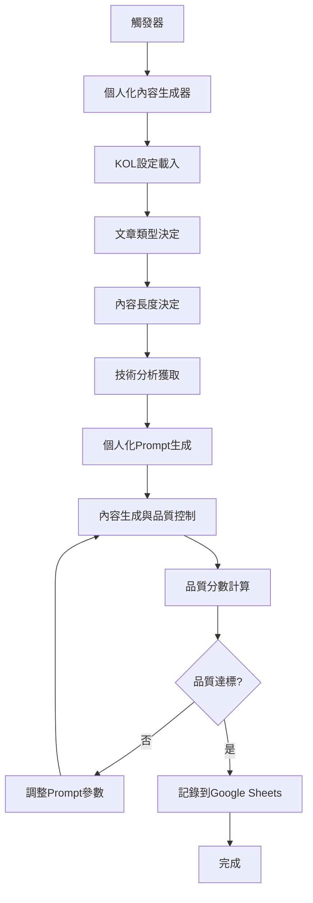

# 個人化內容生成主流程設計

## 🎯 問題分析

### 當前問題
1. **Batch Create AI味重**：不同腳本生成的內容缺乏個人化特色
2. **缺乏品質控制**：沒有按照品質規範要求改進
3. **個人化元素缺失**：文長長度權重、文章類型等設計沒有整合到prompting
4. **內容同質化**：所有KOL生成的內容風格相似

### 根本原因
- 現有的個人化系統沒有被正確整合到主流程
- 缺乏統一的品質控制機制
- 沒有實現真正的內容多樣性控制

## 🏗️ 解決方案：個人化內容生成主流程

### 核心架構



### 1. **文章類型系統 (PostType)**

```python
class PostType(Enum):
    SHARE_OPINION = "share_opinion"      # 分享觀點
    FIND_COMMUNITY = "find_community"    # 找同溫層
    ASK_QUESTION = "ask_question"        # 提問問題引起互動
    TEACHING = "teaching"                # 教學
    NEWS_ALERT = "news_alert"           # 新聞快訊
    ANALYSIS = "analysis"               # 分析
    HUMOR = "humor"                     # 幽默
```

**權重配置：**
- 分享觀點：25%
- 找同溫層：20%
- 提問問題：20%
- 教學：15%
- 新聞快訊：10%
- 分析：5%
- 幽默：5%

### 2. **內容長度系統 (ContentLength)**

```python
class ContentLength(Enum):
    SHORT = "short"    # 50-100字
    MEDIUM = "medium"  # 200-300字
    LONG = "long"      # 400-500字
```

**權重配置：**
- 短文：30%
- 中等長度：50%
- 長文：20%

### 3. **個人化設定整合**

#### A. **Google Sheets KOL設定欄位**
- `ContentLength`: 內容長度偏好
- `QuestionRatio`: 提問比例
- `PostTypeWeights`: 文章類型權重
- `ContentLengthWeights`: 內容長度權重
- `MinQualityScore`: 最低品質分數
- `UseSignatureWords`: 使用專屬詞彙
- `UseCasualExpressions`: 使用口語表達
- `FollowTypingHabits`: 遵循打字習慣

#### B. **個人化元素**
- 專屬詞彙庫
- 口語化表達
- 打字習慣
- 結尾風格
- 語氣向量
- 專業領域權重

### 4. **品質控制系統**

#### A. **品質分數計算**
```python
def calculate_quality_score(content, kol_settings):
    scores = []
    
    # 內容長度分數
    scores.append(length_score)
    
    # 個人化分數
    scores.append(personalization_score)
    
    # 互動性分數
    scores.append(interaction_score)
    
    # 專業性分數
    scores.append(professionalism_score)
    
    return sum(scores) / len(scores)
```

#### B. **品質改進機制**
- 自動重試（最多3次）
- Prompt參數調整
- 溫度參數優化
- 品質指導添加

### 5. **技術分析整合**

```python
# 為技術派KOL提供技術分析數據
if kol_settings.get('finlab_api_needed', False):
    technical_analysis = await get_technical_analysis(stock_data)
    
    # 技術分析數據包含：
    # - 綜合評分 (0-10)
    # - 信心度 (0-100%)
    # - 有效指標列表
    # - 分析摘要
    # - 各指標詳細數據
```

## 🎨 個人化Prompt生成

### 1. **系統Prompt**
- 基於KOL人設和專業領域
- 包含語氣風格和表達習慣
- 整合技術分析數據（如果需要）

### 2. **用戶Prompt**
- 文章類型指導
- 內容長度指導
- 技術分析數據
- 個人化要求

### 3. **生成參數**
- 溫度參數動態調整
- 最大token數控制
- 頻率懲罰和存在懲罰

## 📊 品質規範要求

### 1. **最低品質標準**
- 品質分數：≥ 0.7
- 個人化分數：≥ 0.6
- 互動性分數：≥ 0.5
- 專業性分數：≥ 0.6

### 2. **內容長度控制**
- 短文：50-100字
- 中等長度：200-300字
- 長文：400-500字

### 3. **個人化要求**
- 使用KOL專屬詞彙
- 遵循打字習慣
- 使用固定結尾風格
- 避免AI生成痕跡

## 🔄 整合到主流程

### 1. **觸發器整合**
- 盤後漲停股回顧
- 盤中急漲股
- 其他觸發器（待實現）

### 2. **數據記錄**
- 完整的生成參數
- 品質分數記錄
- 個人化分數記錄
- 技術分析數據

### 3. **Google Sheets整合**
- 新增個人化欄位
- 品質分數追蹤
- 生成元數據記錄

## 🎯 預期效果

### 1. **內容多樣性**
- 每篇內容都有獨特特色
- 避免模板化和重複
- 真正的個人化表達

### 2. **品質提升**
- 自動品質控制
- 符合KOL風格
- 避免AI生成痕跡

### 3. **系統化**
- 統一的個人化標準
- 可追蹤的品質指標
- 可擴展的架構設計

## 📋 實施步驟

### 階段一：核心系統實現
1. ✅ 個人化內容生成器
2. ✅ 文章類型和長度系統
3. ✅ 品質控制機制
4. ✅ 技術分析整合

### 階段二：主流程整合
1. ✅ 增強版主工作流程引擎
2. ✅ 觸發器整合
3. ✅ Google Sheets記錄

### 階段三：測試和優化
1. 🔄 個人化效果測試
2. 🔄 品質分數驗證
3. 🔄 內容多樣性檢查

### 階段四：擴展應用
1. 📋 其他觸發器實現
2. 📋 更多KOL設定
3. 📋 持續優化機制

## 🎉 總結

這個個人化內容生成主流程解決了以下核心問題：

1. **消除Batch Create AI味**：通過真正的個人化設定和品質控制
2. **實現內容多樣性**：通過文章類型和長度權重系統
3. **提升內容品質**：通過自動品質檢查和改進機制
4. **整合技術分析**：為技術派KOL提供專業數據支持

這個系統確保每個KOL生成的內容都符合其個人特色和專業領域，同時保持高品質標準。


