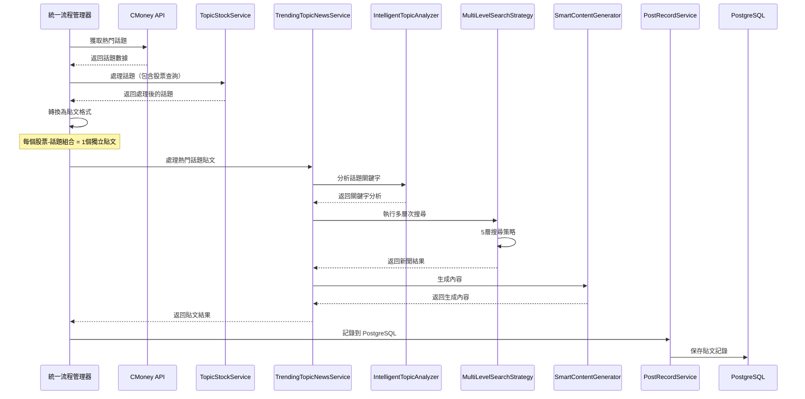

# 熱門話題觸發器 - 智能新聞搜尋整合

## 最新更新 (2024-12-19)

### 🎯 核心改進

我們已經完全重構了熱門話題觸發器，實現了**每個貼文獨立的智能新聞搜尋**：

#### 1. 智能話題分析器 (IntelligentTopicAnalyzer)
- **功能**: 使用 LLM 分析熱門話題並提取關鍵字
- **特點**: 每個貼文獨立分析，不共享關鍵字
- **輸出**: 主要關鍵字、次要關鍵字、產業關鍵字、情感關鍵字、搜尋查詢建議

#### 2. 多層次搜尋策略 (MultiLevelSearchStrategy)
- **功能**: 根據話題分析結果執行多種搜尋策略
- **層次**:
  - 層次1: LLM 生成的搜尋查詢
  - 層次2: 股票相關搜尋（股票代碼 + 關鍵字）
  - 層次3: 產業相關搜尋
  - 層次4: 情感相關搜尋
  - 層次5: 純話題搜尋（無股票標籤的話題）

#### 3. 智能內容生成器 (SmartContentGenerator)
- **功能**: 根據熱門話題和新聞搜尋結果生成相關內容
- **特點**: 每個貼文獨立生成，基於自己的新聞資料
- **輸出**: 標題、內容、摘要、重點、相關連結

#### 4. 熱門話題新聞搜尋服務 (TrendingTopicNewsService)
- **功能**: 統一的服務接口，整合所有組件
- **特點**: 支持並行處理多個貼文，每個貼文完全獨立

## 🔄 更新後的流程

### 流程圖



### 詳細步驟

#### 步驟1: 獲取熱門話題
- 嘗試從 CMoney API 獲取真實熱門話題
- 如果失敗，使用模擬數據作為 fallback
- 支持純話題（無股票標籤）和有股票的話題

#### 步驟2: 處理話題
- 使用 `TopicStockService` 處理話題
- 提取相關股票標籤
- 分類話題類型

#### 步驟3: 轉換為貼文格式
- **股票 x 熱門話題組合**: 每個組合 = 1個獨立貼文
  - 例如：話題A + 股票2330 = 貼文 `topic_A_2330`
- **純熱門話題**: 每個純話題 = 1個獨立貼文
  - 例如：話題B（無股票）= 貼文 `topic_B_topic_only`

#### 步驟4: 智能新聞搜尋
- **每個貼文獨立分析關鍵字**
- **每個貼文獨立搜尋新聞**
- **每個貼文獨立生成內容**

#### 步驟5: 保存到 PostgreSQL
- 使用 `PostRecordService` 保存貼文記錄
- 記錄生成內容、新聞來源、信心分數等

## 🔒 獨立性保證

### 每個貼文都有：
- ✅ **獨立的貼文ID** - 格式：`{topic_id}_{stock_id}` 或 `{topic_id}_topic_only`
- ✅ **獨立的關鍵字分析** - 每個貼文使用 `IntelligentTopicAnalyzer`
- ✅ **獨立的新聞搜尋** - 每個貼文有自己的搜尋策略
- ✅ **獨立的內容生成** - 基於自己的新聞資料生成內容
- ✅ **獨立的貼文ID追蹤** - 所有日誌和結果都有貼文標識

## 📊 搜尋策略詳解

### 股票 x 熱門話題組合
1. **股票代碼 + 主要關鍵字**
2. **股票代碼 + 話題標題**
3. **LLM 生成的專屬查詢**

### 純熱門話題
1. **主要關鍵字組合**
2. **話題標題本身**
3. **LLM 生成的專屬查詢**

## 🗄️ 資料庫記錄

### PostgreSQL 記錄格式
```python
post_data = {
    'post_id': result.post_id,
    'kol_serial': "",  # 待分配
    'kol_nickname': "",  # 待分配
    'kol_persona': "",  # 待分配
    'stock_code': ", ".join(result.stock_ids),
    'stock_name': "",  # 待查詢
    'title': result.generated_content.title,
    'content': result.generated_content.content,
    'content_md': result.generated_content.content,
    'status': 'ready_to_gen',
    'content_type': 'trending_topic',
    'topic_id': result.post_id,
    'topic_title': result.topic_title,
    'topic_keywords': ", ".join(result.stock_ids),
    'generated_at': datetime.now(),
    'news_sources': len(result.news_results),
    'confidence_score': result.generated_content.confidence_score
}
```

## 🚀 技術實現

### 核心文件
- `src/agents/intelligent_topic_analyzer.py` - 智能話題分析器
- `src/agents/multi_level_search_strategy.py` - 多層次搜尋策略
- `src/agents/smart_content_generator.py` - 智能內容生成器
- `src/services/trending_topic_news_service.py` - 熱門話題新聞搜尋服務
- `src/services/flow/unified_flow_manager.py` - 統一流程管理器（已更新）

### 關鍵改進
1. **移除 Google Sheets 依賴** - 改為使用 PostgreSQL
2. **每個貼文獨立處理** - 確保不共享搜尋結果
3. **智能關鍵字提取** - 使用 LLM 分析話題
4. **多層次搜尋策略** - 5種不同的搜尋方法
5. **並行處理支持** - 支持多個貼文同時處理

## 📈 預期效果

- **更精準的新聞搜尋** - 每個貼文都有專屬的搜尋策略
- **更相關的內容生成** - 基於專屬新聞資料生成內容
- **更好的內容品質** - 避免不同貼文間的干擾
- **更完整的記錄追蹤** - PostgreSQL 提供完整的資料庫支持
