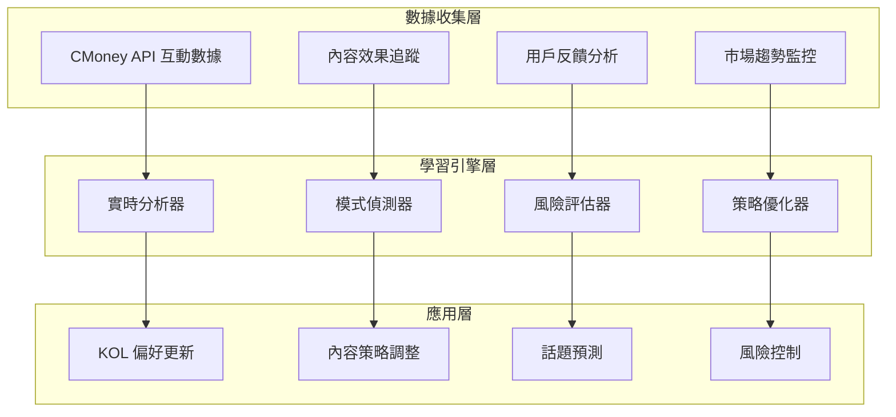
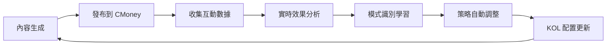
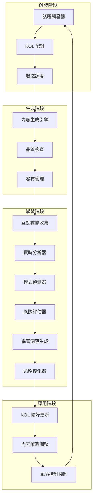
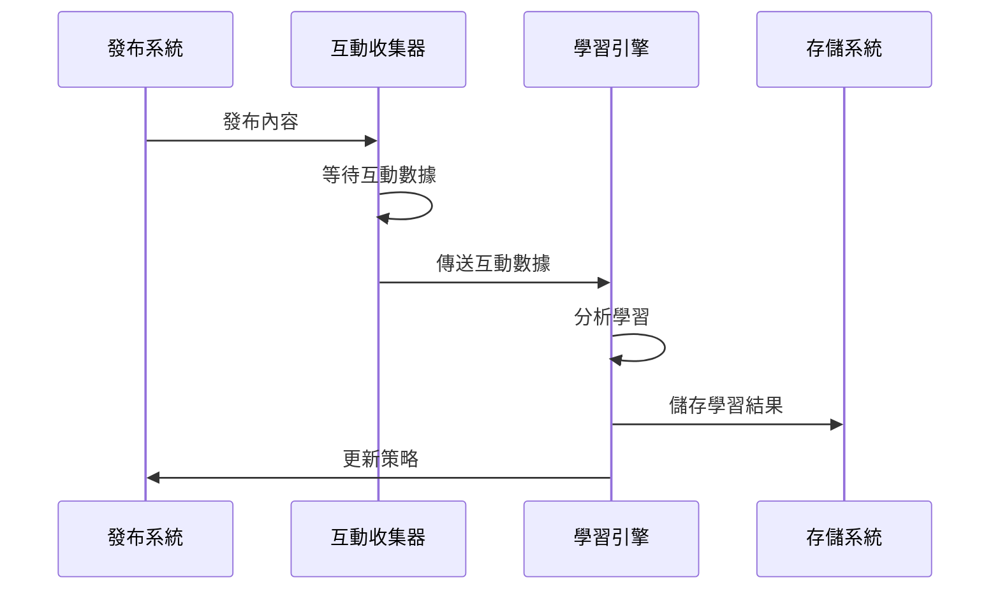

# 4.1 自我學習機制設計

## 概述

自我學習機制是 AI 發文系統的核心競爭優勢，通過持續學習和優化，使系統能夠：

* 自動調整 KOL 偏好設定
* 優化內容生成策略
* 預測熱門話題趨勢
* 提升內容互動效果

## 系統架構

### 學習數據流



### 學習循環



### 詳細學習流程



## 核心組件設計

### 1. 實時分析器 (RealTimeAnalyzer)

#### 功能描述

分析互動數據，計算多維度指標，識別異常模式。

#### 關鍵指標

* **互動分數**：讚、留言、分享、表情的加權分數 (0-100) 機制與晏玲那段互動分數計算同步
* **病毒傳播潛力**：基於分享率和互動比例，給出病毒傳播潛力（從過去成效好的貼文預測傳播潛力）
* **時機有效性**：智能分析最佳發文時機

#### 實現邏輯

```python
class RealTimeAnalyzer:
    def analyze_interaction_performance(self, interaction_data):
        """分析互動表現"""
        return {
            'engagement_score': self._calculate_engagement_score(interaction_data),
            'viral_potential': self._calculate_viral_potential(interaction_data),
            'brand_impact': self._calculate_brand_impact(interaction_data),
            'timing_analysis': self._analyze_timing_pattern(interaction_data),
            'content_analysis': self._analyze_content_features(interaction_data)
        }
    
    def _calculate_engagement_score(self, data):
        """計算綜合互動分數"""
        likes_weight = 0.3
        comments_weight = 0.4
        shares_weight = 0.2
        emoji_weight = 0.1
        
        weighted_score = (
            data.likes * likes_weight +
            data.comments * comments_weight +
            data.shares * shares_weight +
            data.emoji_total * emoji_weight
        )
        
        return min(weighted_score * 5, 100)
```

### 2. 模式偵測器 (PatternDetector)

#### 功能描述

識別成功的內容模式、偵測失敗的內容特徵、發現受眾行為模式。

#### 偵測模式

* **成功模式**：高互動、病毒傳播、最佳時機
* **失敗模式**：低互動、AI偵測風險、時機不佳
* **受眾模式**：受眾活躍度、表情回應模式

#### 實現邏輯

```python
class PatternDetector:
    def detect_patterns(self, interaction_data, performance_analysis):
        """偵測模式"""
        return {
            'success_patterns': self._detect_success_patterns(interaction_data, performance_analysis),
            'failure_patterns': self._detect_failure_patterns(interaction_data, performance_analysis),
            'audience_patterns': self._detect_audience_patterns(interaction_data, performance_analysis)
        }
    
    def _detect_success_patterns(self, data, analysis):
        """偵測成功模式"""
        patterns = []
        
        # 高互動模式
        if analysis['overall_score'] > 70:
            patterns.append({
                'type': 'high_engagement',
                'description': '高互動表現',
                'confidence': 0.8
            })
        
        return patterns
```

### 3. 風險評估器 (RiskAssessor)

#### 功能描述

評估 AI 偵測風險、預測互動失敗風險、識別內容品質問題。

#### 風險評估維度

* **AI 偵測風險**：分析語言正式度、個人化程度、結構規整性
* **互動風險**：評估互動率、內容品質、受眾匹配度
* **時機風險**：分析發文時機的適宜性

#### 實現邏輯

```python
class RiskAssessor:
    def assess_risks(self, interaction_data, performance_analysis, patterns):
        """評估風險"""
        return {
            'ai_detection_risk': self._assess_ai_detection_risk(performance_analysis, patterns),
            'engagement_risk': self._assess_engagement_risk(performance_analysis, patterns),
            'timing_risk': self._assess_timing_risk(performance_analysis, patterns),
            'content_quality_risk': self._assess_content_quality_risk(performance_analysis, patterns),
            'overall_risk': self._calculate_overall_risk(),
            'risk_alerts': self._generate_risk_alerts()
        }
```

### 4. 策略優化器 (StrategyOptimizer)

#### 功能描述

根據分析結果優化 KOL 策略、調整內容生成參數、優化發布時機。

#### 優化策略

* **內容策略優化**：內容類型權重、話題偏好、內容長度
* **發布策略優化**：最佳時機、頻率調整、受眾定位
* **個人化調整**：個人化程度、情感表達、真實性

#### 實現邏輯

```python
class StrategyOptimizer:
    def optimize_content_strategy(self, learning_results):
        """優化內容策略"""
        optimizations = {
            'content_length': self.optimize_content_length(learning_results),
            'publish_timing': self.optimize_publish_timing(learning_results),
            'topic_selection': self.optimize_topic_selection(learning_results),
            'tone_adjustment': self.optimize_tone(learning_results)
        }
        
        return optimizations
```

## 學習數據管理

### 數據結構設計

#### 互動數據表

```sql
CREATE TABLE interaction_learning_data (
    id SERIAL PRIMARY KEY,
    post_id VARCHAR(50),
    kol_id VARCHAR(50),
    content_hash VARCHAR(64),
    publish_time TIMESTAMP,
    likes_count INTEGER,
    comments_count INTEGER,
    shares_count INTEGER,
    reach_count INTEGER,
    engagement_rate DECIMAL(5,4),
    content_features JSONB,
    topic_category VARCHAR(50),
    data_sources_used JSONB,
    created_at TIMESTAMP DEFAULT NOW()
);
```

#### 學習結果表

```sql
CREATE TABLE learning_results (
    id SERIAL PRIMARY KEY,
    kol_id VARCHAR(50),
    learning_type VARCHAR(50),
    old_preferences JSONB,
    new_preferences JSONB,
    improvement_score DECIMAL(3,2),
    applied_at TIMESTAMP,
    created_at TIMESTAMP DEFAULT NOW()
);
```

### 數據收集流程



## 實現時間表

### 第一週：基礎架構

* [ ] 互動數據收集器
* [ ] 基礎學習引擎
* [ ] 數據存儲結構

### 第二週：學習算法

* [ ] KOL 偏好學習
* [ ] 內容效果預測
* [ ] 策略優化邏輯

### 第三週：整合測試

* [ ] 端到端測試
* [ ] 性能優化
* [ ] 監控系統

## 預期效果

### 量化指標

* **內容互動率提升**：30-50%
* **KOL 個人化程度**：90%+
* **預測準確率**：80%+
* **策略調整頻率**：每日自動

### 質化改善

* **內容品質更穩定**
* **個人化程度更高**
* **運營效率提升**
* **風險控制更智能**

## 風險控制

### 學習風險

* **過擬合**：避免過度依賴歷史數據
* **冷啟動**：新 KOL 的學習策略
* **數據偏差**：確保數據代表性

### 控制機制

* **學習速率限制**：避免過度調整
* **效果驗證**：A/B 測試驗證
* **回滾機制**：效果下降時回滾

## 監控指標

### 學習效果監控

* **學習準確率**：預測 vs 實際
* **策略改善度**：調整前後效果對比
* **系統穩定性**：學習過程穩定性

### 業務效果監控

* **整體互動率**：系統整體表現
* **KOL 滿意度**：內容品質滿意度
* **運營效率**：人工干預減少程度

## 未來擴展

### 進階學習功能

* **深度學習模型**：更複雜的模式識別
* **跨平台學習**：多平台數據整合
* **實時學習**：即時策略調整

### 智能決策

* **自動內容策劃**：完全自動化內容規劃
* **市場預測**：提前預測熱門話題
* **競爭分析**：分析競爭對手策略

***

_本文檔將持續更新，反映自我學習機制的實際實現進展和優化方向。_
