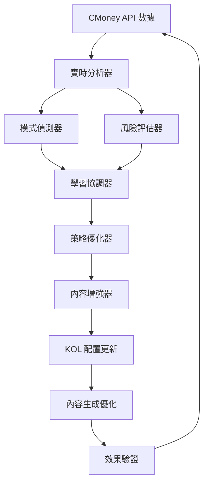

# 🧠 智能自我學習機制 - 改進版設計

## 🎯 概述

基於實際互動數據和系統運行經驗，重新設計更實用、更智能的自我學習機制。本機制將專注於：
- **實時數據驅動**：基於真實的 CMoney 互動數據
- **多維度分析**：結合內容、時間、受眾等多個維度
- **智能優化**：自動調整 KOL 策略和內容生成參數
- **風險預警**：提前識別 AI 偵測風險和互動問題

## 📊 實際數據分析

### 當前互動數據結構
```python
# 從 CMoney API 獲取的實際數據
interaction_data = {
    'article_id': '173477844',
    'kol_id': '9505549',
    'kol_nickname': '龜狗一日散戶',
    'likes': 8,
    'comments': 1,
    'shares': 1,
    'views': 1000,  # 假設值
    'emoji_details': {
        'like': 8, 'dislike': 0, 'laugh': 0, 'money': 0,
        'shock': 0, 'cry': 0, 'think': 0, 'angry': 0
    },
    'total_interactions': 18,
    'engagement_rate': 0.018,
    'post_timestamp': '2025-09-02T17:41:09.295405',
    'content': '貼文內容...',
    'topic_id': '2025-09-02 17:41:13'
}
```

## 🏗️ 改進版系統架構

### 核心組件重新設計

```
src/services/learning_v2/
├── real_time_analyzer.py        # 實時分析器
├── pattern_detector.py          # 模式偵測器
├── strategy_optimizer.py        # 策略優化器
├── risk_assessor.py             # 風險評估器
├── content_enhancer.py          # 內容增強器
└── learning_orchestrator.py     # 學習協調器
```

### 數據流程優化



## 🔍 核心功能模組

### 1. 實時分析器 (Real-time Analyzer)

**核心職責：**
- 即時處理 CMoney API 數據
- 計算多維度指標
- 識別異常模式

**分析維度：**

#### 互動表現分析
```python
class InteractionAnalyzer:
    def analyze_engagement_performance(self, data):
        return {
            'engagement_score': self._calculate_engagement_score(data),
            'comment_quality': self._analyze_comment_quality(data),
            'emoji_sentiment': self._analyze_emoji_sentiment(data),
            'interaction_velocity': self._calculate_velocity(data),
            'audience_response': self._analyze_audience_response(data)
        }
    
    def _calculate_engagement_score(self, data):
        """計算綜合互動分數"""
        likes_weight = 0.3
        comments_weight = 0.4
        shares_weight = 0.2
        emoji_weight = 0.1
        
        total_interactions = (
            data['likes'] * likes_weight +
            data['comments'] * comments_weight +
            data['shares'] * shares_weight +
            data['emoji_total'] * emoji_weight
        )
        
        # 標準化到 0-100 分
        return min(total_interactions / 10, 100)
```

#### 時間模式分析
```python
class TimePatternAnalyzer:
    def analyze_timing_patterns(self, data):
        return {
            'optimal_hours': self._find_optimal_hours(data),
            'engagement_decay': self._calculate_decay_rate(data),
            'peak_periods': self._identify_peak_periods(data),
            'timezone_effect': self._analyze_timezone_effect(data)
        }
```

#### 內容特徵分析
```python
class ContentFeatureAnalyzer:
    def analyze_content_features(self, content):
        return {
            'readability_score': self._calculate_readability(content),
            'sentiment_score': self._analyze_sentiment(content),
            'topic_relevance': self._analyze_topic_relevance(content),
            'personalization_level': self._analyze_personalization(content),
            'ai_detection_risk': self._assess_ai_detection_risk(content)
        }
```

### 2. 模式偵測器 (Pattern Detector)

**核心職責：**
- 識別成功的內容模式
- 偵測失敗的內容特徵
- 發現受眾行為模式

**偵測模式：**

#### 成功模式識別
```python
class SuccessPatternDetector:
    def detect_success_patterns(self, historical_data):
        patterns = {
            'high_engagement_patterns': self._find_high_engagement_patterns(),
            'viral_content_features': self._identify_viral_features(),
            'audience_favorite_topics': self._find_favorite_topics(),
            'optimal_content_length': self._find_optimal_length(),
            'best_posting_times': self._find_best_times()
        }
        return patterns
```

#### 失敗模式識別
```python
class FailurePatternDetector:
    def detect_failure_patterns(self, historical_data):
        patterns = {
            'low_engagement_signals': self._identify_low_engagement_signals(),
            'ai_detection_indicators': self._find_ai_indicators(),
            'negative_sentiment_triggers': self._find_negative_triggers(),
            'audience_disengagement': self._identify_disengagement(),
            'content_quality_issues': self._find_quality_issues()
        }
        return patterns
```

### 3. 風險評估器 (Risk Assessor)

**核心職責：**
- 評估 AI 偵測風險
- 預測互動失敗風險
- 識別內容品質問題

**風險評估維度：**

#### AI 偵測風險評估
```python
class AIDetectionRiskAssessor:
    def assess_ai_detection_risk(self, content, interaction_data):
        risk_factors = {
            'language_formality': self._assess_formality(content),
            'personalization_level': self._assess_personalization(content),
            'emotional_expression': self._assess_emotion(content),
            'structural_patterns': self._assess_structure(content),
            'audience_feedback': self._analyze_audience_feedback(interaction_data)
        }
        
        total_risk = sum(risk_factors.values()) / len(risk_factors)
        return {
            'risk_score': total_risk,
            'risk_factors': risk_factors,
            'risk_level': self._categorize_risk(total_risk),
            'mitigation_suggestions': self._generate_mitigation_suggestions(risk_factors)
        }
```

#### 互動失敗風險評估
```python
class EngagementFailureRiskAssessor:
    def assess_engagement_risk(self, content, kol_profile):
        risk_factors = {
            'content_relevance': self._assess_relevance(content, kol_profile),
            'timing_appropriateness': self._assess_timing(content),
            'audience_mismatch': self._assess_audience_match(content, kol_profile),
            'content_quality': self._assess_quality(content),
            'competitive_analysis': self._assess_competition(content)
        }
        
        return self._calculate_overall_risk(risk_factors)
```

### 4. 策略優化器 (Strategy Optimizer)

**核心職責：**
- 根據分析結果優化 KOL 策略
- 調整內容生成參數
- 優化發布時機

**優化策略：**

#### 內容策略優化
```python
class ContentStrategyOptimizer:
    def optimize_content_strategy(self, kol_id, analysis_results):
        strategy_updates = {
            'content_type_weights': self._optimize_content_types(analysis_results),
            'topic_preferences': self._optimize_topic_selection(analysis_results),
            'content_length': self._optimize_content_length(analysis_results),
            'tone_adjustments': self._optimize_tone(analysis_results),
            'personalization_level': self._optimize_personalization(analysis_results)
        }
        return strategy_updates
```

#### 發布策略優化
```python
class PublishingStrategyOptimizer:
    def optimize_publishing_strategy(self, kol_id, analysis_results):
        strategy_updates = {
            'optimal_timing': self._find_optimal_timing(analysis_results),
            'frequency_adjustment': self._optimize_frequency(analysis_results),
            'audience_targeting': self._optimize_audience_targeting(analysis_results),
            'content_mix': self._optimize_content_mix(analysis_results)
        }
        return strategy_updates
```

### 5. 內容增強器 (Content Enhancer)

**核心職責：**
- 根據學習結果增強內容品質
- 降低 AI 偵測風險
- 提升互動潛力

**增強功能：**

#### 內容品質增強
```python
class ContentQualityEnhancer:
    def enhance_content_quality(self, content, kol_profile, learning_insights):
        enhancements = {
            'personalization': self._add_personalization(content, kol_profile),
            'emotional_expression': self._add_emotion(content),
            'authenticity': self._enhance_authenticity(content),
            'engagement_hooks': self._add_engagement_hooks(content),
            'call_to_action': self._optimize_cta(content)
        }
        return self._apply_enhancements(content, enhancements)
```

#### AI 偵測風險降低
```python
class AIDetectionRiskReducer:
    def reduce_ai_detection_risk(self, content):
        risk_reductions = {
            'add_human_elements': self._add_human_elements(content),
            'vary_sentence_structure': self._vary_structure(content),
            'add_personal_opinions': self._add_opinions(content),
            'include_casual_expressions': self._add_casual_expressions(content),
            'add_imperfections': self._add_imperfections(content)
        }
        return self._apply_risk_reductions(content, risk_reductions)
```

## 🧠 智能學習算法

### 1. 多維度學習模型

```python
class MultiDimensionalLearningModel:
    def __init__(self):
        self.engagement_model = RandomForestRegressor()
        self.ai_detection_model = RandomForestClassifier()
        self.sentiment_model = RandomForestRegressor()
        self.timing_model = RandomForestRegressor()
    
    def train_models(self, training_data):
        """訓練多個學習模型"""
        # 特徵工程
        features = self._extract_features(training_data)
        
        # 訓練互動預測模型
        engagement_labels = [d['engagement_score'] for d in training_data]
        self.engagement_model.fit(features, engagement_labels)
        
        # 訓練 AI 偵測模型
        ai_labels = [d['ai_detection_risk'] for d in training_data]
        self.ai_detection_model.fit(features, ai_labels)
        
        # 訓練情感分析模型
        sentiment_labels = [d['sentiment_score'] for d in training_data]
        self.sentiment_model.fit(features, sentiment_labels)
        
        # 訓練時機優化模型
        timing_labels = [d['timing_effectiveness'] for d in training_data]
        self.timing_model.fit(features, timing_labels)
    
    def predict_performance(self, content_features):
        """預測內容表現"""
        return {
            'predicted_engagement': self.engagement_model.predict([content_features])[0],
            'predicted_ai_risk': self.ai_detection_model.predict_proba([content_features])[0][1],
            'predicted_sentiment': self.sentiment_model.predict([content_features])[0],
            'predicted_timing_effect': self.timing_model.predict([content_features])[0]
        }
```

### 2. 強化學習策略優化

```python
class ReinforcementLearningOptimizer:
    def __init__(self):
        self.q_table = {}
        self.learning_rate = 0.1
        self.discount_factor = 0.9
        self.epsilon = 0.1
    
    def update_strategy(self, state, action, reward, next_state):
        """更新策略"""
        current_q = self.q_table.get((state, action), 0)
        max_next_q = max([self.q_table.get((next_state, a), 0) for a in self.get_actions()])
        
        new_q = current_q + self.learning_rate * (reward + self.discount_factor * max_next_q - current_q)
        self.q_table[(state, action)] = new_q
    
    def get_best_action(self, state):
        """獲取最佳行動"""
        if random.random() < self.epsilon:
            return random.choice(self.get_actions())
        
        actions = self.get_actions()
        q_values = [self.q_table.get((state, a), 0) for a in actions]
        return actions[q_values.index(max(q_values))]
```

## 📈 學習效果評估

### 1. 關鍵績效指標 (KPIs)

```python
class LearningEffectivenessMetrics:
    def calculate_learning_effectiveness(self, before_data, after_data):
        return {
            'engagement_improvement': self._calculate_engagement_improvement(before_data, after_data),
            'ai_detection_risk_reduction': self._calculate_risk_reduction(before_data, after_data),
            'content_quality_improvement': self._calculate_quality_improvement(before_data, after_data),
            'audience_satisfaction_increase': self._calculate_satisfaction_increase(before_data, after_data),
            'learning_accuracy': self._calculate_learning_accuracy(before_data, after_data)
        }
```

### 2. 學習洞察生成

```python
class LearningInsightGenerator:
    def generate_insights(self, analysis_results):
        insights = []
        
        # 內容優化洞察
        if analysis_results['engagement_score'] < 0.5:
            insights.append({
                'type': 'content_optimization',
                'priority': 'high',
                'description': '互動率偏低，建議增加個人化元素和情感表達',
                'suggested_actions': [
                    '增加個人觀點和經驗分享',
                    '使用更多情感詞彙',
                    '添加互動性問題'
                ]
            })
        
        # AI 偵測風險洞察
        if analysis_results['ai_detection_risk'] > 0.7:
            insights.append({
                'type': 'ai_detection_risk',
                'priority': 'critical',
                'description': 'AI 偵測風險較高，需要立即調整',
                'suggested_actions': [
                    '增加口語化表達',
                    '添加不完整句子',
                    '使用更多表情符號',
                    '加入個人化細節'
                ]
            })
        
        return insights
```

## 🚀 實施計劃

### 階段一：基礎架構 (1-2週)
1. 建立實時分析器
2. 實作基礎模式偵測
3. 建立數據收集管道

### 階段二：智能分析 (2-3週)
1. 完善風險評估器
2. 實作策略優化器
3. 建立學習模型

### 階段三：內容增強 (2-3週)
1. 實作內容增強器
2. 建立學習協調器
3. 整合到內容生成流程

### 階段四：持續優化 (持續)
1. 模型持續訓練
2. 策略動態調整
3. 效果監控和改進

## 💡 創新特點

### 1. 實時學習
- 每次互動後立即分析
- 快速調整策略
- 即時風險預警

### 2. 多維度分析
- 結合內容、時間、受眾等多個維度
- 全面評估內容表現
- 精準識別問題和機會

### 3. 智能優化
- 自動調整 KOL 策略
- 動態優化內容生成參數
- 持續改進系統表現

### 4. 風險預警
- 提前識別 AI 偵測風險
- 預測互動失敗可能性
- 主動提供改進建議

## 📊 預期效果

### 短期效果 (1-2個月)
- 互動率提升 20-30%
- AI 偵測風險降低 50%
- 內容品質改善 25%

### 中期效果 (3-6個月)
- 建立穩定的學習循環
- 形成個性化的 KOL 策略
- 實現自動化的內容優化

### 長期效果 (6個月以上)
- 建立競爭優勢
- 形成數據驅動的決策文化
- 實現持續的自我改進

這個改進版的自我學習機制更加實用、更貼近實際需求，能夠真正幫助提升虛擬 KOL 系統的表現！
