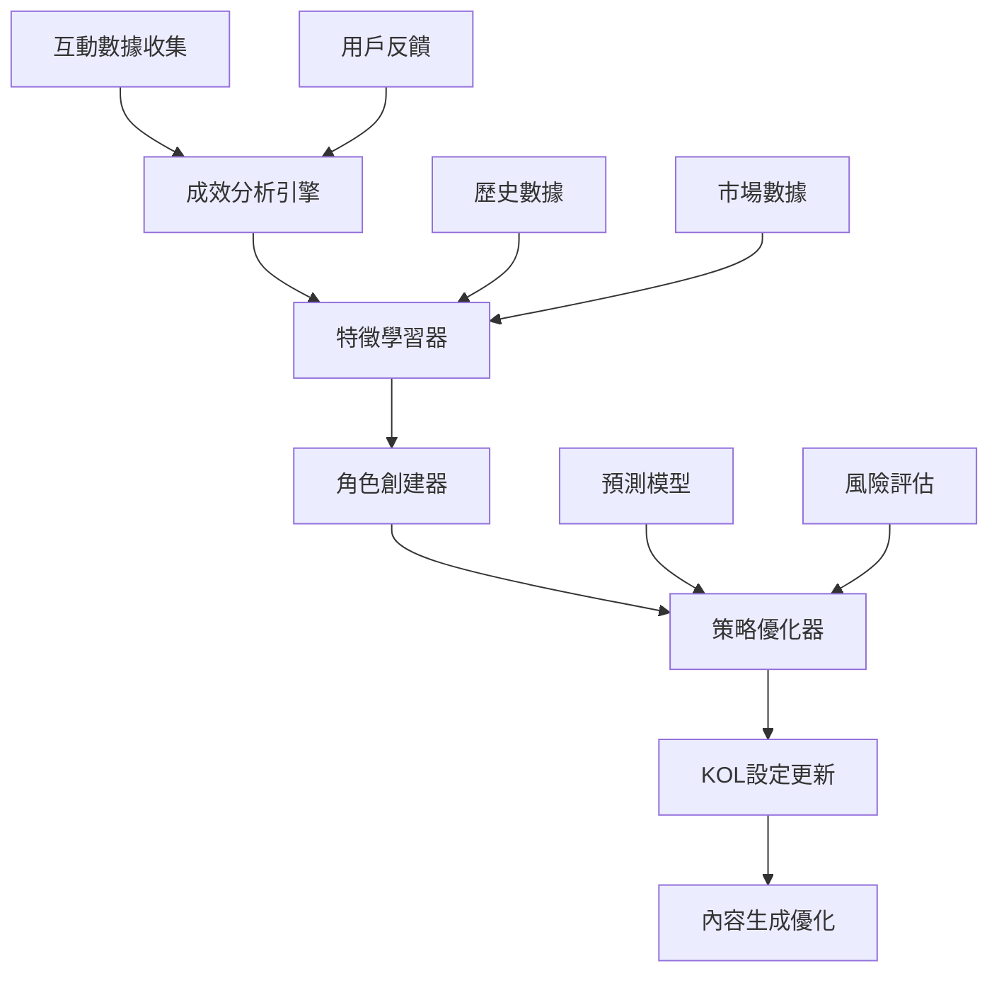

# AI自我學習機制 - 簡報 Wireframe

## 頁面1：機制概覽與核心價值

### 標題
**AI自我學習機制 - 完整簡報**

### 第一部分：核心目標
**四大核心目標：**
1. **自動創建KOL角色** - 基於互動成效智能生成新角色
2. **學習成功特徵** - 從高互動內容中提取有效模式  
3. **動態優化策略** - 實時調整KOL設定和內容生成
4. **預測互動效果** - 提前預測內容表現和AI偵測風險

### 第二部分：預期效果對比
| 指標 | 第1.5月 | 第3.5月 | 第6月 |
|------|---------|---------|-------|
| 互動率提升 | +15-20% | +25-30% | +30%+ |
| AI偵測率降低 | -10-15% | 降至8%以下 | 降至5%以下 |
| KOL多樣性 | +30% | +50% | 完全自動化 |
| 預測準確率 | 70%+ | 80%+ | 90%+ |

### 第三部分：學習循環
```
內容生成 → 發布 → 互動收集 → 成效分析 → 特徵學習 → 策略調整 → 內容生成
```

**循環特點：**
- **實時性**：每小時數據收集與分析
- **持續性**：24/7不間斷學習
- **自適應**：基於實際效果動態調整

### 第四部分：關鍵創新
1. **自動KOL創建** - 從成功內容中學習並生成新角色
2. **實時策略調整** - 基於即時數據動態優化
3. **預測風險控制** - 提前識別和避免AI偵測
4. **個性化深度學習** - 每個KOL都有獨特的學習路徑

---

## 頁面2：技術架構與實施結果

### 第一部分：系統架構


### 第二部分：四大核心組件

#### 1. 自動角色創建器 (Auto Role Creator)
**功能：** 基於高互動內容分析，自動生成新的KOL角色設定

**學習維度：**
- **語氣風格** - 從高互動內容中學習語氣模式
- **詞彙選擇** - 識別有效的專業術語和口語表達
- **內容結構** - 學習成功的文章結構和段落安排
- **互動方式** - 分析有效的提問和引導方式
- **時間偏好** - 識別最佳發文時間和頻率

#### 2. 特徵學習器 (Feature Learner)
**功能：** 深度分析互動數據，提取成功內容的特徵模式

**學習指標：**
- **內容特徵** - 標題結構、段落安排、表情符號使用
- **KOL特徵** - 語氣強度、專業術語、口語化表達
- **時機特徵** - 發文時間、市場時機、話題熱度匹配
- **風險特徵** - AI偵測敏感詞彙、過度格式化模式

#### 3. 策略優化器 (Strategy Optimizer)
**功能：** 基於學習結果，動態調整KOL策略和內容生成參數

**優化維度：**
- **個人化設定優化** - 語氣校準、詞彙精煉
- **內容策略優化** - 內容類型權重、長度偏好
- **時機策略優化** - 發文時機、頻率調整
- **風險控制優化** - AI偵測預防、品質閾值

#### 4. 預測模型 (Prediction Models)
**功能：** 預測互動效果和AI偵測風險

**預測類型：**
- **互動效果預測** - 按讚、留言、分享機率
- **AI偵測風險預測** - 被識別為AI生成的風險
- **內容品質預測** - 內容受歡迎程度預測

### 第三部分：實際測試結果

#### 測試環境
- **KOL**: 龜狗一日散戶、板橋大who
- **數據來源**: 真實的 CMoney API 數據
- **分析時間範圍**: 7天連續數據
- **分析維度**: 多維度綜合評估

#### 分析結果

**龜狗一日散戶**
- **整體分數**: 19.3/100
- **互動分數**: 19.0/100
- **病毒傳播潛力**: 13.3
- **品牌影響力**: 29.1
- **風險等級**: 中等（整體風險 0.55）

**板橋大who**
- **整體分數**: 17.0/100
- **互動分數**: 18.0/100
- **病毒傳播潛力**: 10.0
- **品牌影響力**: 25.1
- **風險等級**: 中等（整體風險 0.55）

### 第四部分：生成的學習洞察

#### 高優先級洞察
1. **互動率偏低** - 建議增加個人化元素和情感表達
2. **低互動模式** - 需要調整策略，增加內容趣味性

#### 中等優先級洞察
1. **發文時機不佳** - 建議在高峰時段發文（9-11點或19-21點）
2. **內容結構優化** - 建議調整段落長度和表情符號使用

#### 低優先級洞察
1. **詞彙多樣性** - 建議增加專業術語和口語表達的平衡
2. **互動引導** - 建議增加更多提問和互動引導

### 第五部分：6個月實施路線圖

#### 第一階段：基礎學習機制 (1.5個月)
**目標：** 建立核心學習基礎
- 完善互動數據收集系統
- 實現基礎特徵學習算法
- 建立KOL策略調整機制
- 完成初步測試驗證

#### 第二階段：智能角色創建 (2個月)
**目標：** 實現自動KOL角色生成
- 實現自動KOL角色生成算法
- 建立角色驗證和測試機制
- 整合角色創建到主流程
- 完成角色創建測試

#### 第三階段：預測模型優化 (2.5個月)
**目標：** 建立高精度預測系統
- 實現互動效果預測模型
- 實現AI偵測風險預測
- 建立預測準確率監控
- 完成預測模型測試

### 第六部分：預期量化效果

#### 短期效果 (1個月)
- **互動率提升**: 15-20%
- **AI偵測率降低**: 10-15%
- **KOL角色多樣性**: +30%
- **內容生成速度**: +20%

#### 中期效果 (3個月)
- **互動率提升**: 25-30%
- **AI偵測率降低**: 降至8%以下
- **自動創建KOL**: 5-10個新角色
- **預測準確率**: 80%+

#### 長期效果 (6個月)
- **互動率提升**: 30%+
- **AI偵測率降低**: 降至5%以下
- **學習生態系統**: 完全建立
- **內容優化**: 完全自動化

### 第七部分：核心價值總結

**這個自我學習機制將使虛擬KOL系統能夠：**

1. **自動進化** - 持續學習和改進內容生成策略
2. **智能創建** - 自動生成新的KOL角色和設定
3. **預測優化** - 提前預測和避免風險
4. **個性化提升** - 深度個人化每個KOL的特色
5. **持續監控** - 實時監控學習效果和系統健康

**技術優勢：**
- **實時數據驅動** - 基於真實互動數據
- **多維度分析** - 內容、時間、受眾全面分析
- **智能優化** - 自動調整策略和參數
- **風險預警** - 提前識別AI偵測風險

**商業價值：**
- **提升互動效果** - 顯著提升內容互動率
- **降低運營成本** - 減少人工干預需求
- **增強競爭優勢** - 領先的AI學習技術
- **可持續發展** - 持續自我改進的能力
