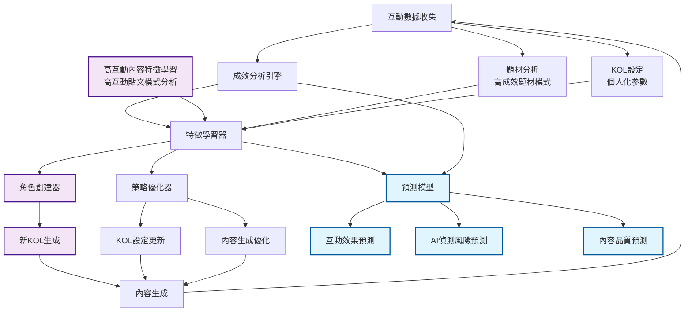

# 9/9 自我學習機制設計文件

## Section 1: 核心目標與實施路線圖

### 四大核心目標
1. **學習高互動內容特徵** - 從高互動貼文中提取有效模式 (P0)
2. **動態優化策略** - 實時調整KOL設定和內容生成參數 (P0)
3. **自動創建KOL角色** - 基於學習成效智能生成新角色 (P1)
4. **預測互動效果** - 提前預測內容表現和AI偵測風險 (P2)

### 實施路線圖
**P0：基礎學習機制 (1.5個月)**
- 完善互動數據收集系統
- 實現高互動內容特徵學習算法
- 建立KOL策略調整機制

**P1：智能角色創建 (2個月)**
- 實現自動KOL角色生成算法
- 建立角色驗證和測試機制
- 整合角色創建到主流程

**P2：預測模型優化 (2.5個月)**
- 實現互動效果預測模型
- 實現AI偵測風險預測
- 建立預測準確率監控

### 預期達成目標
| 指標 | 第1.5月 | 第3.5月 | 第6月 |
|------|---------|---------|-------|
| 互動分數提升 | +15-20% | +25-30% | +30%+ |
| AI偵測率降低 | -10-15% | 降至8%以下 | 降至5%以下 |
| 自動創建KOL數量 | >5個 | >10個 | >20個 |
| KOL發文平均互動分數 | 提升20% | 提升40% | 提升60% |

**互動分數定義：**
- **加權計算** = 按讚數×0.3 + 留言數×0.4 + 分享數×0.2 + 收藏數×0.1
- **互動分數** = 加權總和
- **包含項目**：按讚、留言、分享、表情反應、收藏、打賞等所有用戶互動行為

## Section 2: 系統架構圖

## Section 3: 架構節點詳細說明

#### 數據收集與分析層

**A. 互動數據收集**

* **功能**: 從CMoney API收集所有 AIGC貼文的互動數據
* **數據內容**: 按讚、留言、分享、表情反應、收藏、打賞等
* **更新頻率**: 每小時自動收集
* **數據格式**: 結構化JSON格式，包含時間戳記

**B. 成效分析引擎**

* **功能**: 分析互動數據的成效指標
* **分析維度**: 互動率、時間模式、用戶行為
* **輸出**: 辨識出哪些文章成效好
* **算法**: 統計分析、趨勢預測、異常檢測

#### 特徵學習層

**C. 特徵學習器**

* **功能**: 整合多個數據源，學習成功模式
* **輸入**: 成效分析、題材分析、KOL設定、高互動內容特徵
* **輸出**: 成功特徵模式、學習洞察
* **算法**: 機器學習、模式識別、特徵提取

**D. 高互動內容特徵學習**

* **功能**: 專門分析高互動貼文的共同特徵
* **學習內容**: 標題結構、內容長度、用詞習慣、表情符號使用
* **輸出**: 高互動內容的特徵模式
* **更新方式**: 基於新數據持續學習

**F. 題材分析**

* **功能**: 從貼文紀錄中提取高成效題材模式 →抓出好互動成效的貼文的發文題材及數據源
* **分析內容**: 題材分類、熱門話題、時效性分析
* **輸出**: 題材效果評分、推薦題材列表
* **數據來源**: 互動數據收集的題材標籤

**G. KOL設定**

* **功能**: 從貼文紀錄中提取KOL個人化參數 →抓出好互動成效的貼文的發文題材及數據源
* **參數內容**: 語氣風格、詞彙選擇、發文時間偏好
* **輸出**: KOL個人化設定檔案
* **數據來源**: 互動數據收集的KOL標識

#### 策略優化層

**I. 角色創建器**

* **功能**: 基於學習結果自動生成新的KOL角色
* **輸入**: 特徵學習器的成功模式
* **輸出**: 新的KOL角色設定
* **創建方式**: 組合現有成功特徵，生成新角色

**J. 策略優化器**

* **功能**: 動態調整KOL策略和內容生成參數
* **優化維度**: KOL參數、內容生成、時機策略、風險控制
* **輸出**: 優化後的策略參數
* **更新頻率**: 基於學習結果即時調整

#### 執行層

**K. 新KOL生成**

* **功能**: 執行角色創建器的新角色生成
* **輸出**: 完整的KOL角色檔案
* **驗證**: 自動測試新角色的效果
* **部署**: 整合到內容生成系統

**L. KOL設定更新**

* **功能**: 更新現有KOL的個人化參數
* **更新內容**: 語氣、詞彙、風格、時機偏好
* **更新方式**: 漸進式調整，避免劇烈變化
* **驗證**: A/B測試驗證更新效果

**M. 內容生成優化**

* **功能**: 優化內容生成的各個環節
* **優化內容**: 內容長度、結構、表情符號、互動引導
* **優化方式**: 基於學習結果調整生成參數
* **效果監控**: 即時監控優化效果

**N. 內容生成**

* **功能**: 使用優化後的參數生成新內容
* **輸入**: 優化的KOL設定、內容生成參數
* **輸出**: 高品質的貼文內容
* **品質控制**: 自動品質檢測和風險評估

#### 預測層

**O. 預測模型**

* **功能**: 整合多個預測子模型
* **輸入**: 特徵學習結果、成效分析數據
* **輸出**: 多維度預測結果
* **模型類型**: 機器學習模型、深度學習模型

**P. 互動效果預測**

* **功能**: 預測內容的互動效果
* **預測指標**: 按讚數、留言數、分享數
* **準確率目標**: 80%以上
* **應用**: 內容發布前的效果預估

**Q. AI偵測風險預測**

* **功能**: 預測內容被AI偵測的風險
* **風險指標**: AI偵測機率、風險等級
* **目標**: 將AI偵測率降至5%以下
* **應用**: 內容發布前的風險評估

**R. 內容品質預測**

* **功能**: 預測內容的整體品質
* **品質指標**: 可讀性、專業性、吸引力
* **評分範圍**: 0-100分
* **應用**: 內容品質控制和優化建議

### 特徵學習器功能

**特徵學習器主要功能：**

* **高互動內容特徵學習** - 分析高互動貼文的共同特徵和模式
* **題材分析** - 從歷史數據中學習高成效題材模式
* **KOL設定學習** - 分析不同KOL設定的效果差異
* **高成效模式提取** - 識別高互動內容的共同特徵

**數據學習方式：**

* **高互動內容學習** - 分析高互動貼文的標題、內容結構、用詞習慣
* **實時數據學習** - 每小時收集互動數據，即時調整學習模型
* **跨平台學習** - 整合不同平台的數據，建立統一的學習模型

### 策略優化器功能

**策略優化器主要功能：**

* **KOL參數調整** - 根據學習結果調整語氣、詞彙、風格設定
* **內容生成優化** - 優化內容長度、結構、表情符號使用
* **時機策略調整** - 調整發文時間、頻率、市場時機匹配
* **風險控制優化** - 調整AI偵測預防參數、品質閾值設定
* **A/B測試管理** - 管理不同策略版本的測試和效果比較

### 學習循環

**內容生成 → 發布 → 互動收集 → 成效分析 → 特徵學習 → 策略調整 → 內容生成**

**循環特點：**

* **實時性**：每小時數據收集與分析
* **持續性**：24/7不間斷學習
* **自適應**：基於實際效果動態調整

### 預期效果對比

| 指標      | 第1.5月   | 第3.5月   | 第6月    |
| ------- | ------- | ------- | ------ |
| 互動率提升   | +15-20% | +25-30% | +30%+  |
| AI偵測率降低 | -10-15% | 降至8%以下  | 降至5%以下 |
| KOL多樣性  | +30%    | +50%    | 完全自動化  |
| 預測準確率   | 70%+    | 80%+    | 90%+   |

**互動率定義：**

* **總互動數** = 按讚數 + 留言數 + 分享數 + 表情符號總數 + 收藏數 + 打賞數
* **互動率** = 總互動數 / 瀏覽數 (或基於總互動數的絕對值)
* **包含項目**：按讚、留言、分享、表情反應、收藏、打賞等所有用戶互動行為

***

### 核心價值總結

**技術優勢：**

* 實時數據驅動 - 基於真實互動數據
* 多維度分析 - 內容、時間、受眾全面分析
* 智能優化 - 自動調整策略和參數
* 風險預警 - 提前識別AI偵測風險

**商業價值：**

* 提升互動效果 - 顯著提升內容互動率
* 降低運營成本 - 減少人工干預需求
* 增強競爭優勢 - 領先的AI學習技術
* 可持續發展 - 持續自我改進的能力
