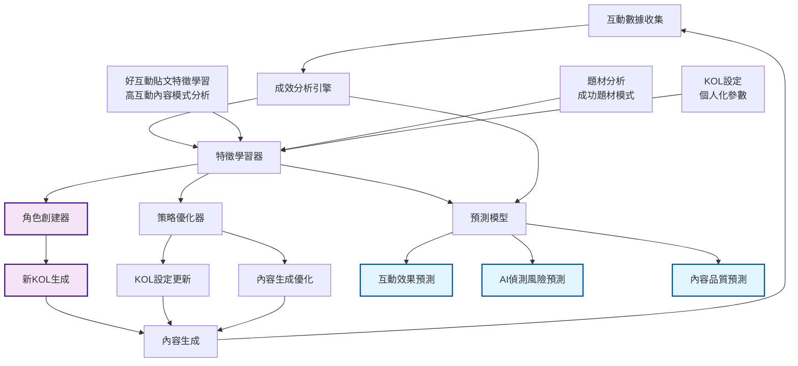

# AI自我學習機制 - 簡報 Wireframe (重新排版)

## 頁面1：核心概念與架構

### 標題
**AI自我學習機制 - 完整簡報**

### 第一部分：四大核心目標
1. **自動創建KOL角色** - 基於互動成效智能生成新角色
2. **學習成功特徵** - 從高互動內容中提取有效模式  
3. **動態優化策略** - 實時調整KOL設定和內容生成參數
4. **預測互動效果** - 提前預測內容表現和AI偵測風險

### 第二部分：系統架構圖

### 第三部分：特徵學習器功能
**特徵學習器主要功能：**
- **好互動貼文特徵學習** - 分析高互動內容的共同特徵和模式
- **題材分析** - 從歷史數據中學習成功題材模式
- **KOL設定學習** - 分析不同KOL設定的效果差異
- **成功模式提取** - 識別高互動內容的共同特徵

**數據學習方式：**
- **好互動貼文學習** - 分析高互動內容的標題、內容結構、用詞習慣
- **實時數據學習** - 每小時收集互動數據，即時調整學習模型
- **跨平台學習** - 整合不同平台的數據，建立統一的學習模型

### 第四部分：策略優化器功能
**策略優化器主要功能：**
- **KOL參數調整** - 根據學習結果調整語氣、詞彙、風格設定
- **內容生成優化** - 優化內容長度、結構、表情符號使用
- **時機策略調整** - 調整發文時間、頻率、市場時機匹配
- **風險控制優化** - 調整AI偵測預防參數、品質閾值設定
- **A/B測試管理** - 管理不同策略版本的測試和效果比較

### 第五部分：學習循環
**內容生成 → 發布 → 互動收集 → 成效分析 → 特徵學習 → 策略調整 → 內容生成**

**循環特點：**
- **實時性**：每小時數據收集與分析
- **持續性**：24/7不間斷學習
- **自適應**：基於實際效果動態調整

### 第六部分：預期效果對比
| 指標 | 第1.5月 | 第3.5月 | 第6月 |
|------|---------|---------|-------|
| 互動率提升 | +15-20% | +25-30% | +30%+ |
| AI偵測率降低 | -10-15% | 降至8%以下 | 降至5%以下 |
| KOL多樣性 | +30% | +50% | 完全自動化 |
| 預測準確率 | 70%+ | 80%+ | 90%+ |

---

## 頁面2：實施結果與路線圖

### 第一部分：實際測試結果
**測試環境：**
- KOL: 龜狗一日散戶、板橋大who
- 數據來源: 真實的 CMoney API 數據
- 分析時間範圍: 7天連續數據

**分析結果：**
- **龜狗一日散戶**: 整體分數 19.3/100，互動分數 19.0/100
- **板橋大who**: 整體分數 17.0/100，互動分數 18.0/100
- **風險等級**: 兩者均為中等風險（0.55）

### 第二部分：關鍵學習洞察
**高優先級洞察：**
1. 互動率偏低 - 建議增加個人化元素和情感表達
2. 低互動模式 - 需要調整策略，增加內容趣味性

**中等優先級洞察：**
1. 發文時機不佳 - 建議在高峰時段發文（9-11點或19-21點）
2. 內容結構優化 - 建議調整段落長度和表情符號使用

### 第三部分：6個月實施路線圖
**第一階段：基礎學習機制 (1.5個月)**
- 完善互動數據收集系統
- 實現基礎特徵學習算法
- 建立KOL策略調整機制

**第二階段：智能角色創建 (2個月)**
- 實現自動KOL角色生成算法
- 建立角色驗證和測試機制
- 整合角色創建到主流程

**第三階段：預測模型優化 (2.5個月)**
- 實現互動效果預測模型
- 實現AI偵測風險預測
- 建立預測準確率監控

### 第四部分：核心價值總結
**技術優勢：**
- 實時數據驅動 - 基於真實互動數據
- 多維度分析 - 內容、時間、受眾全面分析
- 智能優化 - 自動調整策略和參數
- 風險預警 - 提前識別AI偵測風險

**商業價值：**
- 提升互動效果 - 顯著提升內容互動率
- 降低運營成本 - 減少人工干預需求
- 增強競爭優勢 - 領先的AI學習技術
- 可持續發展 - 持續自我改進的能力