# 核心業務流程

## 🎯 業務流程概覽

虛擬 KOL 系統的核心業務流程包括：
1. **觸發器檢測** → 市場數據監控
2. **內容生成** → AI 生成投資分析內容
3. **個人化處理** → KOL 風格適配與內容優化
4. **內容審核** → 可開關的內容品質控制
5. **排程發布** → 自動化發布管理
6. **互動追蹤** → 數據收集與分析
7. **自我學習** → 參數優化與策略調整

## 🔄 主要業務流程

### 1. 觸發器檢測流程

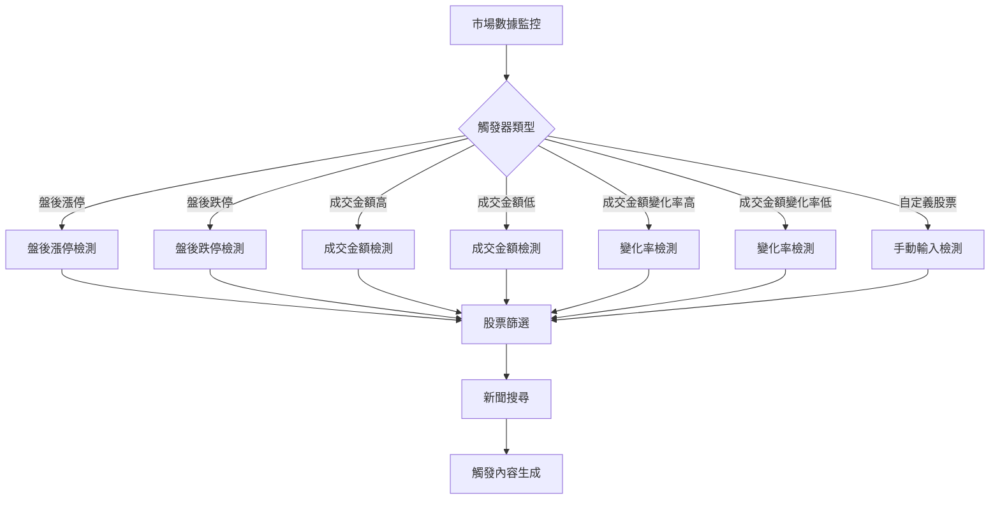

#### 觸發器類型詳解

**盤後觸發器**
- **盤後漲停**: 收盤漲停股票分析
- **盤後跌停**: 收盤跌停股票分析
- **新聞關鍵字**: ["上漲", "漲停", "突破", "強勢"] / ["下跌", "跌停", "弱勢", "回檔"]

**成交量觸發器**
- **成交金額高**: 成交金額絕對值排序（由大到小）
- **成交金額低**: 成交金額絕對值排序（由小到大）
- **成交金額變化率高**: (今日成交金額 - 昨日成交金額) / 昨日成交金額 * 100%
- **成交金額變化率低**: 變化率排序（由小到大）
- **新聞關鍵字**: ["成交量", "爆量", "大量", "活躍"] / ["量縮", "清淡", "觀望"]

**盤中觸發器**
- **漲幅排序+成交額**: 盤中漲幅排序，結合成交額篩選
  - 新聞關鍵字: ["盤中上漲", "漲幅", "成交額", "活躍"]
  - API 端點: `/api/intraday/gainers-by-amount`
- **成交量排序**: 盤中成交量排序，找出最活躍股票
  - 新聞關鍵字: ["成交量", "活躍", "交易熱絡", "盤中"]
  - API 端點: `/api/intraday/volume-leaders`
- **成交額排序**: 盤中成交額排序，找出資金流向
  - 新聞關鍵字: ["成交額", "資金流向", "大額交易", "盤中"]
  - API 端點: `/api/intraday/amount-leaders`
- **跌停篩選**: 盤中跌停股票篩選
  - 新聞關鍵字: ["跌停", "盤中下跌", "弱勢", "賣壓"]
  - API 端點: `/api/intraday/limit-down`
- **漲停篩選**: 盤中漲停股票篩選
  - 新聞關鍵字: ["漲停", "盤中上漲", "強勢", "買盤"]
  - API 端點: `/api/intraday/limit-up`
- **跌停篩選+成交額**: 盤中跌停股票，結合成交額分析
  - 新聞關鍵字: ["跌停", "成交額", "賣壓", "資金流出"]
  - API 端點: `/api/intraday/limit-down-by-amount`

**自定義觸發器**
- **手動輸入**: 用戶指定股票代號
- **股票搜尋**: 支援股票名稱搜尋功能
- **新聞關鍵字**: 根據股票特性動態生成

### 2. 內容生成流程

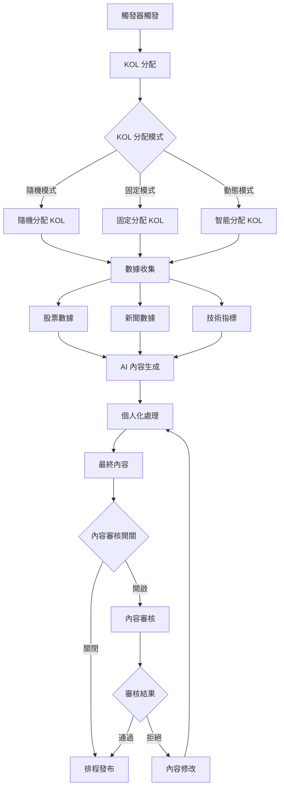

#### KOL 分配策略

**隨機模式**
- 從可用 KOL 池中隨機選擇
- 確保內容多樣性
- 適用於測試和探索階段

**固定模式**
- 指定特定 KOL 處理特定股票
- 保持內容一致性
- 適用於專業領域分析

**動態模式**
- 根據 KOL 專業領域智能分配
- 考慮 KOL 歷史表現
- 優化內容品質和互動率

#### 內容審核開關機制

**審核開關配置**
```python
class ContentReviewConfig:
    def __init__(self):
        self.enabled: bool = True                    # 是否啟用內容審核
        self.auto_approve_threshold: float = 0.8     # 自動通過閾值
        self.require_manual_review: bool = False     # 是否需要人工審核
        self.bypass_scheduled_posts: bool = True     # 排程貼文是否跳過審核
        self.review_timeout: int = 3600              # 審核超時時間（秒）
```

**審核開關邏輯**
- **開啟狀態**: 所有生成內容都需經過審核流程
- **關閉狀態**: 內容直接進入排程發布
- **智能模式**: 基於內容品質分數自動決定是否審核
- **排程跳過**: 排程發布的貼文可選擇跳過審核（提高效率）

**審核開關應用場景**
- **開發測試階段**: 關閉審核，快速驗證功能
- **生產環境**: 開啟審核，確保內容品質
- **緊急發布**: 臨時關閉審核，快速響應市場
- **批量排程**: 跳過審核，提高發布效率

#### 內容生成參數

```python
class GenerationParams:
    def __init__(self):
        # KOL 設定
        self.kol_persona: str          # 技術派、基本面派、籌碼派
        self.content_style: str        # chart_analysis、fundamental_analysis
        self.target_audience: str      # active_traders、long_term_investors
        
        # 內容配置
        self.article_type_distribution: Dict[str, int]  # 文章類型分布
        self.content_length_distribution: Dict[str, int] # 內容長度分布
        self.content_style_distribution: Dict[str, int]  # 風格分布
        self.analysis_depth_distribution: Dict[str, int] # 分析深度分布
        
        # 技術參數
        self.max_words: int            # 最大字數
        self.include_charts: bool      # 是否包含圖表
        self.include_risk_warning: bool # 是否包含風險警告
        
        # 觸發器信息
        self.trigger_type: str         # 觸發器類型
```

### 3. 審核流程

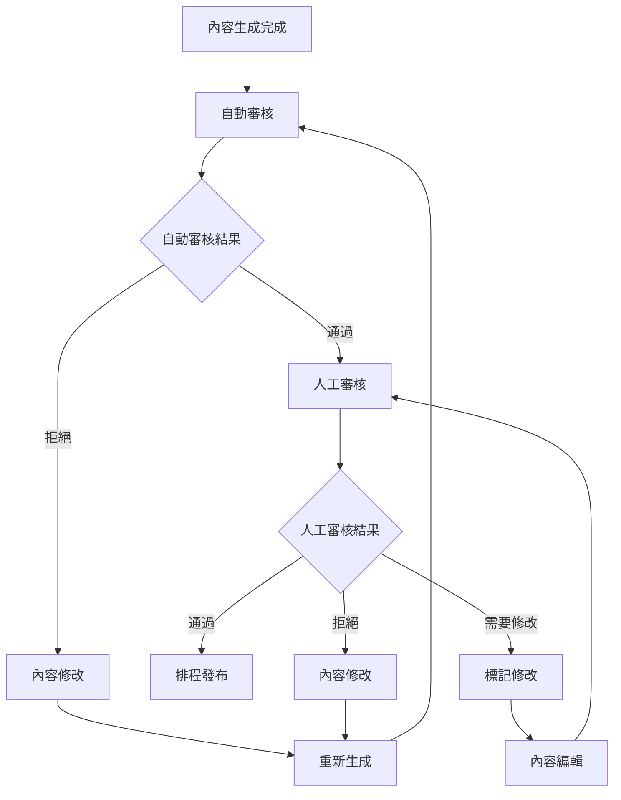

#### 審核標準

**自動審核**
- 內容長度檢查
- 關鍵字過濾
- 風險警告檢查
- 格式規範檢查

**人工審核**
- 內容準確性
- 投資建議合理性
- 風險提示完整性
- 品牌形象一致性

### 4. 排程發布流程

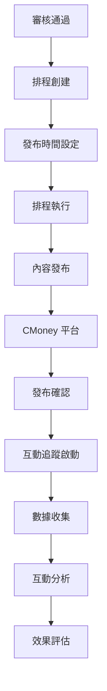

#### 排程管理

**排程類型**
- **即時發布**: 審核通過後立即發布
- **定時發布**: 指定時間發布
- **批次發布**: 多篇內容批量發布
- **智能發布**: 根據互動數據優化發布時間

**發布策略**
- **時間優化**: 根據目標受眾活躍時間
- **頻率控制**: 避免過度發布
- **內容平衡**: 確保內容多樣性
- **風險管理**: 避免市場敏感時段

### 5. 互動追蹤流程

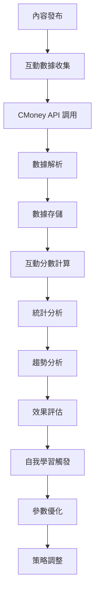

#### 互動數據指標

**基礎指標**
- **瀏覽數 (Views)**: 內容被瀏覽的次數
- **按讚數 (Likes)**: 用戶按讚的次數
- **留言數 (Comments)**: 用戶留言的次數
- **分享數 (Shares)**: 內容被分享的次數
- **收藏數 (Bookmarks)**: 內容被收藏的次數
- **打賞數 (Donations)**: 用戶打賞的次數

**計算指標**
- **互動分數**: 按讚×1 + 留言×1.5 + 分享×2 + 收藏×2 + 打賞×3
- **互動率**: 互動分數 / 瀏覽數 × 100%
- **參與度**: (留言數 + 分享數) / 瀏覽數 × 100%
- **傳播力**: 分享數 / 瀏覽數 × 100%

### 6. 自我學習流程

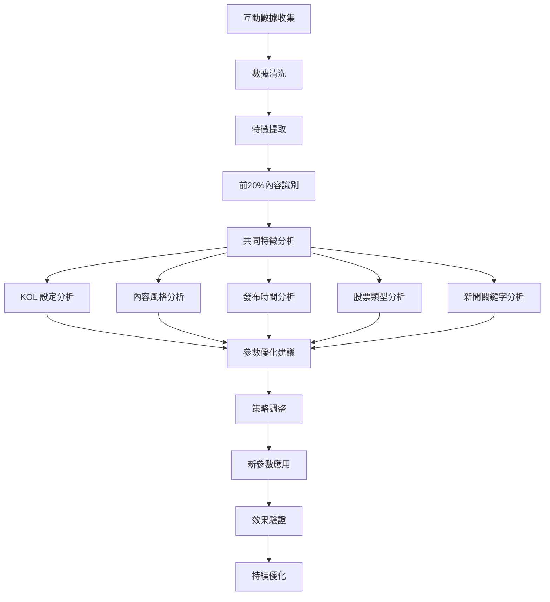

#### 自我學習算法

**前20%內容識別**
```python
def identify_top_performing_content(posts: List[PostRecord], percentile: float = 0.2) -> List[PostRecord]:
    # 計算互動分數
    posts_with_scores = []
    for post in posts:
        interaction_score = (
            post.likes * 1 +
            post.comments * 1.5 +
            post.shares * 2 +
            post.bookmarks * 2 +
            post.donations * 3
        )
        posts_with_scores.append((post, interaction_score))
    
    # 按分數排序
    posts_with_scores.sort(key=lambda x: x[1], reverse=True)
    
    # 取前20%
    top_count = int(len(posts_with_scores) * percentile)
    return [post for post, score in posts_with_scores[:top_count]]
```

**共同特徵分析**
```python
def analyze_common_features(top_posts: List[PostRecord]) -> CommonFeatures:
    features = {
        'kol_personas': {},
        'content_styles': {},
        'publish_times': {},
        'stock_types': {},
        'news_keywords': {},
        'trigger_types': {}
    }
    
    for post in top_posts:
        # 統計 KOL 人格
        features['kol_personas'][post.kol_persona] = features['kol_personas'].get(post.kol_persona, 0) + 1
        
        # 統計內容風格
        if post.generation_params:
            params = json.loads(post.generation_params)
            content_style = params.get('content_style', 'unknown')
            features['content_styles'][content_style] = features['content_styles'].get(content_style, 0) + 1
        
        # 統計發布時間
        if post.published_at:
            hour = post.published_at.hour
            features['publish_times'][hour] = features['publish_times'].get(hour, 0) + 1
        
        # 統計股票類型
        features['stock_types'][post.stock_code] = features['stock_types'].get(post.stock_code, 0) + 1
        
        # 統計觸發器類型
        if post.generation_params:
            params = json.loads(post.generation_params)
            trigger_type = params.get('trigger_type', 'unknown')
            features['trigger_types'][trigger_type] = features['trigger_types'].get(trigger_type, 0) + 1
    
    return CommonFeatures(**features)
```

## 📊 批次處理流程

### 批次生成流程

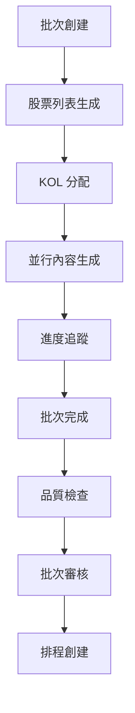

#### 批次處理參數

```python
class BatchConfig:
    def __init__(self):
        # 批次基本設定
        self.batch_name: str
        self.description: str
        self.trigger_type: str
        self.stock_count: int
        
        # KOL 設定
        self.kol_allocation_mode: str  # random, fixed, dynamic
        self.kol_persona: str
        self.content_style: str
        self.target_audience: str
        
        # 內容設定
        self.article_type_distribution: Dict[str, int]
        self.content_length_distribution: Dict[str, int]
        self.max_words: int
        self.include_charts: bool
        self.include_risk_warning: bool
        
        # 新聞設定
        self.news_config: NewsConfig
        self.enable_smart_search: bool
        
        # 排程設定
        self.auto_schedule: bool
        self.schedule_time: Optional[datetime]
        self.schedule_interval: Optional[int]
```

### 批次歷史管理

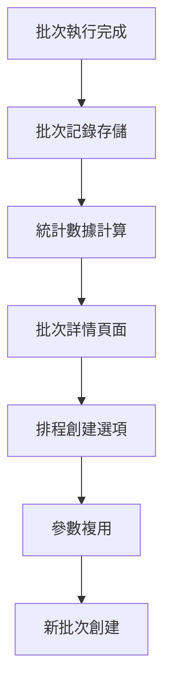

#### 批次統計指標

**執行統計**
- **總貼文數**: 批次中生成的貼文總數
- **成功數**: 成功生成的貼文數
- **失敗數**: 生成失敗的貼文數
- **成功率**: 成功數 / 總貼文數 × 100%

**品質統計**
- **平均品質分數**: 所有貼文的平均品質分數
- **審核通過率**: 通過審核的貼文比例
- **發布成功率**: 成功發布的貼文比例

**互動統計**
- **平均互動分數**: 所有貼文的平均互動分數
- **總互動數**: 批次所有貼文的總互動數
- **互動率**: 總互動數 / 總瀏覽數 × 100%

## 🔄 排程管理流程

### 排程創建流程

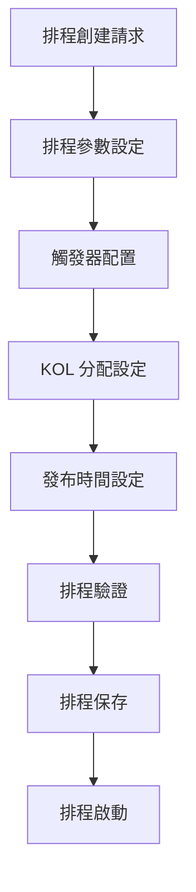

#### 排程類型

**自動排程**
- **觸發器驅動**: 基於市場數據自動觸發
- **時間驅動**: 定時執行排程
- **事件驅動**: 基於特定事件觸發

**手動排程**
- **即時執行**: 立即執行排程
- **定時執行**: 指定時間執行
- **條件執行**: 滿足條件時執行

### 排程執行流程

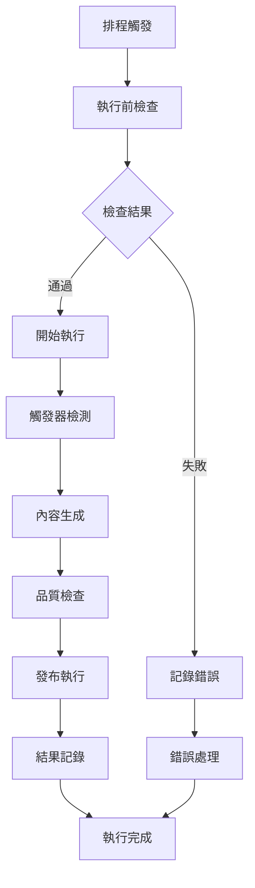

#### 排程監控

**執行狀態**
- **等待中**: 排程已創建，等待執行
- **執行中**: 排程正在執行
- **已完成**: 排程執行完成
- **已失敗**: 排程執行失敗
- **已暫停**: 排程被暫停
- **已取消**: 排程被取消

**執行統計**
- **執行次數**: 排程總執行次數
- **成功次數**: 成功執行次數
- **失敗次數**: 失敗執行次數
- **成功率**: 成功次數 / 執行次數 × 100%

## 📈 數據分析流程

### 互動分析流程

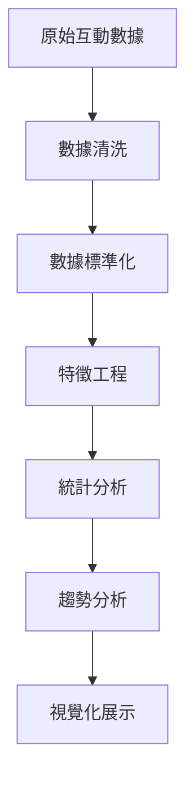

#### 分析維度

**時間維度**
- **1小時數據**: 最近1小時的互動數據
- **1日數據**: 最近1天的互動數據
- **7日數據**: 最近7天的互動數據
- **30日數據**: 最近30天的互動數據

**內容維度**
- **KOL 分析**: 不同 KOL 的互動表現
- **內容風格分析**: 不同內容風格的互動效果
- **股票類型分析**: 不同股票類型的互動情況
- **觸發器分析**: 不同觸發器的互動表現

**互動維度**
- **互動分數分布**: 互動分數的統計分布
- **互動率分析**: 互動率的變化趨勢
- **參與度分析**: 用戶參與度的分析
- **傳播力分析**: 內容傳播力的分析

### 成效分析流程

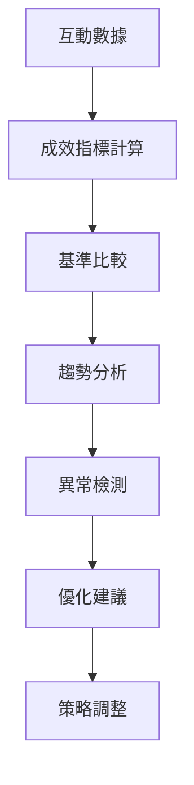

#### 成效指標

**內容成效**
- **內容品質分數**: AI 評估的內容品質
- **互動分數**: 用戶互動的綜合分數
- **傳播指數**: 內容傳播的廣度和深度
- **影響力指數**: 內容對用戶的影響程度

**業務成效**
- **發布成功率**: 內容成功發布的比例
- **審核通過率**: 內容通過審核的比例
- **用戶參與度**: 用戶參與互動的比例
- **品牌影響力**: 對品牌形象的影響程度

## 🔧 系統優化流程

### 性能優化

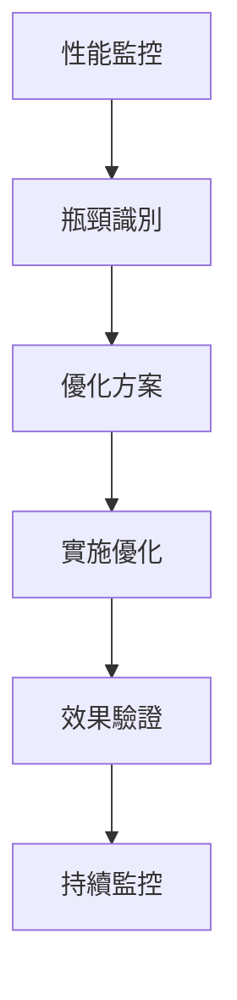

#### 優化策略

**並行處理優化**
- **API 並行調用**: 同時調用多個外部 API
- **內容並行生成**: 同時生成多篇內容
- **數據並行處理**: 並行處理大量數據
- **任務隊列**: 使用任務隊列管理異步任務

**緩存優化**
- **API 響應緩存**: 緩存外部 API 響應
- **數據庫查詢緩存**: 緩存常用數據庫查詢
- **內容生成緩存**: 緩存相似內容生成結果
- **靜態資源緩存**: 緩存靜態資源文件

**數據庫優化**
- **索引優化**: 優化數據庫索引
- **查詢優化**: 優化 SQL 查詢語句
- **連接池**: 使用數據庫連接池
- **分片策略**: 實施數據分片策略

### 品質優化

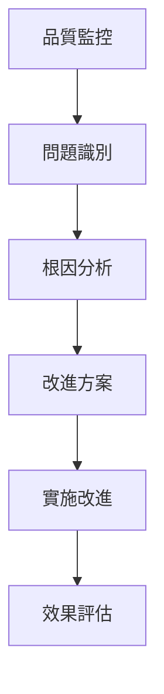

#### 品質指標

**內容品質**
- **準確性**: 內容信息的準確程度
- **相關性**: 內容與主題的相關程度
- **完整性**: 內容信息的完整程度
- **可讀性**: 內容的可讀性程度

**系統品質**
- **穩定性**: 系統運行的穩定程度
- **可靠性**: 系統功能的可靠程度
- **可用性**: 系統的可用性程度
- **安全性**: 系統的安全程度
