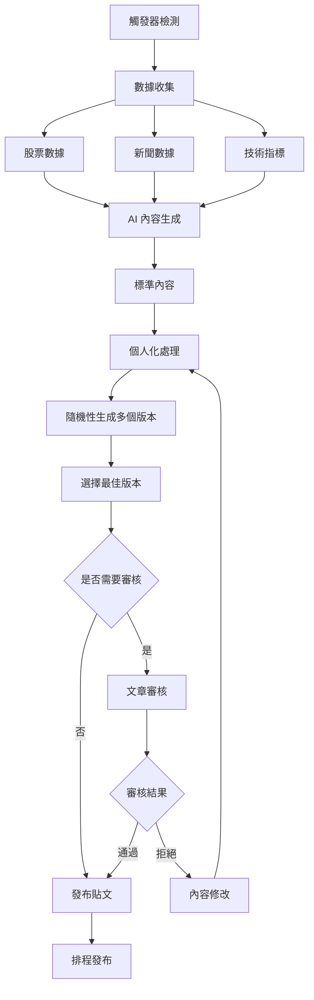
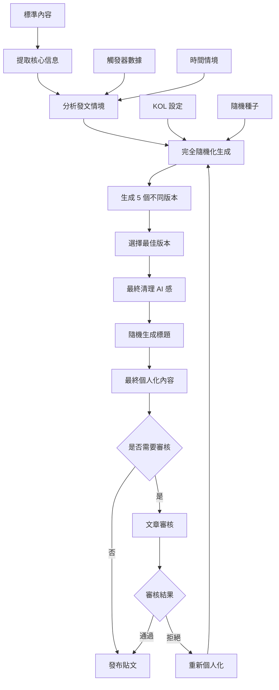

# 內容生成流程

## 🎯 內容生成流程概覽

內容生成流程是虛擬 KOL 系統的核心，包含從觸發器檢測到最終內容發布的完整流程。流程分為標準內容生成和個人化處理兩個階段。

## 🔄 完整內容生成流程

### 1. 標準內容生成階段



### 2. AI 內容生成詳細流程

#### OpenAI GPT 內容生成
```python
class ContentGenerator:
    def __init__(self):
        self.openai_client = OpenAIClient(os.getenv("OPENAI_API_KEY"))
        self.serper_client = SerperClient(os.getenv("SERPER_API_KEY"))
        self.finlab_client = FinLabClient()
    
    async def generate_standard_content(self, request: PostingRequest) -> GeneratedContent:
        """生成標準內容"""
        try:
            # 1. 收集股票數據
            stock_data = await self._collect_stock_data(request)
            
            # 2. 搜尋相關新聞
            news_data = await self._search_news(request)
            
            # 3. 獲取技術指標
            technical_data = await self._get_technical_indicators(request)
            
            # 4. 構建 AI 提示詞
            prompt = self._build_ai_prompt(stock_data, news_data, technical_data, request)
            
            # 5. 調用 OpenAI API
            ai_response = await self.openai_client.generate_content(prompt)
            
            # 6. 解析 AI 響應
            parsed_content = self._parse_ai_response(ai_response)
            
            # 7. 後處理和驗證
            final_content = self._post_process_content(parsed_content, request)
            
            return GeneratedContent(
                title=final_content['title'],
                content=final_content['content'],
                content_md=final_content['content_md'],
                technical_analysis=final_content['technical_analysis'],
                serper_data=news_data,
                quality_score=self._calculate_quality_score(final_content),
                generation_params=request.generation_params
            )
            
        except Exception as e:
            logger.error(f"❌ 標準內容生成失敗: {e}")
            raise
    
    def _build_ai_prompt(self, stock_data: Dict, news_data: Dict, technical_data: Dict, request: PostingRequest) -> str:
        """構建 AI 提示詞"""
        prompt_template = """
你是一個專業的股票分析師，請根據以下信息生成一篇投資分析文章：

## 股票信息
- 股票代號：{stock_code}
- 股票名稱：{stock_name}
- 當前價格：{current_price}
- 漲跌幅：{change_percent}%

## 技術指標
{technical_indicators}

## 相關新聞
{news_summary}

## 分析要求
- 內容風格：{content_style}
- 目標受眾：{target_audience}
- 分析深度：{analysis_depth}
- 最大字數：{max_words}

## 內容結構
1. 題材面分析
2. 基本面分析
3. 技術面分析
4. 籌碼面分析
5. 操作建議
6. 風險提醒

請生成標題和內容，確保內容專業、客觀、有參考價值。
"""
        
        return prompt_template.format(
            stock_code=stock_data.get('stock_code', ''),
            stock_name=stock_data.get('stock_name', ''),
            current_price=stock_data.get('current_price', ''),
            change_percent=stock_data.get('change_percent', ''),
            technical_indicators=self._format_technical_indicators(technical_data),
            news_summary=self._format_news_summary(news_data),
            content_style=request.content_style,
            target_audience=request.target_audience,
            analysis_depth=request.analysis_depth,
            max_words=request.max_words
        )
```

### 3. 內容審核系統

#### 審核配置
```python
class ContentReviewConfig:
    def __init__(self):
        self.auto_review_enabled = True
        self.manual_review_enabled = True
        self.skip_review_for_scheduled = True  # 排程內容跳過審核
        self.quality_threshold = 0.8
        self.risk_keywords = ['投資有風險', '謹慎投資', '風險自負']
    
    def should_skip_review(self, content: GeneratedContent, request: PostingRequest) -> bool:
        """判斷是否跳過審核"""
        # 排程內容跳過審核
        if request.batch_mode and self.skip_review_for_scheduled:
            return True
        
        # 高品質內容跳過審核
        if content.quality_score >= self.quality_threshold:
            return True
        
        return False
```

#### 自動審核邏輯
```python
class AutoContentReviewer:
    def __init__(self):
        self.risk_keywords = ['投資有風險', '謹慎投資', '風險自負']
        self.prohibited_keywords = ['保證獲利', '穩賺不賠', '內線消息']
        self.min_length = 100
        self.max_length = 5000
    
    async def review_content(self, content: GeneratedContent) -> ReviewResult:
        """自動審核內容"""
        issues = []
        
        # 1. 長度檢查
        if len(content.content) < self.min_length:
            issues.append(f"內容過短，少於 {self.min_length} 字")
        
        if len(content.content) > self.max_length:
            issues.append(f"內容過長，超過 {self.max_length} 字")
        
        # 2. 風險警告檢查
        if not any(keyword in content.content for keyword in self.risk_keywords):
            issues.append("缺少風險警告")
        
        # 3. 禁用詞彙檢查
        for keyword in self.prohibited_keywords:
            if keyword in content.content:
                issues.append(f"包含禁用詞彙: {keyword}")
        
        # 4. 格式檢查
        if not content.title or len(content.title.strip()) == 0:
            issues.append("標題為空")
        
        # 5. 品質分數檢查
        if content.quality_score < 0.6:
            issues.append(f"品質分數過低: {content.quality_score}")
        
        # 決定審核結果
        if len(issues) == 0:
            return ReviewResult(
                status='approved',
                issues=[],
                score=content.quality_score
            )
        elif len(issues) <= 2:
            return ReviewResult(
                status='needs_revision',
                issues=issues,
                score=content.quality_score
            )
        else:
            return ReviewResult(
                status='rejected',
                issues=issues,
                score=content.quality_score
            )
```

### 4. 個人化處理階段

#### 個人化模組架構
```python
class EnhancedPersonalizationProcessor:
    """增強版個人化處理器"""
    
    def __init__(self):
        self.kol_service = KOLDatabaseService()
        self.llm_processor = cLLMPersonalizationProcessor()
        self.style_randomizer = PostingStyleRandomizer()
        self.parameter_mapper = ParameterMapper()
        self.logger = logging.getLogger(__name__)
    
    def personalize_content(self, standard_title: str, standard_content: str, kol_serial: str, 
                          batch_config: Dict = None, serper_analysis: Dict = None, 
                          trigger_type: str = None, real_time_price_data: Dict = None) -> Tuple[str, str]:
        """個人化內容處理"""
        
        try:
            # 1. 獲取 KOL 設定
            kol_profile = self.kol_service.get_kol_by_serial(int(kol_serial))
            if not kol_profile:
                self.logger.warning(f"⚠️ 找不到 KOL {kol_serial}，返回原始內容")
                return standard_title, standard_content
            
            # 2. 決定發文形態 (提問 vs 發表看法)
            style_type, style_params = self.style_randomizer.determine_posting_style(kol_profile)
            self.logger.info(f"📝 發文形態: {style_type}")
            
            # 3. 根據發文形態決定內容長度
            content_length = self.resolve_content_length_with_style(kol_profile, batch_config or {}, style_type)
            self.logger.info(f"📏 內容長度: {content_length}")
            
            # 4. 映射參數
            prompt_params = self.parameter_mapper.map_kol_to_prompt(kol_profile, style_params, content_length)
            prompt_params.update({
                'standard_title': standard_title,
                'standard_content': standard_content,
                'style_instructions': self.parameter_mapper.get_style_instructions(style_type, style_params)
            })
            
            # 5. 使用 LLM 生成個人化內容
            personalized_content = self.llm_processor.generate_personalized_content(
                standard_content, kol_profile, trigger_type
            )
            
            # 6. 使用 LLM 生成個人化標題
            personalized_title = self.llm_processor.generate_personalized_title(
                personalized_content, kol_profile, standard_title
            )
            
            # 7. 整合新聞來源
            if serper_analysis and serper_analysis.get('news_items'):
                personalized_content = self._integrate_news_sources(personalized_content, serper_analysis)
            
            # 8. 增強實時數據
            if real_time_price_data:
                personalized_content = self._enhance_content_with_realtime_data(
                    personalized_content, real_time_price_data, trigger_type
                )
            
            self.logger.info(f"✅ 個人化完成 - KOL: {kol_serial}, 標題: {personalized_title}")
            return personalized_title, personalized_content
            
        except Exception as e:
            self.logger.error(f"❌ 個人化處理失敗: {e}")
            return standard_title, standard_content
```

#### LLM 個人化處理器
```python
class cLLMPersonalizationProcessor:
    """LLM 驅動的個人化處理器"""
    
    def generate_personalized_content(self, standard_content: str, kol_profile: KOLProfile, trigger_type: str = None) -> str:
        """使用 LLM 生成個人化內容"""
        
        try:
            # 1. 構建動態 prompt
            prompt = self._build_dynamic_prompt(standard_content, kol_profile, trigger_type)
            
            # 2. 調用指定的 GPT 模型
            response = self._call_llm(prompt, kol_profile)
            
            # 3. 後處理和驗證
            personalized_content = self._post_process_content(response, kol_profile)
            
            self.logger.info(f"🤖 LLM 個人化完成 - 模型: {kol_profile.model_id}, 長度: {len(personalized_content)} 字")
            return personalized_content
            
        except Exception as e:
            self.logger.error(f"❌ LLM 個人化失敗: {e}")
            # 回退到配置驅動
            return self._fallback_to_config(standard_content, kol_profile)
    
    def _build_dynamic_prompt(self, standard_content: str, kol_profile: KOLProfile, trigger_type: str = None) -> str:
        """構建動態個人化 prompt"""
        
        prompt_template = """
你是一個{persona}風格的股票分析師，名為{nickname}。

## 角色背景
{backstory}

## 專業領域
{expertise}

## 寫作風格設定
- 語氣風格：{tone_style}
- 打字習慣：{typing_habit}
- 常用術語：{common_terms}
- 口語化用詞：{colloquial_terms}

## 語調控制
- 正式程度：{tone_formal}/10
- 情感強度：{tone_emotion}/10
- 自信程度：{tone_confidence}/10
- 緊迫感：{tone_urgency}/10

## 內容結構偏好
- 內容骨架：{prompt_skeleton}
- 行動呼籲：{prompt_cta}
- 標籤風格：{prompt_hashtags}
- 個人簽名：{signature}

## 互動風格
- 提問比例：{question_ratio}%
- 幽默機率：{humor_probability}%
- 互動開場白：{interaction_starters}

## 目標受眾
{target_audience}

## 任務
請將以下標準化內容轉換為符合你個人風格的版本：

**標準內容：** {standard_content}

**要求：**
1. 保持核心資訊不變
2. 符合你的寫作風格設定
3. 語調要符合你的設定
4. 內容要自然流暢，像真人寫的分析
5. 不要使用結構化標題（如：【技術分析】等）
6. 不要使用 emoji 表情符號

**輸出格式：**
[個人化內容]
"""
        
        return prompt_template.format(
            persona=kol_profile.persona,
            nickname=kol_profile.nickname,
            backstory=kol_profile.backstory or '資深股票分析師',
            expertise=kol_profile.expertise or '股票分析',
            tone_style=kol_profile.tone_style or '專業理性',
            typing_habit=kol_profile.typing_habit or '標準標點符號',
            common_terms=kol_profile.common_terms or '專業術語',
            colloquial_terms=kol_profile.colloquial_terms or '口語化表達',
            tone_formal=kol_profile.tone_formal or 7,
            tone_emotion=kol_profile.tone_emotion or 5,
            tone_confidence=kol_profile.tone_confidence or 7,
            tone_urgency=kol_profile.tone_urgency or 6,
            prompt_skeleton=kol_profile.prompt_skeleton or '標準分析結構',
            prompt_cta=kol_profile.prompt_cta or '歡迎討論',
            prompt_hashtags=kol_profile.prompt_hashtags or '相關標籤',
            signature=kol_profile.signature or '',
            question_ratio=int((kol_profile.question_ratio or 0.3) * 100),
            humor_probability=int((kol_profile.humor_probability or 0.3) * 100),
            interaction_starters=', '.join(kol_profile.interaction_starters) if kol_profile.interaction_starters else '你覺得呢？',
            target_audience=kol_profile.target_audience or '一般投資者',
            standard_content=standard_content
        )
```

### 5. 發文形態隨機器

#### 發文形態決定邏輯
```python
class PostingStyleRandomizer:
    """發文形態隨機器"""
    
    def determine_posting_style(self, kol_profile: KOLProfile) -> Tuple[str, Dict]:
        """決定發文形態"""
        
        # 根據 KOL 設定決定發文形態
        if kol_profile.posting_style_preference == 'interaction':
            return 'interaction', {
                'question_ratio': 0.7,
                'interaction_focus': True,
                'call_to_action': True
            }
        elif kol_profile.posting_style_preference == 'analysis':
            return 'analysis', {
                'analysis_depth': 'detailed',
                'technical_focus': True,
                'data_driven': True
            }
        else:
            # 隨機決定
            import random
            if random.random() < 0.5:
                return 'interaction', {
                    'question_ratio': 0.6,
                    'interaction_focus': True,
                    'call_to_action': True
                }
            else:
                return 'analysis', {
                    'analysis_depth': 'comprehensive',
                    'technical_focus': True,
                    'data_driven': True
                }
```

### 6. 批次內容生成

#### 並行批次生成
```python
class ParallelBatchGenerator:
    """並行批次生成器"""
    
    def __init__(self, max_concurrent: int = 2, timeout: int = 120):
        self.post_generation_processor = PostGenerationProcessor(max_concurrent, timeout)
        self.personalization_processor = EnhancedPersonalizationProcessor()
    
    async def generate_posts_parallel_stream(self, request: BatchRequest, progress_callback: Optional[Callable] = None) -> AsyncGenerator[str, None]:
        """並行批量生成貼文，並通過 SSE 流式返回進度"""
        
        total_posts = len(request.posts)
        successful_posts = 0
        failed_posts = 0
        
        self.logger.info(f"🚀 開始並行批量發文生成 - 會話ID: {request.session_id}, 貼文數量: {total_posts}")
        
        # 生成批次級別的共享 commodity tags
        batch_commodity_tags = await self._generate_batch_tags(request)
        
        yield f"data: {json.dumps({'type': 'batch_start', 'total': total_posts, 'session_id': request.session_id, 'shared_tags_count': len(batch_commodity_tags)})}\n\n"
        
        tasks = [
            (self._generate_single_post_task, post_data, request, batch_commodity_tags)
            for post_data in request.posts
        ]
        
        async for result_event in self.post_generation_processor.process_batch_stream(tasks, progress_callback):
            if result_event.get('success'):
                successful_posts += 1
            else:
                failed_posts += 1
            
            # 添加進度信息
            result_event['progress'] = {
                'current': successful_posts + failed_posts,
                'total': total_posts,
                'percentage': round((successful_posts + failed_posts) / total_posts * 100, 1),
                'successful': successful_posts,
                'failed': failed_posts
            }
            yield f"data: {json.dumps(result_event)}\n\n"
        
        yield f"data: {json.dumps({'type': 'batch_end', 'total': total_posts, 'successful': successful_posts, 'failed': failed_posts, 'timestamp': datetime.now().isoformat()})}\n\n"
    
    async def _generate_single_post_task(self, post_data: Dict[str, Any], request: Any, batch_commodity_tags: List[Dict[str, Any]]) -> Dict[str, Any]:
        """生成單個貼文的異步任務"""
        try:
            self.logger.info(f"📝 開始生成單篇貼文: {post_data.get('stock_name', post_data.get('stock_code'))}")
            
            # 1. 生成標準內容
            standard_content = await self._generate_standard_content(post_data, request)
            
            # 2. 內容審核（可配置跳過）
            if not self._should_skip_review(request):
                review_result = await self._review_content(standard_content)
                if review_result.status == 'rejected':
                    return {
                        'type': 'post_generated',
                        'success': False,
                        'error': f"內容審核失敗: {', '.join(review_result.issues)}",
                        'timestamp': datetime.now().isoformat()
                    }
            
            # 3. 個人化處理
            personalized_title, personalized_content = self.personalization_processor.personalize_content(
                standard_content.title,
                standard_content.content,
                post_data.get('kol_serial'),
                request.batch_config,
                standard_content.serper_data,
                request.batch_config.get('trigger_type')
            )
            
            # 4. 保存到數據庫
            post_record = await self._save_post_record(
                personalized_title,
                personalized_content,
                post_data,
                request,
                batch_commodity_tags
            )
            
            self.logger.info(f"✅ 貼文生成完成: {post_record.post_id}")
            return {
                'type': 'post_generated',
                'success': True,
                'post_id': post_record.post_id,
                'content': personalized_content,
                'timestamp': datetime.now().isoformat(),
                'kol_serial': post_data.get('kol_serial'),
                'stock_name': post_data.get('stock_name')
            }
            
        except Exception as e:
            self.logger.error(f"❌ 生成貼文失敗: {e}")
            return {
                'type': 'post_generated',
                'success': False,
                'error': str(e),
                'timestamp': datetime.now().isoformat()
            }
```

## 📊 內容生成監控

### 生成統計
```python
class ContentGenerationStats:
    def __init__(self):
        self.stats = {
            'total_generated': 0,
            'successful_generated': 0,
            'failed_generated': 0,
            'review_passed': 0,
            'review_failed': 0,
            'personalization_success': 0,
            'personalization_failed': 0,
            'average_generation_time': 0,
            'average_quality_score': 0
        }
    
    def record_generation(self, success: bool, generation_time: float, quality_score: float = None):
        """記錄生成統計"""
        self.stats['total_generated'] += 1
        
        if success:
            self.stats['successful_generated'] += 1
        else:
            self.stats['failed_generated'] += 1
        
        if quality_score:
            self.stats['average_quality_score'] = (
                (self.stats['average_quality_score'] * (self.stats['total_generated'] - 1) + quality_score) / 
                self.stats['total_generated']
            )
        
        # 更新平均生成時間
        self.stats['average_generation_time'] = (
            (self.stats['average_generation_time'] * (self.stats['total_generated'] - 1) + generation_time) / 
            self.stats['total_generated']
        )
```

### 品質監控
```python
class ContentQualityMonitor:
    def __init__(self):
        self.quality_threshold = 0.7
        self.risk_keywords = ['投資有風險', '謹慎投資', '風險自負']
    
    def calculate_quality_score(self, content: str, title: str) -> float:
        """計算內容品質分數"""
        score = 0.0
        
        # 1. 長度分數 (30%)
        length_score = min(len(content) / 500, 1.0) * 0.3
        score += length_score
        
        # 2. 結構分數 (25%)
        structure_score = self._calculate_structure_score(content) * 0.25
        score += structure_score
        
        # 3. 風險警告分數 (20%)
        risk_score = self._calculate_risk_score(content) * 0.2
        score += risk_score
        
        # 4. 專業性分數 (15%)
        professionalism_score = self._calculate_professionalism_score(content) * 0.15
        score += professionalism_score
        
        # 5. 可讀性分數 (10%)
        readability_score = self._calculate_readability_score(content) * 0.1
        score += readability_score
        
        return min(score, 1.0)
    
    def _calculate_structure_score(self, content: str) -> float:
        """計算結構分數"""
        # 檢查是否包含標準分析結構
        structure_keywords = ['題材面', '基本面', '技術面', '籌碼面', '操作建議', '風險提醒']
        found_keywords = sum(1 for keyword in structure_keywords if keyword in content)
        return found_keywords / len(structure_keywords)
    
    def _calculate_risk_score(self, content: str) -> float:
        """計算風險警告分數"""
        found_risk_keywords = sum(1 for keyword in self.risk_keywords if keyword in content)
        return min(found_risk_keywords / len(self.risk_keywords), 1.0)
```

## 🔧 內容生成配置

### 生成參數配置
```python
@dataclass
class GenerationParams:
    # KOL 設定
    kol_persona: str
    content_style: str
    target_audience: str
    
    # 內容配置
    article_type_distribution: Optional[Dict[str, int]] = None
    content_length_distribution: Optional[Dict[str, int]] = None
    content_style_distribution: Optional[Dict[str, int]] = None
    analysis_depth_distribution: Optional[Dict[str, int]] = None
    
    # 技術參數
    max_words: Optional[int] = None
    include_charts: Optional[bool] = None
    include_risk_warning: Optional[bool] = None
    
    # 觸發器信息
    trigger_type: Optional[str] = None
    
    # 審核設定
    skip_review: bool = False
    auto_approve: bool = False
    
    # 個人化設定
    enable_personalization: bool = True
    personalization_level: str = 'full'  # full, basic, none
```

### 審核開關配置
```python
class ReviewConfig:
    def __init__(self):
        self.auto_review_enabled = True
        self.manual_review_enabled = True
        self.skip_review_for_scheduled = True  # 排程內容跳過審核
        self.skip_review_for_high_quality = True  # 高品質內容跳過審核
        self.quality_threshold = 0.8
        self.auto_approve_threshold = 0.9
    
    def should_review(self, content: GeneratedContent, request: PostingRequest) -> bool:
        """判斷是否需要審核"""
        # 排程內容跳過審核
        if request.batch_mode and self.skip_review_for_scheduled:
            return False
        
        # 高品質內容跳過審核
        if content.quality_score >= self.quality_threshold and self.skip_review_for_high_quality:
            return False
        
        # 手動設定跳過審核
        if request.generation_params and request.generation_params.get('skip_review'):
            return False
        
        return True
    
    def should_auto_approve(self, content: GeneratedContent) -> bool:
        """判斷是否自動通過"""
        return content.quality_score >= self.auto_approve_threshold
```

## 🎭 個人化模組詳細流程

### 問題分析：現有個人化模組的限制

#### 現有問題：
1. **過度結構化** - 固定的 prompt 模板，缺乏自然性
2. **AI 感明顯** - 簽名檔、emoji、格式化標題等讓內容看起來很假
3. **單一風格** - 每個 KOL 只能有一種固定風格，缺乏變化
4. **缺乏情境感知** - 無法根據不同發文情境調整表達方式

#### ChatGPT 的優勢：
- **自然多樣性** - 同樣內容可以產生完全不同的表達
- **情境適應** - 能根據平台、受眾、目的調整風格
- **風格靈活** - 可以同時具備多種表達方式

### 新的個人化架構設計

#### 1. 簡化的 KOL 設定
```python
@dataclass
class SimplifiedKOLProfile:
    """簡化的 KOL 設定 - 移除 AI 感元素"""
    # 基本身份
    nickname: str
    persona: str  # 技術派、基本面派、短線客、長線投資者
    
    # 核心風格（只保留最重要的）
    tone: str  # casual, professional, analytical, emotional
    expertise: str  # 專精領域
    
    # 表達習慣
    question_style: str  # direct, rhetorical, open_ended
    conclusion_style: str  # confident, cautious, neutral
    
    # 內容偏好
    content_length_preference: str  # short, medium, long
    technical_level: str  # beginner, intermediate, advanced
```

#### 2. 情境驅動的個人化
```python
@dataclass
class PersonalizationContext:
    """個人化情境設定"""
    # 發文情境
    platform: str  # cmoney, facebook, line
    audience: str  # general, professional, casual
    purpose: str  # analysis, discussion, entertainment
    
    # 內容情境
    market_sentiment: str  # bullish, bearish, neutral
    stock_performance: str  # strong, weak, volatile
    news_impact: str  # high, medium, low
    
    # 時間情境
    posting_time: str  # morning, afternoon, evening
    market_session: str  # pre_market, trading, after_hours
```

#### 3. 完全隨機化生成器
```python
class TrulyNaturalGenerator:
    """真正自然的生成器 - 完全隨機化，無模板"""
    
    def __init__(self):
        self.openai_client = OpenAIClient()
        self.generation_count = 0  # 記錄生成次數，增加隨機性
    
    def generate_multiple_variations(self, base_content: str, kol_profile: SimplifiedKOLProfile, 
                                   context: PersonalizationContext, num_versions: int = 5) -> List[str]:
        """生成多個完全不同的版本供選擇"""
        
        # 1. 提取核心信息
        core_info = self._extract_core_information(base_content)
        
        # 2. 生成多個完全不同的版本
        variations = []
        for i in range(num_versions):
            variation = self._generate_completely_random_version(core_info, kol_profile, context, i)
            variations.append(variation)
        
        return variations
    
    def _generate_completely_random_version(self, core_info: Dict, kol_profile: SimplifiedKOLProfile, 
                                          context: PersonalizationContext, version_id: int) -> str:
        """生成完全隨機的版本 - 每次都不一樣"""
        
        # 構建完全隨機的 prompt
        random_prompt = self._build_random_prompt(core_info, kol_profile, context, version_id)
        
        # 調用 OpenAI 生成
        response = self.openai_client.generate_content(random_prompt)
        
        # 後處理 - 移除 AI 感
        return self._remove_ai_artifacts(response)
    
    def _build_random_prompt(self, core_info: Dict, kol_profile: SimplifiedKOLProfile, 
                           context: PersonalizationContext, version_id: int) -> str:
        """構建完全隨機的 prompt - 每次都不一樣"""
        
        # 隨機選擇表達方式
        expression_styles = [
            "用最自然的口語化方式",
            "像在跟朋友聊天一樣",
            "用最隨性的語氣",
            "像在發朋友圈一樣",
            "用最真實的感受"
        ]
        
        # 隨機選擇長度
        length_styles = [
            "簡短幾句話",
            "中等長度",
            "稍微詳細一點",
            "簡潔有力",
            "隨意發揮"
        ]
        
        # 隨機選擇風格
        tone_styles = [
            "輕鬆一點",
            "專業一點",
            "感性一點",
            "理性一點",
            "隨性一點"
        ]
        
        import random
        expression = random.choice(expression_styles)
        length = random.choice(length_styles)
        tone = random.choice(tone_styles)
        
        # 增加時間戳隨機性
        timestamp = self.generation_count + version_id
        self.generation_count += 1
        
        prompt = f"""
你是一個{kol_profile.persona}風格的投資者，名叫{kol_profile.nickname}。

現在要發文討論這支股票：{core_info['stock_name']}

核心信息：
- 股票表現：{core_info['stock_performance']}
- 主要觀點：{core_info['main_points']}
- 市場情況：{context.market_sentiment}

要求：
1. {expression}表達
2. {length}
3. {tone}
4. 完全不要用任何格式化標題（如【技術分析】等）
5. 不要用 emoji
6. 不要用簽名檔
7. 就像真人在聊天一樣自然
8. 每次表達都要不一樣，要有自己的個性

請生成一段完全自然的內容，就像你真的在跟朋友分享你的看法一樣。
"""
        
        return prompt
    
    def _extract_core_information(self, content: str) -> Dict:
        """提取核心信息，去除所有格式化元素"""
        return {
            'stock_name': self._extract_stock_name(content),
            'stock_performance': self._extract_performance(content),
            'main_points': self._extract_main_points(content)
        }
```

#### 4. 核心個人化流程
```python
class EnhancedPersonalizationFlow:
    """增強版個人化流程 - 完全隨機化，無模板"""
    
    def __init__(self):
        self.natural_generator = TrulyNaturalGenerator()
        self.context_analyzer = ContextAnalyzer()
    
    def personalize_content(self, standard_content: str, kol_serial: str, 
                          trigger_data: Dict = None) -> Tuple[str, str]:
        """個人化內容處理 - 完全隨機化，生成多個版本供選擇"""
        
        try:
            # 1. 獲取 KOL 設定
            kol_profile = self._get_kol_profile(kol_serial)
            
            # 2. 分析發文情境
            context = self.context_analyzer.analyze_context(trigger_data, standard_content)
            
            # 3. 生成多個完全隨機的自然內容版本
            variations = self.natural_generator.generate_multiple_variations(
                standard_content, kol_profile, context, num_versions=5
            )
            
            # 4. 選擇最佳版本（可以根據品質、自然度等標準）
            selected_content = self._select_best_version(variations, kol_profile, context)
            
            # 5. 生成隨機標題
            personalized_title = self._generate_random_title(
                selected_content, kol_profile, context
            )
            
            # 6. 最終清理 - 移除任何殘留的 AI 感
            final_content = self._final_cleanup(selected_content)
            final_title = self._final_cleanup(personalized_title)
            
            return final_title, final_content
            
        except Exception as e:
            logger.error(f"❌ 個人化處理失敗: {e}")
            return self._fallback_to_simple_personalization(standard_content, kol_serial)
    
    def _select_best_version(self, variations: List[str], kol_profile: SimplifiedKOLProfile, 
                           context: PersonalizationContext) -> str:
        """選擇最佳版本 - 可以根據多種標準"""
        
        # 可以根據不同標準選擇：
        # 1. 隨機選擇（最簡單）
        # 2. 根據品質分數選擇
        # 3. 根據自然度選擇
        # 4. 根據 KOL 風格匹配度選擇
        
        import random
        
        # 暫時使用隨機選擇，後續可以加入更複雜的選擇邏輯
        return random.choice(variations)
    
    def _generate_random_title(self, content: str, kol_profile: SimplifiedKOLProfile, 
                             context: PersonalizationContext) -> str:
        """生成完全隨機的標題"""
        
        # 提取股票名稱
        stock_name = self._extract_stock_name(content)
        
        # 完全隨機的標題生成方式
        import random
        
        # 隨機選擇標題風格
        title_approaches = [
            lambda: f"{stock_name} {random.choice(['今天', '這個', '這支'])} {random.choice(['走勢', '表現', '盤'])}",
            lambda: f"{random.choice(['看到', '觀察', '分析'])} {stock_name}",
            lambda: f"{stock_name} {random.choice(['你們', '大家', '有人'])} {random.choice(['怎麼看', '覺得', '想法'])}？",
            lambda: f"{random.choice(['關於', '對於', '這支'])} {stock_name}",
            lambda: f"{stock_name} {random.choice(['分析', '看法', '觀察', '觀點'])}"
        ]
        
        # 隨機選擇一種方式
        selected_approach = random.choice(title_approaches)
        return selected_approach()
    
    def _final_cleanup(self, content: str) -> str:
        """最終清理 - 移除任何殘留的 AI 感"""
        
        # 移除所有可能的 AI 格式化元素
        content = re.sub(r'【.*?】', '', content)
        content = re.sub(r'## .*?\n', '', content)
        content = re.sub(r'⸻.*$', '', content, flags=re.MULTILINE)
        content = re.sub(r'---.*$', '', content, flags=re.MULTILINE)
        content = re.sub(r'[😀-🙏]{2,}', '', content)
        content = re.sub(r'^\d+️⃣\s*', '', content, flags=re.MULTILINE)
        content = re.sub(r'\n{3,}', '\n\n', content)
        
        # 移除過於正式的用詞
        formal_words = ['因此', '然而', '此外', '值得注意的是', '總而言之']
        for word in formal_words:
            content = content.replace(word, '')
        
        return content.strip()
    
    def _remove_ai_artifacts(self, content: str) -> str:
        """移除 AI 感元素"""
        
        # 移除格式化標題
        content = re.sub(r'【.*?】', '', content)
        content = re.sub(r'## .*?\n', '', content)
        
        # 移除簽名檔
        content = re.sub(r'⸻.*$', '', content, flags=re.MULTILINE)
        content = re.sub(r'---.*$', '', content, flags=re.MULTILINE)
        
        # 移除過多的 emoji
        content = re.sub(r'[😀-🙏]{2,}', '', content)
        
        # 移除過度結構化的編號
        content = re.sub(r'^\d+️⃣\s*', '', content, flags=re.MULTILINE)
        
        # 清理多餘的換行
        content = re.sub(r'\n{3,}', '\n\n', content)
        
        return content.strip()
    
    def _generate_natural_title(self, content: str, kol_profile: SimplifiedKOLProfile, 
                              context: PersonalizationContext) -> str:
        """生成自然的標題"""
        
        # 提取股票名稱
        stock_name = self._extract_stock_name(content)
        
        # 根據 KOL 風格生成標題
        if kol_profile.tone == 'casual':
            title_templates = [
                f"{stock_name} 今天這個走勢",
                f"{stock_name} 你們怎麼看？",
                f"{stock_name} 這個盤"
            ]
        elif kol_profile.tone == 'professional':
            title_templates = [
                f"{stock_name} 技術分析",
                f"{stock_name} 盤勢觀察",
                f"{stock_name} 投資觀點"
            ]
        else:
            title_templates = [
                f"{stock_name} 分析",
                f"{stock_name} 看法",
                f"{stock_name} 觀察"
            ]
        
        import random
        return random.choice(title_templates)
```

#### 5. 情境分析器
```python
class ContextAnalyzer:
    """情境分析器 - 分析發文情境"""
    
    def analyze_context(self, trigger_data: Dict, content: str) -> PersonalizationContext:
        """分析發文情境"""
        
        # 分析市場情緒
        market_sentiment = self._analyze_market_sentiment(content, trigger_data)
        
        # 分析股票表現
        stock_performance = self._analyze_stock_performance(trigger_data)
        
        # 分析新聞影響
        news_impact = self._analyze_news_impact(trigger_data)
        
        # 分析時間情境
        posting_time = self._get_posting_time()
        market_session = self._get_market_session()
        
        return PersonalizationContext(
            platform='cmoney',  # 預設平台
            audience='general',
            purpose='analysis',
            market_sentiment=market_sentiment,
            stock_performance=stock_performance,
            news_impact=news_impact,
            posting_time=posting_time,
            market_session=market_session
        )
    
    def _analyze_market_sentiment(self, content: str, trigger_data: Dict) -> str:
        """分析市場情緒"""
        bullish_keywords = ['上漲', '突破', '強勢', '看好', '利多']
        bearish_keywords = ['下跌', '跌破', '弱勢', '看空', '利空']
        
        content_lower = content.lower()
        bullish_count = sum(1 for keyword in bullish_keywords if keyword in content_lower)
        bearish_count = sum(1 for keyword in bearish_keywords if keyword in content_lower)
        
        if bullish_count > bearish_count:
            return 'bullish'
        elif bearish_count > bullish_count:
            return 'bearish'
        else:
            return 'neutral'
```

### 新的個人化流程圖



### 關鍵改進點

#### 1. 完全隨機化 - 無模板
- ❌ 完全移除所有模板和固定格式
- ❌ 不再使用預定義的開場白、轉折詞、結尾
- ✅ 每次生成都完全不同，就像 ChatGPT 一樣

#### 2. 真正的多樣性
- 每次生成 5 個完全不同的版本
- 隨機選擇其中一個（不選擇"最自然"的）
- 增加時間戳和版本 ID 作為隨機種子

#### 3. 動態 Prompt 構建
- 隨機選擇表達方式、長度、風格
- 每次 prompt 都不一樣
- 避免重複的表達模式

#### 4. 徹底清理 AI 感
- 移除所有格式化元素
- 移除過於正式的用詞
- 保持最自然的口語化表達

### 實現建議

1. **漸進式改進** - 先實現核心流程，再逐步優化
2. **A/B 測試** - 對比新舊個人化效果
3. **用戶反饋** - 收集真實用戶對內容自然性的評價
4. **持續優化** - 根據效果調整風格模板和情境分析

這個架構的核心思想是：**用簡單的方法實現複雜的自然性**，而不是用複雜的方法實現簡單的效果。
