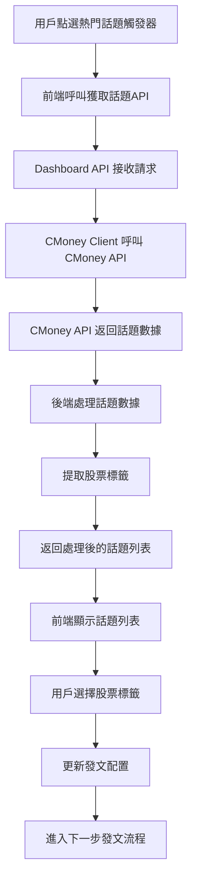

# 熱門話題觸發器串接功能需求規劃文件

## 1. 功能概述

### 1.1 目標
在現有的發文管理系統中新增「熱門話題觸發器」，讓用戶可以：
1. 點選觸發器呼叫 CMoney API 獲取當前熱門話題
2. 查看熱門話題的標題和內容
3. 從熱門話題中提取附帶的股票標籤
4. 將符合篩選條件的股票標籤列為可選項目
5. 選取後進入下一步發文流程

### 1.2 核心價值
- **即時性**：獲取最新的市場熱門話題
- **相關性**：自動提取話題相關的股票標籤
- **便利性**：一鍵獲取話題和相關股票，無需手動搜尋
- **整合性**：與現有發文流程無縫整合

## 2. 技術架構分析

### 2.1 現有系統架構
```
前端 (React + Ant Design)
├── PostingGenerator (發文生成器)
├── TriggerSelector (觸發器選擇器)
└── 其他組件...

後端 (FastAPI)
├── dashboard-api (儀表板API)
├── trending-api (熱門話題API)
├── posting-service (發文服務)
└── CMoney Client (CMoney API客戶端)
```

### 2.2 現有觸發器類型
- 個股觸發器：盤後漲、盤後跌、成交量暴增等
- 產業觸發器：類股輪動、產業動能等
- 總經觸發器：Fed政策、經濟數據等
- 新聞觸發器：公司新聞、監管新聞等

## 3. 功能需求詳述

### 3.1 熱門話題觸發器新增

#### 3.1.1 觸發器分類
在現有的觸發器分類中新增「熱門話題」分類：

```typescript
{
  key: 'trending',
  label: '熱門話題',
  icon: <FireOutlined />,
  color: '#f5222d',
  triggers: [
    {
      key: 'trending_topics',
      label: 'CMoney熱門話題',
      icon: <FireOutlined />,
      description: '獲取CMoney平台熱門話題',
      apiEndpoint: '/api/Topic/Trending'
    }
  ]
}
```

#### 3.1.2 觸發器配置
```typescript
interface TrendingTopicConfig {
  triggerType: 'trending';
  triggerKey: 'trending_topics';
  apiEndpoint: string;
  filters?: {
    category?: string;
    limit?: number;
    timeRange?: 'today' | 'week' | 'month';
  };
}
```

### 3.2 熱門話題數據結構

#### 3.2.1 CMoney API 回應格式
```typescript
interface TrendingTopic {
  id: string;
  title: string;
  content: string;
  relatedStockSymbols?: Array<{
    type: 'Stock' | 'Index';
    key: string;
    name?: string;
  }>;
  category: string;
  created_at: string;
  engagement_score: number;
  view_count?: number;
  comment_count?: number;
}
```

#### 3.2.2 前端顯示格式
```typescript
interface TrendingTopicDisplay {
  id: string;
  title: string;
  content: string;
  stocks: Array<{
    code: string;
    name: string;
    type: 'Stock' | 'Index';
  }>;
  category: string;
  engagement_score: number;
  created_at: string;
  isSelected: boolean;
}
```

### 3.3 用戶操作流程

#### 3.3.1 觸發器選擇
1. 用戶在觸發器選擇頁面點選「熱門話題」分類
2. 選擇「CMoney熱門話題」觸發器
3. 系統顯示話題獲取按鈕

#### 3.3.2 話題獲取與顯示
1. 點選「獲取熱門話題」按鈕
2. 系統呼叫 CMoney API 獲取話題列表
3. 顯示話題列表，包含：
   - 話題標題
   - 話題內容摘要
   - 相關股票標籤
   - 話題分類
   - 熱度評分

#### 3.3.3 股票標籤篩選與選擇
1. 系統自動提取所有話題的股票標籤
2. 提供篩選選項：
   - 按產業分類篩選
   - 按股票類型篩選（個股/指數）
   - 按熱度排序
3. 用戶可選擇多個股票標籤
4. 選取後自動更新發文配置

## 4. 技術實現方案

### 4.1 前端實現

#### 4.1.1 觸發器選擇器擴展
在 `TriggerSelector.tsx` 中新增熱門話題分類：

```typescript
// 在 triggerCategories 陣列中新增
{
  key: 'trending',
  label: '熱門話題',
  icon: <FireOutlined />,
  color: '#f5222d',
  triggers: [
    {
      key: 'trending_topics',
      label: 'CMoney熱門話題',
      icon: <FireOutlined />,
      description: '獲取CMoney平台熱門話題',
      apiEndpoint: '/api/Topic/Trending'
    }
  ]
}
```

#### 4.1.2 熱門話題組件
新增 `TrendingTopicsDisplay.tsx` 組件：

```typescript
interface TrendingTopicsDisplayProps {
  triggerConfig: TrendingTopicConfig;
  onStockSelect: (stocks: StockInfo[]) => void;
}

const TrendingTopicsDisplay: React.FC<TrendingTopicsDisplayProps> = ({
  triggerConfig,
  onStockSelect
}) => {
  const [topics, setTopics] = useState<TrendingTopicDisplay[]>([]);
  const [loading, setLoading] = useState(false);
  const [selectedStocks, setSelectedStocks] = useState<StockInfo[]>([]);

  const fetchTrendingTopics = async () => {
    setLoading(true);
    try {
      const response = await PostingManagementAPI.getTrendingTopics(triggerConfig);
      setTopics(response.topics);
    } catch (error) {
      message.error('獲取熱門話題失敗');
    } finally {
      setLoading(false);
    }
  };

  const handleStockSelection = (stock: StockInfo, isSelected: boolean) => {
    // 處理股票選擇邏輯
  };

  return (
    <Card title="熱門話題" size="small">
      <Button 
        type="primary" 
        icon={<FireOutlined />}
        onClick={fetchTrendingTopics}
        loading={loading}
      >
        獲取熱門話題
      </Button>
      
      {topics.length > 0 && (
        <div style={{ marginTop: 16 }}>
          {/* 話題列表顯示 */}
          {/* 股票標籤篩選與選擇 */}
        </div>
      )}
    </Card>
  );
};
```

#### 4.1.3 API 服務擴展
在 `postingManagementAPI.ts` 中新增：

```typescript
export class PostingManagementAPI {
  // 獲取熱門話題
  static async getTrendingTopics(config: TrendingTopicConfig): Promise<{
    topics: TrendingTopicDisplay[];
    total_count: number;
  }> {
    const response = await api.post('/trending-topics', config);
    return response.data;
  }

  // 獲取話題相關股票
  static async getTopicRelatedStocks(topicId: string): Promise<StockInfo[]> {
    const response = await api.get(`/trending-topics/${topicId}/stocks`);
    return response.data;
  }
}
```

### 4.2 後端實現

#### 4.2.1 Dashboard API 擴展
在 `dashboard-api` 中新增熱門話題端點：

```python
# main.py
@app.post("/trending-topics")
async def get_trending_topics(config: TrendingTopicConfig):
    """獲取熱門話題"""
    try:
        # 呼叫 CMoney API
        cmoney_client = CMoneyClient()
        token = await cmoney_client.login(credentials)
        topics = await cmoney_client.get_trending_topics(token.token)
        
        # 處理話題數據
        processed_topics = []
        for topic in topics:
            processed_topic = {
                "id": topic.id,
                "title": topic.title,
                "content": topic.content,
                "stocks": extract_stock_symbols(topic),
                "category": topic.category,
                "engagement_score": topic.engagement_score,
                "created_at": topic.created_at,
                "isSelected": False
            }
            processed_topics.append(processed_topic)
        
        return {
            "topics": processed_topics,
            "total_count": len(processed_topics)
        }
    except Exception as e:
        raise HTTPException(status_code=500, detail=str(e))

def extract_stock_symbols(topic: Topic) -> List[StockInfo]:
    """從話題中提取股票標籤"""
    stocks = []
    if hasattr(topic, 'relatedStockSymbols') and topic.relatedStockSymbols:
        for stock_symbol in topic.relatedStockSymbols:
            if stock_symbol.get('type') == 'Stock':
                stocks.append({
                    "code": stock_symbol.get('key'),
                    "name": get_stock_name(stock_symbol.get('key')),
                    "type": "Stock"
                })
    return stocks
```

#### 4.2.2 CMoney Client 擴展
確保 `CMoneyClient` 支援熱門話題 API：

```python
async def get_trending_topics(self, access_token: str) -> List[Topic]:
    """獲取熱門話題"""
    try:
        headers = {
            "Authorization": f"Bearer {access_token}",
            "X-Version": "2.0",
            "cmoneyapi-trace-context": "n8n"
        }
        
        url = f"{self.api_base_url}/api/Topic/Trending"
        response = self.client.get(url, headers=headers)
        
        if response.status_code != 200:
            raise Exception(f"獲取話題失敗: HTTP {response.status_code}")
        
        result = response.json()
        topics = []
        
        # 處理回應格式
        if isinstance(result, list):
            topic_list = result
        elif isinstance(result, dict) and "topics" in result:
            topic_list = result["topics"]
        else:
            topic_list = [result] if result else []
        
        # 轉換為 Topic 物件
        for item in topic_list:
            topic = Topic(
                id=item.get('id'),
                title=item.get('title'),
                content=item.get('content'),
                relatedStockSymbols=item.get('relatedStockSymbols', []),
                category=item.get('category'),
                created_at=item.get('created_at'),
                engagement_score=item.get('engagement_score', 0)
            )
            topics.append(topic)
        
        return topics
    except Exception as e:
        logger.error(f"獲取熱門話題失敗: {e}")
        raise
```

### 4.3 數據流程

#### 4.3.1 完整數據流程


#### 4.3.2 錯誤處理
- API 呼叫失敗：顯示錯誤訊息，提供重試按鈕
- 無話題數據：顯示空狀態提示
- 股票標籤提取失敗：記錄錯誤，繼續處理其他話題
- 網路超時：提供重新載入選項

## 5. 用戶介面設計

### 5.1 觸發器選擇頁面
- 在現有觸發器分類中新增「熱門話題」卡片
- 使用火焰圖示和紅色主題色
- 點選後顯示話題獲取按鈕

### 5.2 熱門話題顯示頁面
- 話題列表：標題、內容摘要、分類標籤
- 股票標籤區域：顯示所有相關股票
- 篩選選項：按產業、類型、熱度篩選
- 選擇狀態：已選股票高亮顯示

### 5.3 響應式設計
- 支援桌面和行動裝置
- 話題列表支援分頁
- 股票標籤支援多選

## 6. 測試計劃

### 6.1 單元測試
- CMoney API 客戶端測試
- 股票標籤提取邏輯測試
- 前端組件測試

### 6.2 整合測試
- 端到端流程測試
- API 整合測試
- 錯誤處理測試

### 6.3 用戶驗收測試
- 話題獲取功能測試
- 股票選擇功能測試
- 發文流程整合測試

## 7. 部署計劃

### 7.1 開發階段
1. 後端 API 開發（2-3天）
2. 前端組件開發（2-3天）
3. 整合測試（1-2天）

### 7.2 測試階段
1. 功能測試（1天）
2. 整合測試（1天）
3. 用戶驗收測試（1天）

### 7.3 部署階段
1. 預生產環境部署
2. 生產環境部署
3. 監控和維護

## 8. 風險評估

### 8.1 技術風險
- CMoney API 變更：建立 API 版本管理
- 網路連線問題：實作重試機制
- 數據格式不一致：加強數據驗證

### 8.2 業務風險
- 話題內容品質：實作品質篩選
- 股票標籤準確性：建立驗證機制
- 用戶體驗：提供清晰的錯誤提示

## 9. 後續擴展

### 9.1 功能擴展
- 話題分類篩選
- 話題熱度排序
- 自定義話題收藏
- 話題歷史記錄

### 9.2 性能優化
- 話題數據快取
- 股票標籤預處理
- 分頁載入優化

### 9.3 整合擴展
- 其他平台話題整合
- 社交媒體熱度整合
- 新聞事件關聯

---

## 結論

這個熱門話題觸發器功能將為用戶提供更便捷的市場熱點獲取方式，通過自動提取相關股票標籤，大幅提升發文效率。技術實現上充分利用現有架構，確保與現有系統的無縫整合。

請確認以上需求規劃是否符合您的期望，我們可以開始進行具體的開發實現。
